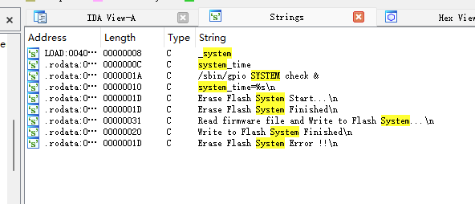
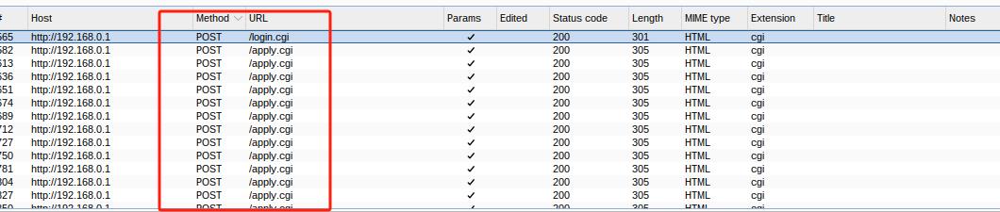

# 0719

# 文件的目录


# 模拟启动


```
 PID  Uid     VmSize Stat Command
    1 root        764 S   init      
    2 root            SW  [kthreadd]
    3 root            SW  [ksoftirqd/0]
    4 root            SW  [kworker/0:0]
    5 root            SW< [kworker/0:0H]
    6 root            SW  [kworker/u2:0]
    7 root            SW< [khelper]
    8 root            SW  [khungtaskd]
    9 root            SW< [writeback]
   10 root            SWN [ksmd]
   11 root            SW< [crypto]
   12 root            SW< [bioset]
   13 root            SW< [kblockd]
   14 root            SW< [ata_sff]
   15 root            SW< [cfg80211]
   16 root            SW  [kworker/0:1]
   17 root            SW  [kswapd0]
   18 root            SW  [fsnotify_mark]
   35 root            SW  [scsi_eh_0]
   36 root            SW< [scsi_tmf_0]
   37 root            SW  [scsi_eh_1]
   38 root            SW< [scsi_tmf_1]
   39 root            SW  [kworker/u2:1]
   40 root            SW  [kworker/u2:2]
   41 root            SW  [kworker/u2:3]
   44 root            SW< [kpsmoused]
   45 root            SW< [ipv6_addrconf]
   46 root            SW< [deferwq]
   47 root            SW< [kworker/0:1H]
   49 root        664 S   init       
   50 root        720 S   /bin/sh /etc/rc.d/rcS 

启动了   /bin/sh /etc/rc.d/rcS  目录下的这个文件


   54 root        808 S   /bin/sh

lrwxrwxrwx  1 iot iot      7 7月  19 10:14 sh -> busybox*
链接启动的busybox
   
 
   56 root        948 S   rc init 
   
在rcS文件启动的 rc文件 init 是守护进程

   57 root        768 S   /firmadyne/sh /firmadyne/network.sh 
   脚本的程序  配置网络相关的设置
   60 root        644 S   /firmadyne/sh /firmadyne/debug.sh 
   脚本的程序    启动debug的
   63 root        640 S   /firmadyne/busybox telnetd -p 31338 -l /firmadyne/sh 
   工具的telnet的服务
   64 root        452 S   /firmadyne/busybox sleep 36000 
   65 root        696 S   /firmadyne/sh 
```


```
   94 root        544 S   tftpd 
```
  

rc启动的 网络共享服务

tftp
监听TFTP默认端口（UDP端口69），接收来自客户端的请求。
根据客户端请求的文件路径，读取对应的文件。
将文件分块传输给客户端，以满足文件传输请求。
处理客户端发送的写入请求，将文件写入到服务器的指定目录。

```
   
  100 root            Z   [syslogd]
  102 root            Z   [syslogd]
  103 root            Z   [klogd]
  105 root        676 S   syslogd -C 20 
  106 root            Z   [klogd]
  108 root        648 S   klogd 
  110 root            Z   [gpio]
  113 root       2816 S < httpd 

启动了httpd服务
  

  116 root        508 S   timer 
  
"timer"（定时器）是一个进程，它在操作系统中用于管理和触发定时事件。
  
timer &
killall -SIGTSTP timer &
killall wantimer &
/var/sbin/wantimer &
********** wan_timer fail => stop wan monitor **********
idle timer count %d
IPv6 idle timer count %d


  118 root        548 S   dcc 
 
"DDC"代表"Display Data Channel"（显示数据通道），它是用于在计算机和显示器之间进行通信的一种协议。
  120 root            Z   [lld2d]
  123 root            Z   [lld2d]
  124 root        548 S   lld2d br0 
  145 root        836 S   /var/sbin/wantimer 
  147 root        492 S   udhcpc -w dhcpc -i eth1 -H DIR-825 -s /usr/share/udhc
  151 root            Z   [gpio]
  157 root            Z   [gpio]
  160 root            Z   [killall]
  165 root            Z   [gpio]
  170 root            Z   [gpio]
  189 root            Z   [killall]
  193 root            Z   [llmnr]
  213 root            Z   [igmpproxy]
  216 root        492 S   igmpproxy -r 
  218 root        864 S   arpping 192.168.0.1 192.168.0.100 192.168.0.199 br0 e
  221 root        864 S   arpping 192.168.0.1 192.168.0.100 192.168.0.199 br0 e
  

这些进程的命令是使用arpping命令进行ARP（地址解析协议）探测。ARP是一种用于将IP地址映射到物理MAC地址的协议。这些进程的目的是通过发送ARP请求来检测指定IP地址的网络设备是否可达，并获取其相应的MAC地址。

具体命令中的参数解释如下：

192.168.0.1是要探测的目标IP地址。
192.168.0.100和192.168.0.199是源IP地址范围，可能表示要从这些源地址发送ARP请求。
br0是网络接口，可能是要使用的网络接口。
e可能是指定要使用以太网协议进行ARP探测

  224 root            Z   [nmbd]
  
  226 root            Z   [nmbd]
  227 root        504 S   nmbd dlinkrouter 00:01:23:45:67:89 
  254 root       1192 S   avahi-daemon: running [DIR-825.local]        
  380 root            Z   [radvd]
  398 root            Z   [radvd]
  418 root            Z   [radvd]
  436 root            Z   [radvd]
  446 root            Z   [radvd]
  460 root            Z   [radvd]
  471 root        508 S   /firmadyne/busybox sleep 60 
  478 root            Z   [radvd]
  492 root            Z   [radvd]
  500 root        720 S   /firmadyne/sh 
  507 root            Z   [radvd]
  508 root        864 S   arpping 192.168.0.1 192.168.0.100 192.168.0.199 br0 e
  509 root        864 S   arpping 192.168.0.1 192.168.0.100 192.168.0.199 br0 e
  510 root        864 S   arpping 192.168.0.1 192.168.0.100 192.168.0.199 br0 e
  511 root        720 R   ps 


```


# rcS文件


mount -a 命令会根据 /etc/fstab 文件中的配置，挂载所有在其中定义的文件系统。
mount -o remount +w / 命令会重新挂载根文件系统，并赋予它写权限。
mount -t tmpfs tmpfs /tmp -o size=256k 命令会将一个大小为256KB的基于内存的临时文件系统挂载到 /tmp 目录上。
export PATH=$PATH:/etc/ath 命令将 /etc/ath 目录添加到系统的环境变量 PATH 中，以便系统可以在该目录下找到可执行文件。
mount -t usbfs none /proc/bus/usb 命令将 USB 文件系统挂载到 /proc/bus/usb 目录。
rc init & 命令运行一个名为 rc init 的程序，并将其放在后台运行。


# httpd服务

上面知道了HHTPD服务被启动，我们看rcS文件并没有直接的启动，而是只启动了rc文件

## rc文件

rc是个二进制文件


# 危险函数
## 关于httpd的危险函数
```
strings httpd |grep "strcpy\|strcat\|sprintf\|gets\|memset\|scanf\|printf\|strcat\|system"
wfprintf
sscanf
strcpy
```


```
memset
strcat
sprintf
BIO_gets
BIO_printf
vsnprintf
wfgets
_system
fscanf
return_system_time
system_time.cgi*
```


```
 Success, system rebooting. 
 Fail, system rebooting. 
log_system_activity
system_time
return_online_firmware_check: fgets error
sscanf: error 1
sscanf: error 2
sscanf: error 3
parse_wlanSecurity_to_xml: sscanf wlan0_security error
parse_wlanSecurity_to_xml: sscanf wlan0_security successfully


system_info
system_log
<system_log>
<log_system>%s</log_system>
</system_log>
<system_time>
<system_time>%s</system_time>
</system_info>
<system_info>
system_current_time
<system_current_time>%s</system_current_time>
```


## 关于rc的危险函数


```
strings rc |grep "strcpy\|strcat\|sprintf\|gets\|memset\|scanf\|printf\|strcat\|system"
fprintf
memset
sprintf
_system
sscanf
strcpy、
```


```
snprintf
fscanf
fgets
strcat


system_time
system_time=%s
```



# 网页

## 第一项
对于网页的抓包


在文件里找到这个文件

在httpd中定位到，但是发现并没有被引用


## 第二项




发现还是这个（因为保存都是失败，跳转到提示需要管理员登录的界面）

## 第三项


第三项发现了新的cgi文件，跟[ping]按钮有关的


在httpd文件中发现是没有被引用的


## 第四项


抓包到新的cgi文件


发现并没有被交叉引用


## 第五相项


全部是get请求

## 总结

对于的页面的抓包操作来看，即使是admin登录，保存时会出现不是“admin”身份的问题
