# NetgearDGN-1000分析

Netgear DGN1000是一款由美国公司Netgear生产的DSL调制解调器/路由器组合设备。Netgear成立于1996年，总部位于加利福尼亚州圣荷西，专注于网络设备的开发与制造，产品线包括无线路由器、调制解调器、网络存储设备等。DGN1000主要用于家庭和小型办公室，提供高效的互联网连接和网络管理功能。

## 1、信息分析
### 1.1、基础信息分析
在拿到固件后，先看一下文件系统
```
binwalk DGN1000WW_V1.1.00.45.img 
```
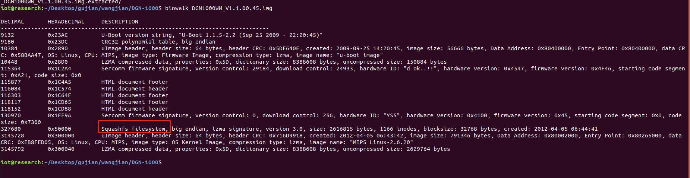

发现是squashfs文件系统。
然后对文件进行解包。
```
binwalk -Me DGN1000WW_V1.1.00.45.img

```

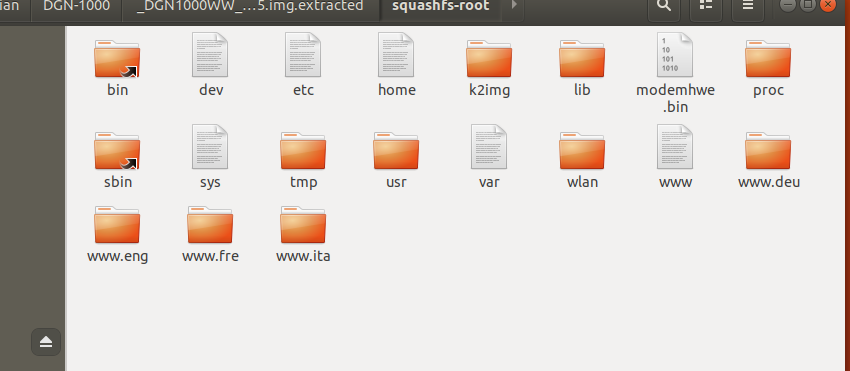


查看一下文件的软连接

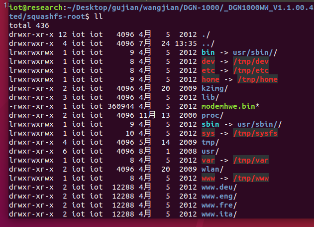


进到usr/sbin/

查看一下busybox文件
```
file busybox

checksec --file=busybox
```

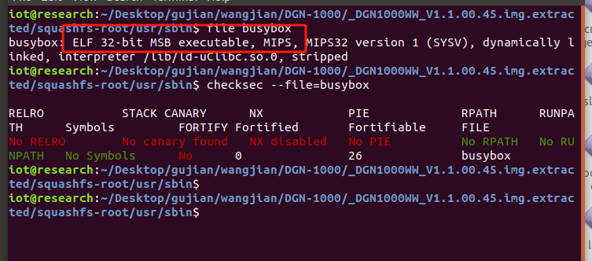


发现是32位大端MIPS

### 1.2、firmAE模拟

```
sudo ./run.sh -d asus ./firmwares/DGN1000WW_V1.1.00.45.img
```

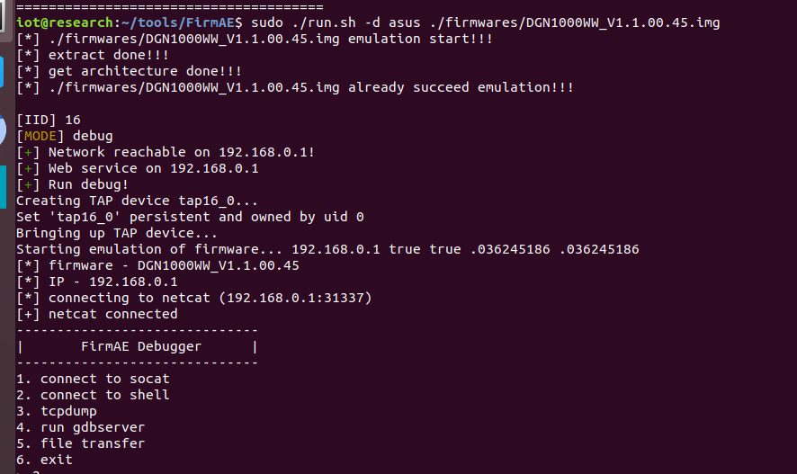

浏览器打开web界面
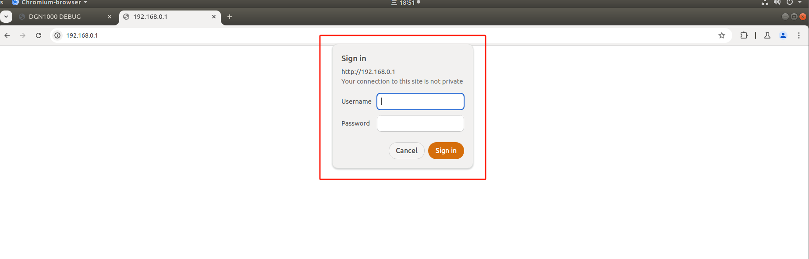


发现我们需要密码账号。

### 1.3、获取密码

#### 我自己的方法（运气好）
我想的是我需要拿到这个密码，所以就用firmwalker抓一下“password”的关键词
```
sudo ./firmwalker.sh ../../Desktop/gujian/wangjian/DGN-1000/_DGN1000WW_V1.1.00.45.img.extracted/squashfs-root
```
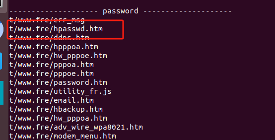


发现一个比较可疑文件，打开以后
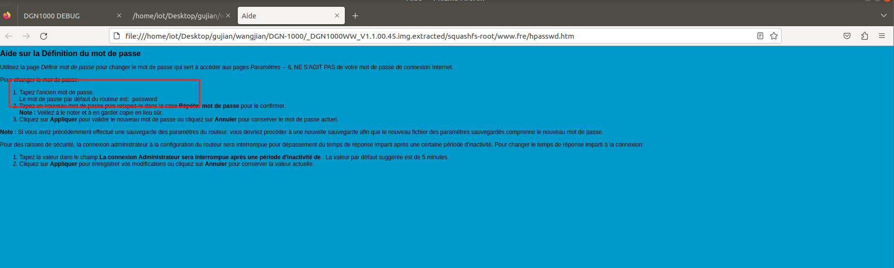


我们发现这边说的是初始密码为：password

我们试下账号：admin发现是正确的。


#### 正确的方法
因为这个固件模拟起来以后，它就让我们进登录验证，那也就是说它的启动项里面是初始了账户的账号密码的，所以我们对启动项文件rc进行分析。

```
grep -r "rc"
```
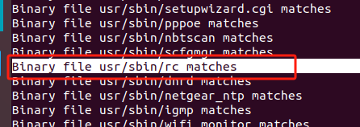

在IDA里面的分析rc文件，寻找关键词“password”
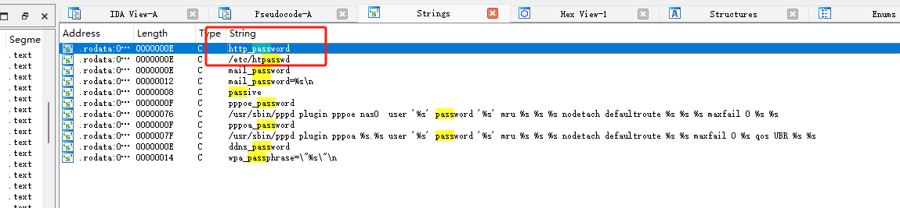

定位过去，发现这里有存放的路径
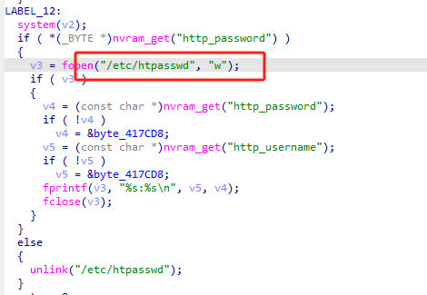

进shll之后，读取文件

```
cat ./etc/h

```

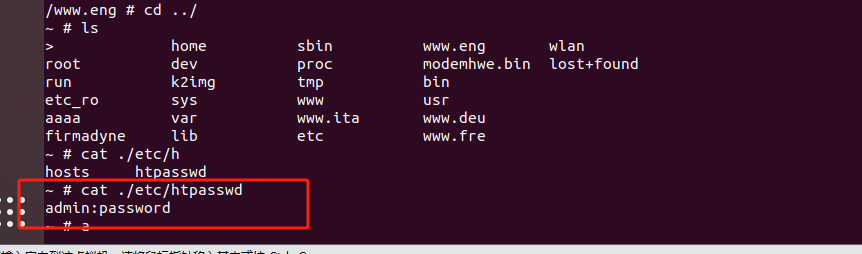

#### 更正确的方法

因为是初始化固件，所以直接在固件找default文件（default 文件通常用于配置系统或应用程序的默认设置。具体内容和位置视软件和系统而定。）

```
cat ./usr/etc/default
```
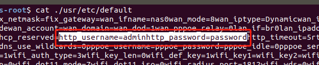


## 2、漏洞分析
### 2.1、命令执行文件
#### 2.1.1漏洞描述
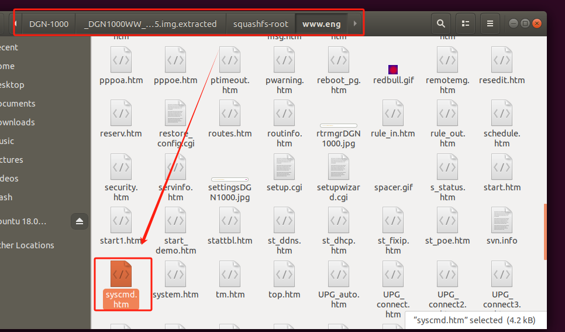

在这个目录下有一个命令执行的界面。

#### 2.1.2、复现分析
我们先打开界面，试一下，并进行抓包。

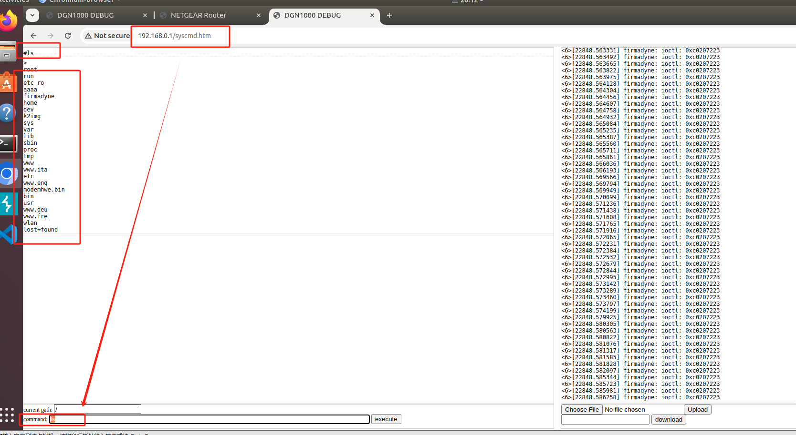

再看我们抓到的包，

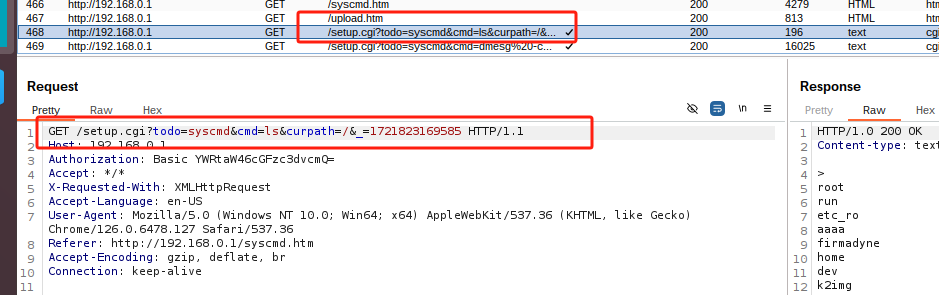


我们现在对setup.cgi文件进行分析。
首先对一个变量进行追踪（这里我也不太明白为啥）
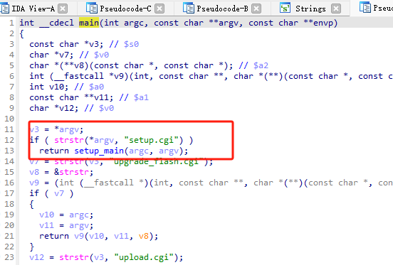

在主函数中跳转到了setup_main（）函数
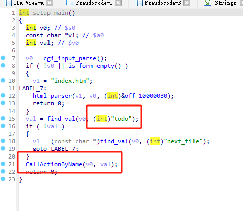
进去后追到了我们的变量。再往下的函数我也没搞明白，大概意思好像是在这调用了一下这个的.cgi文件（我猜的）


对别的变量进行继续的追踪
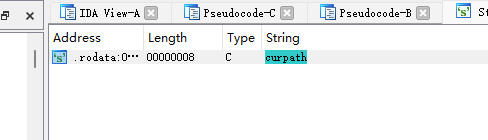

追踪过去之后，我们追踪到了我们想要追踪的变量。

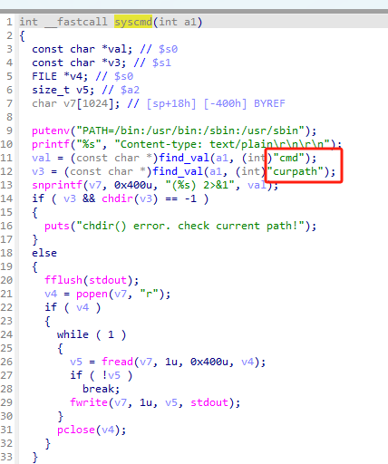

下面的代码大概意思就是执行了命令，然后读取输出。。

我们上面进行的是有认证的命令执行，着了还可以实现绕过认证的命令执行。
在命令执行前，需要验证，验证失败会报401
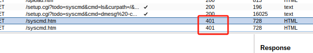
那也就是说明这是mini_httpd处理的这个状态401。
那我们先对mini_httpd分析，找到进行身份认证的相关代码。
我们已知它的逻辑对一串字符串的比对，所以我们对字符串比对函数（strstr）进行查找。

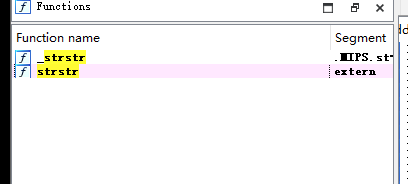

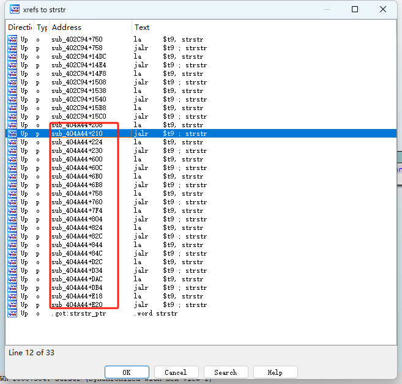

然后我们看伪代码，

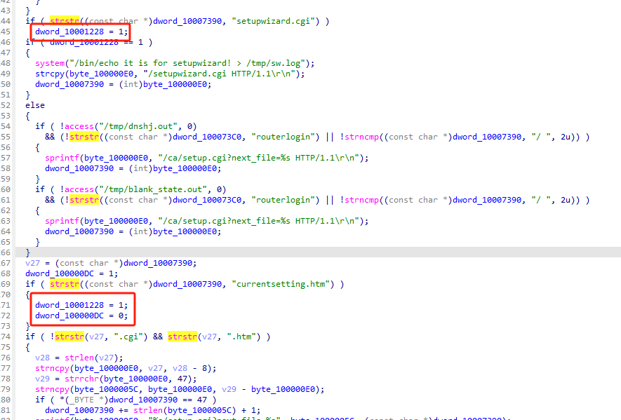


看到对比之后改变了变量的值，我们对变量继续往下追踪。
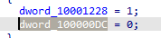


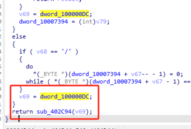


我们看到这个值被调用，进函数分析

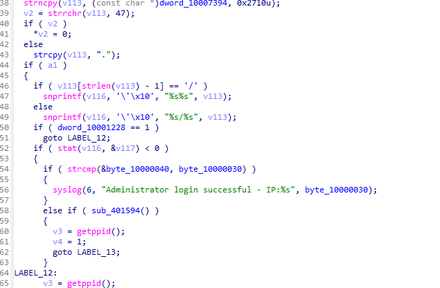

我们通过对这个函数的分析，发现这个函数就是对认证判定，而且是通过刚才传进来的那个值进行的判定，上一个函数使这个变量值改变的字符串为currentsetting.htm。往回看，那也就说明我们请求的变量中包含这个串，就可以通过验证。（虽然我也不太懂为什么抓包的请求头不包含这个信息，但这边验证会用到这个串。）
所以，也就是说在请求头中加上这个串就可以实现绕过认证，想法成立，开始抓包验证。

我们自己改的请求

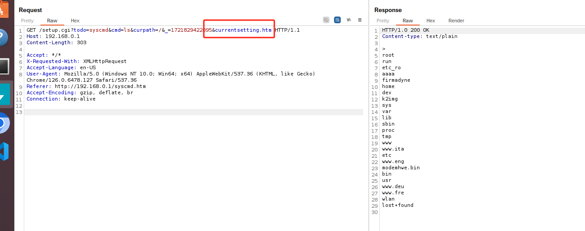


原请求

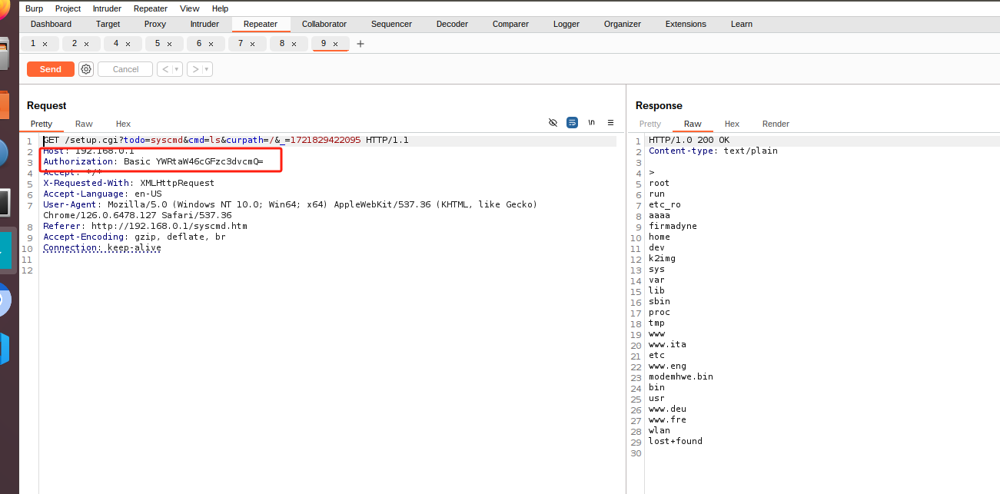


对比发现，我们的想法是对的。


## 3、写exp


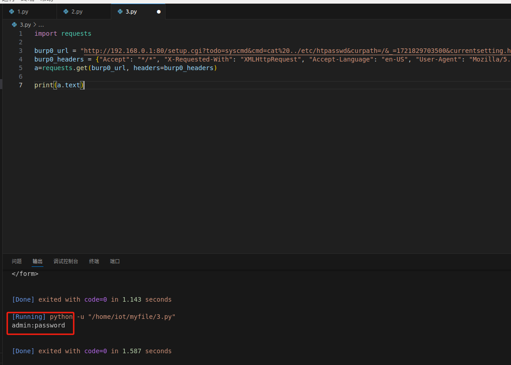


