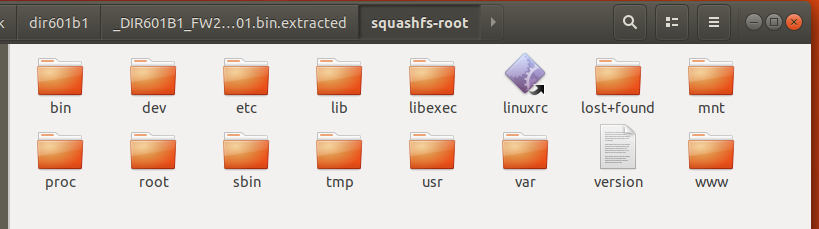
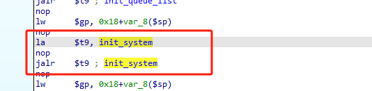
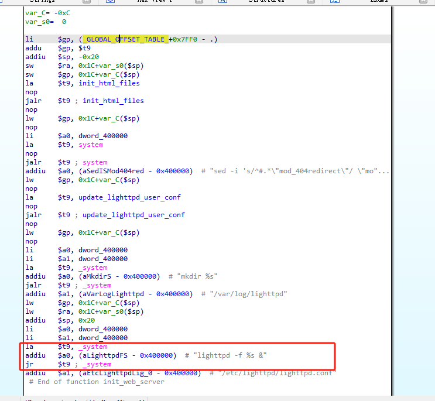
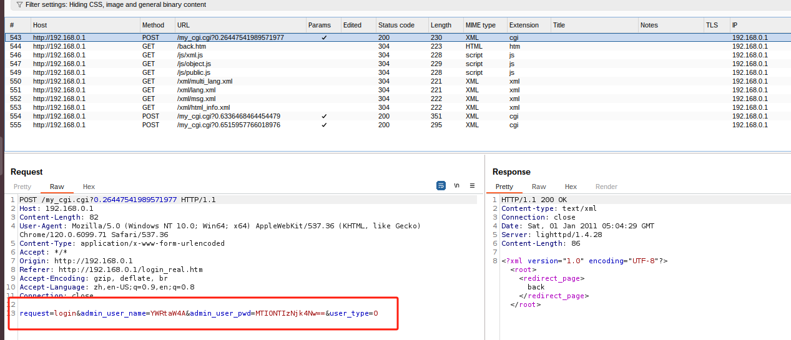
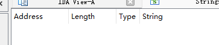

# 关于DIR-601b1的信息收集和漏洞复现


## 1、信息收集

### 1.1、基础信息收集
#### binwalk

```
binwalk DIR601B1_FW202NAb01.bin
```


发现文件系统是Squashfs

然后我们对这个二进制文件进行解压缩

```
binwalk -Me DIR601B1_FW202NAb01.bin
```



bin: 包含基本的用户命令和可执行文件，通常是系统启动和运行所需的程序。
dev: 设备文件目录，包含与设备驱动程序相关的特殊文件，用于与硬件设备进行交互。
etc: 配置文件目录，包含系统和应用程序的配置文件。
lib: 系统库文件目录，包含程序运行所需的共享库。
libexec: 存放系统辅助程序的目录，通常是供系统和其他程序使用的执行文件。
linuxrc: 启动时运行的脚本或程序，通常用于初始化和设置系统环境。
lost+found: 文件系统检查时用来恢复丢失文件的目录。
mnt: 挂载点目录，通常用于临时挂载文件系统。
proc: 虚拟文件系统，提供关于系统和进程的信息。
root: 超级用户的主目录。
sbin: 系统管理员命令目录，包含超级用户使用的命令。
tmp: 临时文件目录，存放临时文件。
usr: 用户程序目录，包含用户安装的应用程序和库。
var: 可变数据目录，包含不断变化的数据文件，如日志文件和数据库。
version: 存储系统或软件版本信息的文件。
www: 通常用于存放网页文件或相关资源的目录。


#### file&checksec


我们发现这个固件的编译是使用的32位的大端mips架构，并且没有打开栈保护（canary）、PIE和NX

#### firmAE模拟

```
sudo ./run.sh -d dlink ./firmwares/DIR601B1_FW202NAb01.bin
```


### 1.2、关于启动行的分析

进入到etc目录下

我们发现里面放着两个文件和一个目录，我们先看这两个文件
#### fstab
源码


```

/proc    /proc       proc     defaults    0 0
none     /var        ramfs    defaults    0 0
none     /etc        ramfs    defaults    0 0
none     /www        ramfs    defaults    0 0
devpts   /dev/pts    devpts   mode=0622   0 0


`/etc/fstab` 解析

**`/proc /proc proc defaults 0 0`**

- **描述**：挂载虚拟文件系统 `/proc`。
- **用途**：提供关于系统进程和内存的信息。
- **选项**：`defaults` 表示使用默认挂载选项。

2. **`none /var ramfs defaults 0 0`**

- **描述**：挂载一个 RAM 文件系统到 `/var`。
- **用途**：提供快速的临时存储，适合日志和缓存。
- **选项**：`defaults` 表示使用默认挂载选项。

3. **`none /etc ramfs defaults 0 0`**

- **描述**：挂载一个 RAM 文件系统到 `/etc`。
- **用途**：可能用于在内存中存储配置文件，增强性能。
- **选项**：`defaults` 表示使用默认挂载选项。

4. **`none /www ramfs defaults 0 0`**

- **描述**：挂载一个 RAM 文件系统到 `/www`。
- **用途**：用于存放网站文件，提供快速访问。
- **选项**：`defaults` 表示使用默认挂载选项。

5. **`devpts /dev/pts devpts mode=0622 0 0`**

- **描述**：挂载伪终端文件系统到 `/dev/pts`。
- **用途**：支持多用户环境中的伪终端。
- **选项**：`mode=0622` 设置文件权限。

这段 `/etc/fstab` 配置定义了几个重要的挂载点，包括虚拟文件系统和 RAM 文件系统，适合高性能和临时存储需求。
```

#### inittab

源码
```
::sysinit:/etc/rc.d/rcS
ttyS0::askfirst:/bin/ash
#::shutdown:/etc/ath/killVAP all
#::shutdown:/bin/umount -a

1. **`::sysinit:/etc/rc.d/rcS`**

- **功能**：在系统初始化时执行 `/etc/rc.d/rcS` 脚本。
- **作用**：该脚本通常用于设置系统的基本配置和服务。

2. **`ttyS0::askfirst:/bin/ash`**

- **功能**：在串口设备 `ttyS0` 上启动一个 shell。
- **作用**：`askfirst` 选项表示在登录前显示提示，允许用户通过串口控制系统。

3. **`#::shutdown:/etc/ath/killVAP all`**

- **功能**：被注释掉的命令，表示在系统关闭时执行 `/etc/ath/killVAP all`。
- **作用**：`killVAP` 可能用于关闭虚拟接入点（VAP），如果需要可将注释去掉以启用。

4. **`#::shutdown:/bin/umount -a`**

- **功能**：同样被注释掉的命令，在系统关闭时卸载所有文件系统。
- **作用**：确保在关闭时安全地卸载所有挂载的文件系统，防止数据丢失。

这段配置主要用于定义系统启动和关闭时的行为，涉及初始化脚本的执行和串口的 shell 启动。被注释的部分可以根据需要启用以增加系统的安全性和可靠性。

```

#### init.d

进入到init.d目录下启动项文件夹

```
ls
```

我们发现只有一个启动项文件rcS文件

源码
```
#!/bin/ash

# This script runs when init it run during the boot process.
# Mounts everything in the fstab
mount -a
mount -o remount +w /

# Mount the RAM filesystem to /tmp
mount -t tmpfs tmpfs /tmp

# copy all files in the mnt folder to the etc folder
cp -a /mnt/* /etc
mkdir -p /var/etc
mkdir -p /var/firm
mkdir -p /var/log
mkdir -p /var/misc
mkdir -p /var/run
mkdir -p /var/sbin
mkdir -p /var/tmp
mkdir -p /tmp/var

#/bin/echo "Init System..."
system_manager &

#/bin/echo "Start tftpd..."
tftpd &

```

##### 脚本说明

这是一个初始化脚本，通常在系统启动过程中运行，负责挂载文件系统和设置目录结构。

###### 1. **挂载文件系统**

```
mount -a
```
- 挂载 `/etc/fstab` 中定义的所有文件系统。

```
mount -o remount,rw /
```
- 以读写模式重新挂载根文件系统。

###### 2. **挂载 RAM 文件系统**

```
mount -t tmpfs tmpfs /tmp
```
- 将临时文件系统（tmpfs）挂载到 `/tmp` 目录，提供快速的临时存储。

###### 3. **复制文件**

```
cp -a /mnt/* /etc
```
- 将 `/mnt` 目录中的所有文件复制到 `/etc`，保留文件属性。

###### 4. **创建目录**

```
mkdir -p /var/etc
mkdir -p /var/firm
mkdir -p /var/log
mkdir -p /var/misc
mkdir -p /var/run
mkdir -p /var/sbin
mkdir -p /var/tmp
mkdir -p /tmp/var
```
- 创建多个必要的目录结构，以便后续使用。

###### 5. **启动服务**

```
system_manager &
```
- 在后台启动 `system_manager` 服务。

```
tftpd &
```
- 在后台启动 TFTP 服务器。

###### 总结

该脚本负责系统启动时的文件系统挂载、目录创建和服务启动，是系统初始化的重要组成部分。


##### 
##### system_manager

我们查看相关进程找到了这个文件被启动。


我们把它放到IDA进行分析，拿到这个二进制文件的伪代码。
源码
```
int __cdecl main(int argc, const char **argv, const char **envp)
{
  __pid_t v3; // $v0

  signal(13, (__sighandler_t)1);
  signal(32, (__sighandler_t)sub_402AAC);
  signal(33, (__sighandler_t)sub_402AAC);
  signal(34, (__sighandler_t)sub_402AAC);
  signal(39, (__sighandler_t)sub_402AAC);
  signal(40, (__sighandler_t)sub_402AAC);
  signal(41, (__sighandler_t)sub_402AAC);
  signal(42, (__sighandler_t)sub_402AAC);
  signal(35, (__sighandler_t)sub_402AAC);
  signal(51, (__sighandler_t)sub_402AAC);
  signal(52, (__sighandler_t)sub_402AAC);
  signal(53, (__sighandler_t)sub_402AAC);
  signal(54, (__sighandler_t)sub_402AAC);
  signal(38, (__sighandler_t)sub_402AAC);
  signal(56, (__sighandler_t)sub_402AAC);
  signal(57, (__sighandler_t)sub_402AAC);
  signal(58, (__sighandler_t)sub_402AAC);
  signal(59, (__sighandler_t)sub_402AAC);
  signal(60, (__sighandler_t)sub_402AAC);
  signal(61, (__sighandler_t)sub_402AAC);
  signal(62, (__sighandler_t)sub_402AAC);
  signal(65, (__sighandler_t)sub_402AAC);
  signal(63, (__sighandler_t)sub_402AAC);
  signal(64, (__sighandler_t)sub_402AAC);
  signal(66, (__sighandler_t)sub_402AAC);
  signal(77, (__sighandler_t)sub_402AAC);
  signal(78, (__sighandler_t)sub_402AAC);
  signal(46, (__sighandler_t)sub_402AAC);
  signal(36, (__sighandler_t)sub_402AAC);
  signal(81, (__sighandler_t)sub_402AAC);
  signal(82, (__sighandler_t)sub_402AAC);
  signal(83, (__sighandler_t)sub_402AAC);
  signal(84, (__sighandler_t)sub_402AAC);
  signal(85, (__sighandler_t)sub_402AAC);
  signal(86, (__sighandler_t)sub_402AAC);
  signal(87, (__sighandler_t)sub_402AAC);
  signal(37, (__sighandler_t)sub_402AAC);
  signal(91, (__sighandler_t)sub_402AAC);
  signal(92, (__sighandler_t)sub_402AAC);
  signal(93, (__sighandler_t)sub_402AAC);
  signal(94, (__sighandler_t)sub_402AAC);
  signal(97, (__sighandler_t)sub_402AAC);
  signal(99, (__sighandler_t)sub_402AAC);
  signal(95, (__sighandler_t)sub_402AAC);
  signal(101, (__sighandler_t)sub_402AAC);
  signal(96, (__sighandler_t)sub_402AAC);
  signal(100, (__sighandler_t)sub_402AAC);
  sigemptyset(&stru_413818);
  v3 = getpid();
  create_pid_file(v3, "/var/run/system_manager.pid");
  init_queue_list();
  init_system();
  task_loop();
  return 0;
}
```

这段代码设置了多个信号的处理程序，并进行了一系列初始化步骤，适合构建一个守护进程或系统管理工具。信号处理部分尤其需要注意，以确保程序的稳定性和安全性。
主要用来处理进程的不同信号。


##### tftpd

TFTP（Trivial File Transfer Protocol） 是一种简单的文件传输协议，主要用于在网络中传输小文件，常见于网络设备的引导和配置。
* 主要特点：
简单：没有复杂的认证和控制机制，适合用于小型网络。
无连接：基于 UDP 协议，传输速度快，但可靠性较低。
* 常用于：
网络设备的固件升级。
启动映像的传输（如 PXE 启动）。


### 1.3、对于web服务的启动分析

我们通过上面的分析知到了rcS的启动项中启动了system_manager文件，而web服务也是在这个文件中启动的

#### 1.3.1、查看web服务

##### 方法一（firmAE模拟启动后）
我们在firmAE模拟启动后，进入shll，查看进程，进程中我们看到了，web服务的启动位：lighttpd


##### 方法二（在不进行firmAE模拟的情况下，我们使用firmwalker）
我们使用firmwalker对文件系统进行分析


分析后，我们发现web服务为：lighttpd

#### 1.3.2、对服务的启动过程进行分析


##### 第一步
我们在上面的分析中知道了web服务为：lighttpd，所以我们接下来可以在文件系统中进行分析定位，如果用的是上面1.3.1查看web服务中的方法一，那么我们还需要在文件系统中查找一下关于lighttpd的其他信息。
```
grep -ir "lighttpd"

```


##### 第二步
接下来我们分析它是怎么启动的，上面我们分析信息得知，这个lighttp是由system_manager启动的，那么我们先把这个二进制文件放到IDA进行分析。

通过对关键字的查找


我们找到了我们想要看到的。接下来，定位到准确位置。


我们发先这里通过调用system函数进行了系统命令执行，也就是这里进行了web服务的开启，
那么我们接下来继续看的这个的调用链（就是一步一步查看上面是那个函数调用了，为了防止混淆，我就按照正确的调用顺序进行讲解）

在system_manager的主函数中，调用了init_system（）函数




我们进入init_system（）函数，在这个函数中，又调用了init_web_server()函数


我们进入init_web_server()函数，就看到了这里通过调用system函数进行了系统命令执行，启动web服务。




## 2、漏洞复现

### 2.1信息泄露

#### 2.1.1、漏洞描述：
在固件web端发送请求时，请求出现了不需要验证，而且在请求的回复中会对前面的亲求进行回显，通过构建请求发包会显示出管理员账号的账号密码。

#### 2.1.2、前置条件
因为这个固件模拟起来以后不会有密码，为了更好的显示这个漏洞，我们需要为这个路由器设置上密码。


#### 2.1.3、复现过程
首先我们先把我们的固件进行firmAE模拟

我们先对firmAE模拟起来的web服务进行抓包分析。

首先我们面对这个路由器，先随便输入密码，观察所抓到请求包。（假装自己不知道密码，输入错误的密码，毕竟一个陌生设备）



对于我们抓到的这个包，我们可以分析一下这个请求所能给我们提供的信息。

* 1、这个请求是发送给my_cgi.cgi文件的
* 2、下面发送的变量，出现了no_auth的字样
* 3、后面跟的变量，在返回包中都进行了相关配置值的回显
* 4、变量的名字

然而最主要是这个no_auth（no_auth 通常是指在某些系统或应用中，表示不需要身份验证的状态）看到这个以后，我们肯定是想试一下能不能在这里回显一下敏感的信息，比如账号密码什么的，或者是wifi密码什么的（目前只是猜测）

所以我们先对my_cgi.cgi这个文件在IDA进行分析。
我们对相关变量进行关键字搜索。

##### 2.1.3-1、抓到的第一个包
###### 关键字搜索
**request**


在这里我们看到了一些疑似有用的信息，但是我们还不确定它有没有用，我们接着看别的变量。

**table_name**


发现没有，继续往下看。
但是我们看到返回的请求包中后面有相应的返回信息，那么就看一下他是怎么返回的这些信息

我们对其中的一些值进行搜索。例如：hw_ver（哪个都行）


然后进行追调。


我们找到了这里面其他的值，并且发现这些配置信息是通过这里面的一些html代码进行的回显。（调用的相应的自定义函数）例如：


我们现在知道了这些是通过这个my_cgi.cgi进行的页面回显输出。那么在二个包的分析时我们也需要着重注意一下这些代码。

##### 2.1.3-1、抓到的第二个包
###### 关键字搜索
**admin_user_name**


发现没有

**admin_user_pwd**


我们进行回调


在这个函数我们不仅发现了我们着重关注的html代码，还发现了，与admin_user_pwd相对应的变量名在这个文件变为了admin_user，所以才会导致我们没有搜到。

那么我们这直接就可以进行尝试看看可不可以输出我们想要的账号和密码


我们发现可以直接回显我们的管理员账号密码。


大概思路


### 2.2、ping的命令执行

ping这个地方比较容易的命令执行
所以特别关注一下


抓包看一下


在IDA查看my_cgi.cgi里面查看字符串


定位回调。


发现没有过滤的拼接

所以就是一下命令拼接


进shll查看WWW目录


但是发现内容并没有写进去。


再试试别的方法


发现写入成功了，并且有内容


