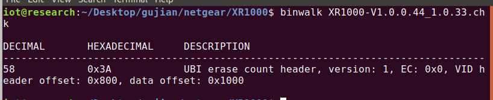
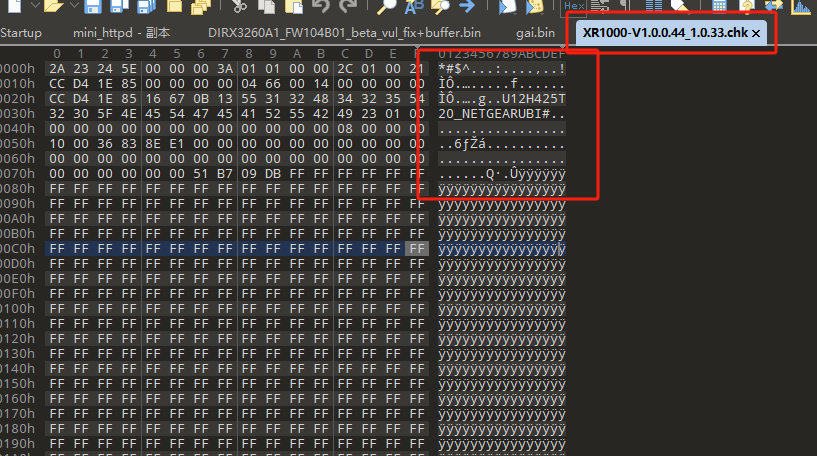
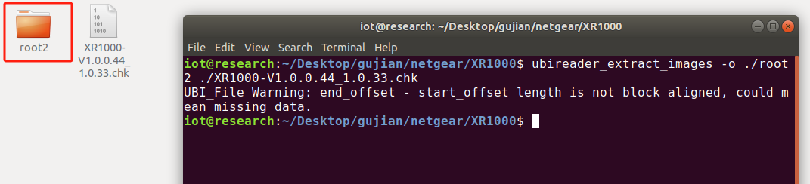
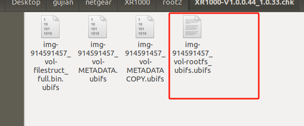
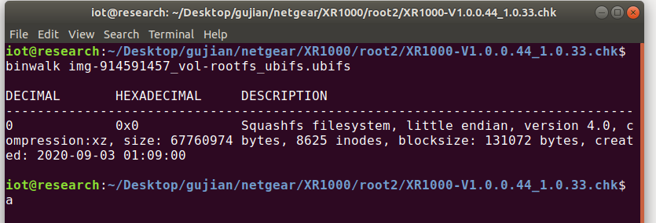
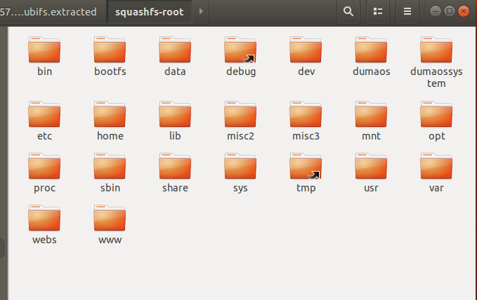

# UBI压缩固件

## 1、关于UBI&UBIFS的解释

UBI（Unsorted Block Image）和 UBIFS（UBI File System）是用于嵌入式系统中闪存存储的两种技术。以下是它们的详细解释：

### UBI（Unsorted Block Image）

- **定义**：UBI 是一种管理闪存设备的层，旨在管理 NAND 闪存的物理块。
- **功能**：
  - **块管理**：负责处理闪存的坏块和擦除操作，确保数据的可靠性。
  - **动态分配**：允许动态地分配和释放存储空间，适应各种大小的数据。
  - **映射层**：提供一种方法，将逻辑地址映射到物理地址，以提高存储利用率和效率。
- **优势**：
  - 解决了 NAND 闪存操作中的一些问题，如坏块管理和擦除操作的复杂性。
  - 提高了存储的可靠性和性能。

### UBIFS（UBI File System）

- **定义**：UBIFS 是一种在 UBI 层之上构建的文件系统，专为 NAND 闪存设计。
- **功能**：
  - **文件管理**：提供标准的文件系统功能，如文件创建、删除、读取和写入。
  - **高效性**：设计上能够处理大型文件和小文件，适应不同的存储需求。
  - **日志功能**：通过日志技术提高数据完整性，确保在故障情况下能够恢复数据。
- **优势**：
  - 兼具高性能和高可靠性，适合于嵌入式系统和移动设备。
  - 通过对闪存特性的优化，提供更好的写入性能和耐用性。

### 总结

- **UBI** 是对 NAND 闪存物理块进行管理的层，负责坏块处理和空间分配。
- **UBIFS** 则是在 UBI 之上的文件系统，提供标准的文件操作和数据管理功能。

这两者配合使用，可以有效提高嵌入式系统中闪存存储的效率和可靠性。

## 2、ubi文件类型的文件系统的提取方法

以netgearXR1000为例

固件：[XR1000-V1.0.0.44_1.0.33.chk](vx_attachments/200857075815688/XR1000-V1.0.0.44_1.0.33.chk)

我们拿到一个固件，直接binwalk看一下

    binwalk XR1000-V1.0.0.44_1.0.33.chk

刚开始我不知道这是一种压缩方式，直接binwalk解压也解压不出来

然后放到010 Editor 看一下

发现它的头是这个东西，后来检索加搜集资料，我发现这个UBI压缩方式的一种提取文件方法，需要用到另外的一个工具，ubi_reader

### ubi_reader下载

https://github.com/onekey-sec/ubi_reader

    $ git clone https://github.com/jrspruitt/ubi_reader
    $ cd ubi_reader
    $ pip install --user ubi_reader

下载完成以后，

    ubireader_extract_images -o ./root2 ./XR1000-V1.0.0.44_1.0.33.chk

进入到里面我们就可以看到我们的文件系统

binwalk一下

    binwalk img-914591457_vol-rootfs_ubifs.ubifs

我们发现这个固件的文件系统是Squashfs。

    binwalk -Me img-914591457_vol-rootfs_ubifs.ubifs

解压这个文件

