# dir-850l解密


未加密固件：[DIR-850L_FIRMWARE_1.03 (1).ZIP](vx_attachments/314097877682121/DIR-850L_FIRMWARE_1.03%20(1).ZIP)
加密固件：[DIR-850L_REVB_FIRMWARE_2.07.B05_WW.ZIP](vx_attachments/314097877682121/DIR-850L_REVB_FIRMWARE_2.07.B05_WW.ZIP)

固件下载地址：https://support.dlink.com/resource/products/DIR-850L/


## 1、基础信息的简单收集

### 1.1、file&checksec&readelf

    file busybox
    checksec busybox
    readelf -l busybox | grep GNU_STACK

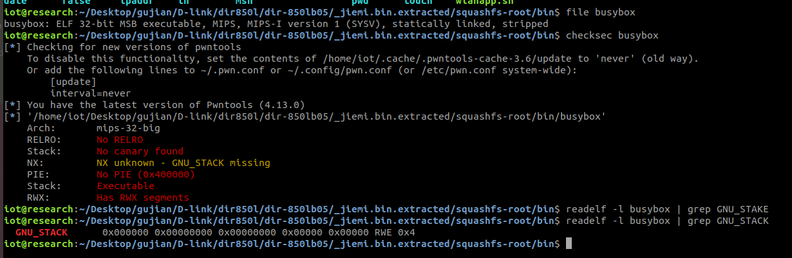

我们可以看到这个固件的架构mips大端,且没开保护。


### 1.2、firmwalker

    ./firmwalker-pro-max.sh /home/iot/Desktop/gujian/D-link/dir850l/dir-850lb05/_jiemi.bin.extracted/squashfs-root

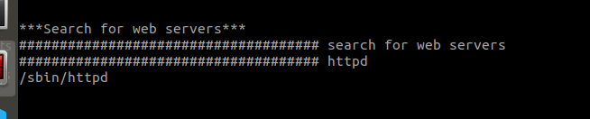


我们可以看到的是这个固件的web服务是httpd


## 2、解密

这个固件B版本是加密的,我们在网上可以看到这个固件的解密方法

知道这个的固件的加密是通过异或进行加密的，一个密钥是该设备的硬编码一个是【1-251】的循环。

下面是我们自己编写的解密源码。

```
#!/usr/bin/env python
# -*- coding: utf-8 -*-

import itertools
import sys

key1 = itertools.cycle(b'wrgac25_dlink.2013gui_dir850l')
key2 = itertools.cycle(range(1, 252))

with open(sys.argv[1], 'rb') as f:
    fw = f.read()  # fw 应该是字节类型

with open(sys.argv[2], 'wb') as f:
    for i in range(0,len(fw)):
        # 确保 fw[i] 是字节类型
        f.write(bytes([fw[i] ^ next(key1) ^ next(key2)]))
#        print(bytes([fw[i] ^ next(key1) ^ next(key2)]))

#print(len(fw))

f.close()
```
我们可以看到这个解密算法其实就是原加密字节与两个密钥进行异或，然后得到解密字节。

### 2.1、异或加密/解密的原理

举个例子

```
# 定义 A, B, C
A = 42         # 原始值 A
B = 15         # 原始值 B
C = 7          # 原始值 C

# 计算 D
D = A ^ B ^ C
print(f"Calculated D: {D}")

# 从 D 计算 A
A_calculated = D ^ B ^ C
print(f"Calculated A: {A_calculated}")

# 验证 A 是否正确
if A == A_calculated:
    print("A is correctly calculated!")
else:
    print("A calculation is incorrect.")
```
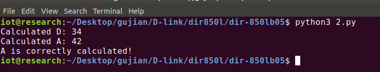


这也就说明，我们面对异或加密的时候，只要我们拿到它的异或算法和key，理论上我们就可以解密它。

面对异或，我们如果实在是找不到它的解密脚本的时候，我们也可以从它的加密脚本下手。（因为算法都是一样的，可能有的程序员懒的改个名字再调用了，所以会出现解密的时候也是调用的加密脚本）


我们虽然直接自己写出来了这个固件的解密脚本。但是我还是非常好奇这个到底是个怎么样的过程。（如果你不好奇，可以拿着源码走了。）


### 2.2、解密过程的分析

首先我们要知道的是，什么时候会涉及到整个固件的解密，那就是我们再手动更新的我们设备固件的时候。

所以我们可以去把这个固件模拟器起来，然后去它的固件更新界面抓包看一下。
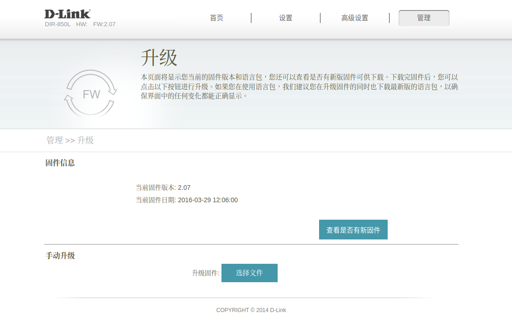


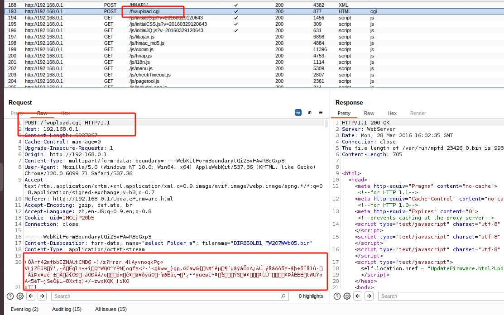


    hexdump -C DIR850LB1_FW207WWb05.bin |less

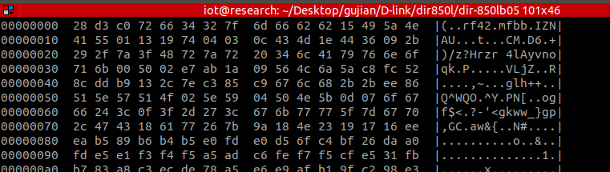


我们发现了这个流量包，这个POST请求上传了我们手动上传的固件的全部内容。因为我们已知我们自己上传的是一个加密固件所以我们接需要去追踪一下这个解密的过程。

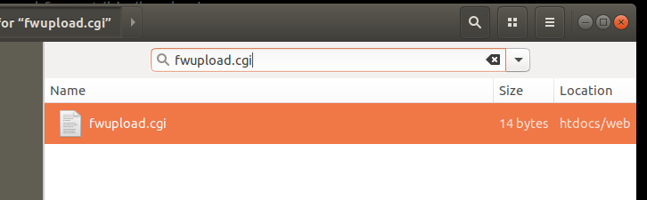


我们直接搜索，发现了这个文件


    ls -al | grep "fwupload.cgi"

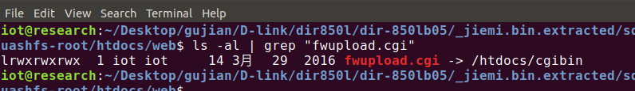

然后发现这个是一个软链接，链接到了cgibin上

我们把这个文件放在ghidra上看一下。
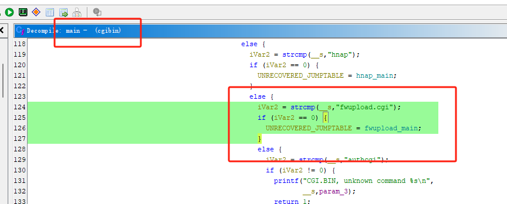


我们看到这个fwupload.cgi文件

我们看到这个很多的文件都被封装在这个文件里面。

我么接下来进入到函数查看一下。

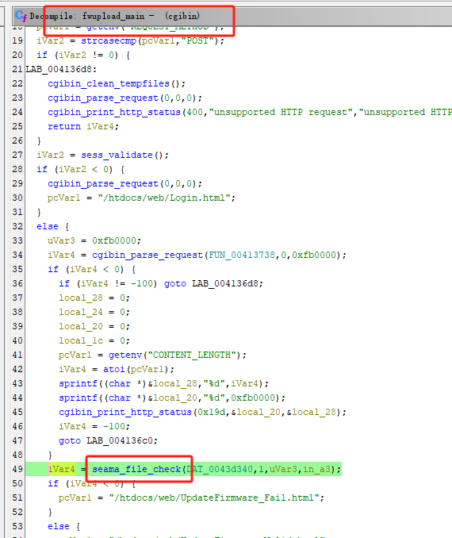


我们在里面看到一个seama_file_check()函数，这个是检查上传的更新固件的函数（至于为啥确定，具体见3.1讲解）

进入到这个函数

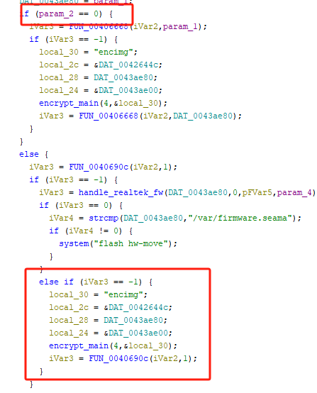


我们调用这个seama_file_check()函数时，传进来的参数是1，所以走的是下面的encrypt_main()函数。

在这个函数里面，提到了'encimg'，通过后续的调用和我们对固件的文件系统检索我们可以知到，这是一个可执行文件（详细见3.2讲解）


我们进入到这个函数。

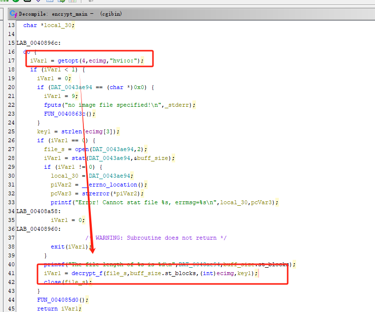

在这个函数里面有这个函数decrypt_f()函数（源代码没有符号表，为了方便这个是我改的函数名）

传进去的参数分别是【文件头指针】【文件大小】【一个指针】【密钥1（就是固件的硬编码）】

变量三是我们上面提到的
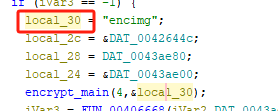


ps：这个参数是在decrypt_f()函数里面的调用过程中分析出来的。


我们再进入到这个decrypt_f()函数

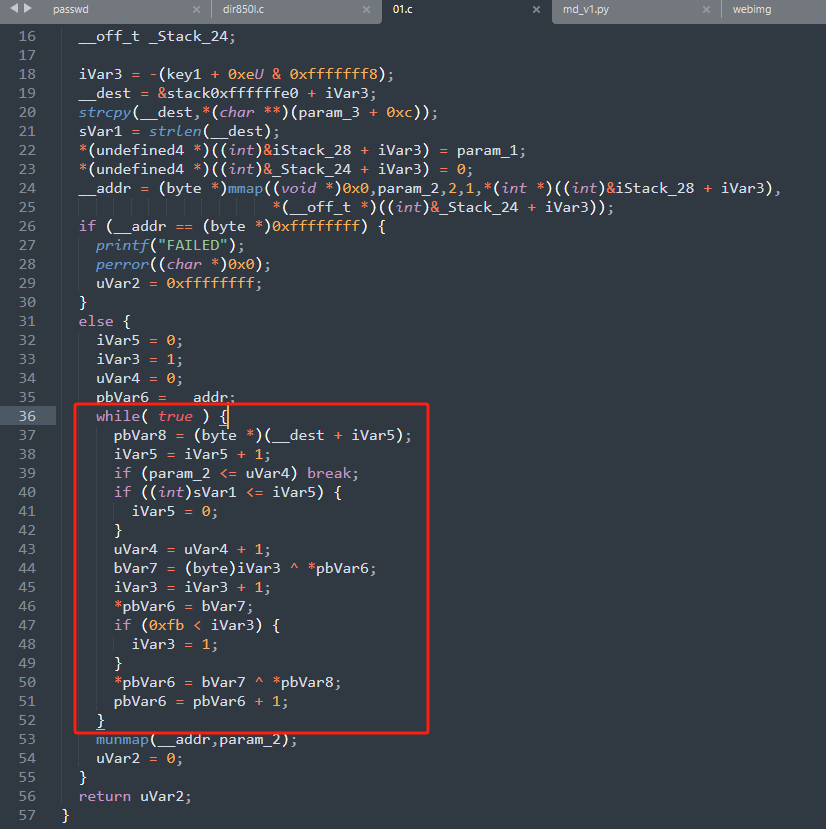


我们发现了解密的全过程源码。


根据这个，我们可以写出自己脚本进行解密。


## 3、关于一些细节的补充

### 3.1、关于上面提到的seama_file_check()的解释

这函数的命名格式很敏感，是因为在这个固件的一个脚本里面存在相关的处理。

上面也讲到，涉及到相关解密功能点应该是固件更新，所以我们可以搜索【upgrade】

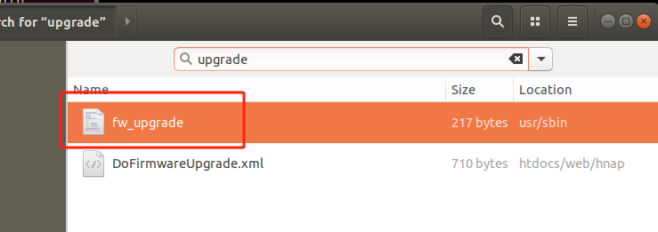


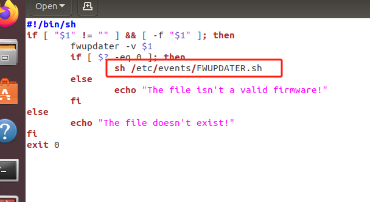

这个fw_upgrade.sh文件启动了另一个脚本文件FWUPDATER.sh

我们再打开这个脚本文件

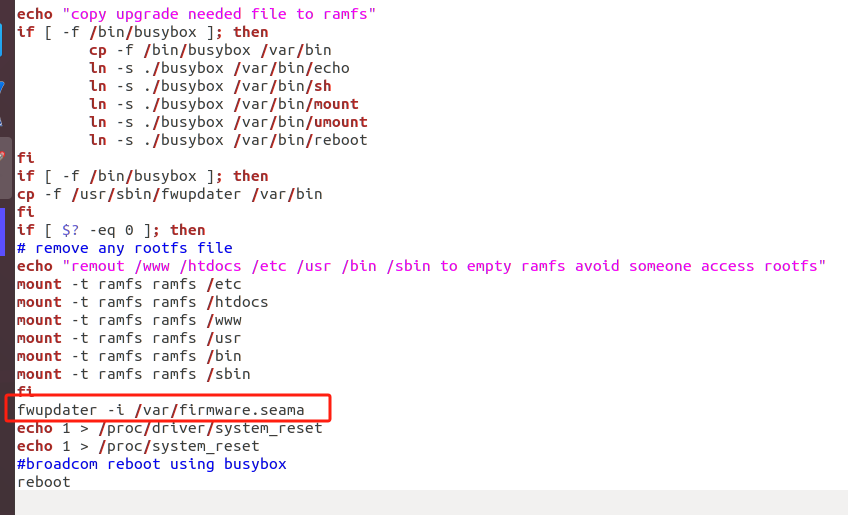


然而这个FWUPDATER.sh脚本启动的一个可执行文件fwupgrade

我们进行检索fwupdater
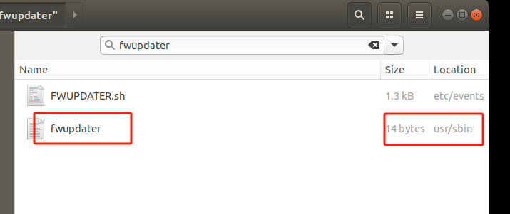


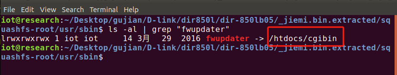

我们发现这个可执行文件也是链接到的cgibin文件

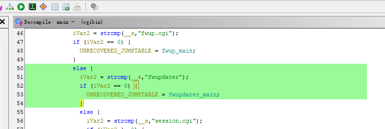


进入到这个函数


这个函数就调用了seama_file_check()函数，

而且这个可执行文件的参数也是一个.seama文件。

所以我们在上面fwupload.cgi指向的函数fwupload_main()函数里面看到这个函数才会认为这个是对固件文件进行的操作。


### 3.2、关于encimg的讲解

我们在后面的seama_file_check()函数里面看到有一段代码：iVar1 = getopt(4,ecimg,"hvi:o:");

**代码解释**
```c
iVar1 = getopt(param_1, param_2, "hvi:o:");
```
**参数解析**
1. **`param_1`**：
   - 这是一个整数，通常表示命令行参数的数量（`argc`）。

2. **`param_2`**：
   - 这是一个字符串数组（`argv`），包含所有的命令行参数。

3. **`"hvi:o:"`**：
   - 这是一个选项字符串，用于定义可接受的选项。
   - 每个字符代表一个选项：
     - `h`：可选项，通常表示帮助。
     - `v`：可选项，通常表示版本或详细模式。
     - `i:`：表示 `-i` 选项后面需要跟一个参数。
     - `o:`：表示 `-o` 选项后面需要跟一个参数。

**返回值**

- `getopt` 函数返回当前解析的选项字符。如果没有更多选项可解析，返回 `-1`。
- 如果解析到一个需要参数的选项（如 `-i` 或 `-o`），`getopt` 会将对应参数存储在一个全局变量 `_optarg` 中。


也就是说这条命令就是启动这个可执行程序，那我们再在固件问价系统寻找

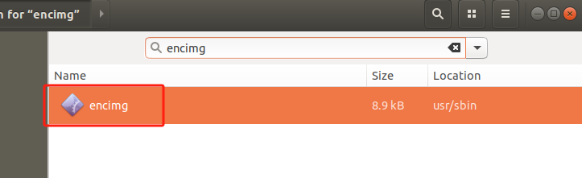

我们把这个可执行文件拿出来看一下

源码来看，我们发现很熟悉，仔细对比发现，这个就是cgibin文件里面的encrypt_main()被单独拿出来了。


下面是源码对比图

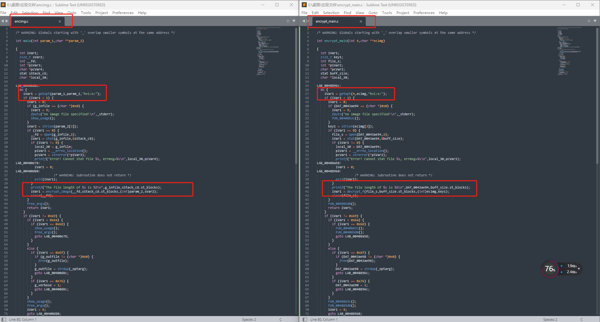

这张图的第三个红框圈出来的地方就是解密（或者说是加密）的函数。

源码附件：[encimg.c](vx_attachments/314097877682121/encimg.c)
源码附件：[encrypt_main.c](vx_attachments/314097877682121/encrypt_main.c)


### 3.3、关于硬编码的获取方法

这个固件的的B版本是加密的，但是A版本都是未加密的，所以我们可以从A版本获取硬编码。

    cat etc/config/image_sign 

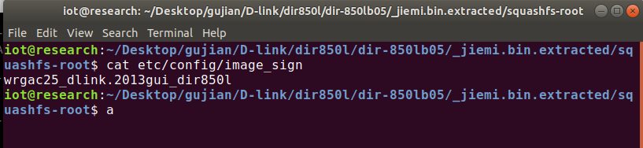


