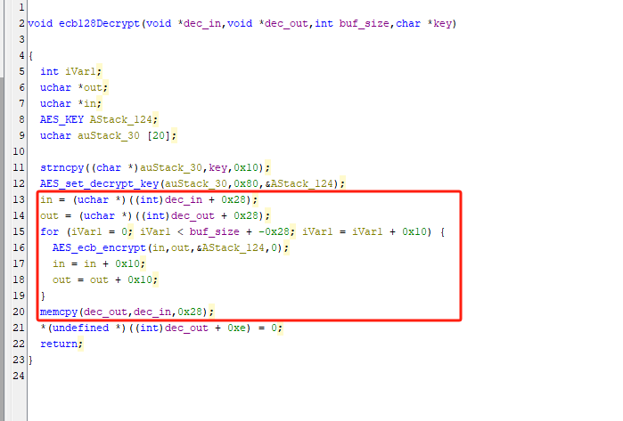

# maxo设备解密

## 2、解密

    binwalk moxa-nport-w2150a-w2250a-series-firmware-v2.3.rom 
    

我们的这个2.3版本的固件是加密的，但是我们，我们可以下载到初始版本，也就是我们的固件[moxa-nport-w2150a-w2250a-series-firmware-v1.11.rom]，我们对这个文件binwalk看一下。

    binwalk moxa-nport-w2150a-w2250a-series-firmware-v1.11.rom

我们可以看到这个固件的文件系统是squashfs

对它解包

    binwalk -Me moxa-nport-w2150a-w2250a-series-firmware-v1.11.rom

我们现在已知这个的固件的后续版本是加密的，所以在这个设备升级的时候，肯定会涉及到加密固件的解密，也就是说在这个1.1版本的固件里面会有解密方法。

所以，我们查找一下这个固件关固件更新的相关内容  

    grep -r "upgrade*"

我们看到了这个相关的依赖库，我们在ghidra看一下这个依赖库

我们在查看函数名的时候，看到一些跟解密加密相关的函数。

我们查看这个的函数的引用关系，可以看到这个函数还调用了ecb128Decrypt函数，从名字能看出来这是解密，我们追进去具体看一下。

我们可以看到这个跟我们想的是一样的。那也就是说这个fw_decrypt函数就是用来进行解密的。那么我们再看一下这个函数源码。

我们看到ecb128Decry函数在调用的时候传进去一个passwd.3309的参数，在传进去前的时候还进行了一些异或操作。

经过分析我们知到这个变量是密钥。

这个变量的值我们可以看到。
【95 b3 15 32 e4 e4 43 6b 90 be 1b 31 a7 8b 2d 05】

然后我们可以看到这个的上面对这个值的异或操作，我们可以自己写个python3 的代码，进行上面的操作。

    python3 1.py

我们就拿到了这个密钥

再对fw_decrypt函数进行分析，我们可以看到调用ecb128Decrypt函数时，传进去的参数是要解密的buffer起始地址，长度和密钥

我们再看ecb128Decrypt这个函数

这里面我们可以看到，这个函数的解密是从buffer的0x28以后开始解密的

上面我们知到它的加密/解密的算法是ecb128

我们可以借助openssl这个工具进行解密。

    openssl help
        

因为这个是从这个文件的0x28以后开始的，所以我们可以直接dd命令进行提取。

    dd if=moxa-nport-w2150a-w2250a-series-firmware-v2.3.rom bs=1 skip=40 of=myfile.bin

然后进行解密。

    openssl enc -aes-128-ecb -d -K "32383837436f6e6e373536340000" -in myfile.bin -out jiemi.bin

这个命令使用 `openssl` 工具来对文件进行 AES-128-ECB 解密。以下是命令的详细解释：

 参数解析

1. **`openssl enc`**：
   - `openssl` 是一个广泛使用的加密工具，`enc` 表示使用其加密功能。

2. **`-aes-128-ecb`**：
   - 指定使用 AES（高级加密标准）算法，密钥长度为 128 位，采用 ECB（电子密码本）模式。

3. **`-d`**：
   - 表示解密操作（decrypt）。

4. **`-K "32383837436f6e6e373536340000"`**：
   - `-K` 后面跟随的是用于解密的密钥，以十六进制形式提供。这个密钥是 16 字节（128 位），表示为 `32383837436f6e6e373536340000`。

5. **`-in myfile.bin`**：
   - 指定输入文件为 `myfile.bin`，该文件包含被加密的数据。

6. **`-out jiemi.bin`**：
   - 指定输出文件为 `jiemi.bin`，解密后的数据将保存在这个文件中。

我们对我们解密好的固件进行解压

    binwalk jiemi.bin

    binwalk -Me jiemi.bin

解密成功！！！！！！！！！！！！！！！！！！！！！！！！！！！！！！！！！！！！！！！！

## 3、细节补充

### 首先是对于ghidra的解释

我们如果想查看所有的函数

如果想调用这个函数的调用树状图

如果想看这个文件的十六进制文件

如果想看函数流程图

