# netgear9000

# 1、信息收集
## 1.1、基础信息收集
### 1.1.1、binwalk
```
binwalk R9000-V1.0.4.26.img
```
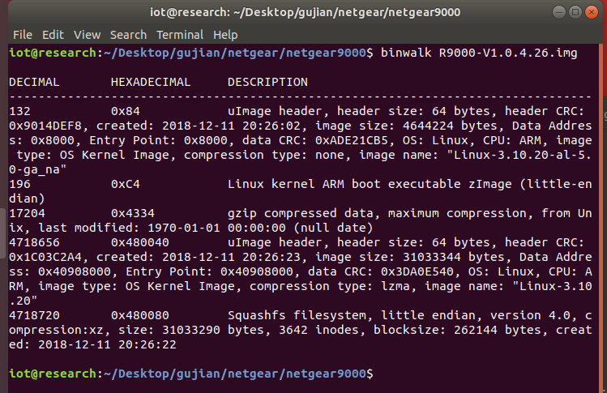

我们发现这个是Squashfs文件系统

然后解包
```
binwalk -Me R9000-V1.0.4.26.img
```
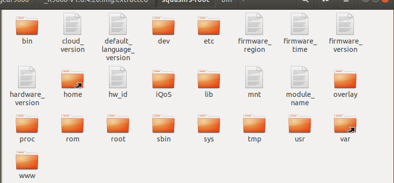


### 1.1.2、file&checksec

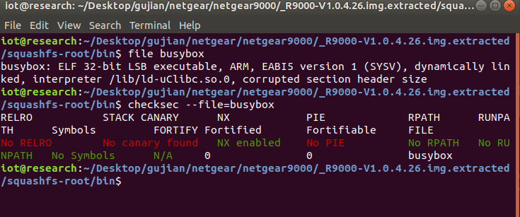


我们发现这个文件是32位arm架构的小端，并且没有开栈保护和PIE。


## 1.2、启动项分析
### 1.2.1、firmwalker


```
sudo ./firmwalker-pro-max.sh /home/iot/Desktop/gujian/netgear/netgear9000/_R9000-V1.0.4.26.img.extracted/squashfs-root > 1.txt
```

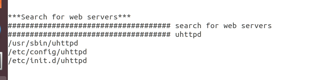

我们发现这个web是由uhttpd启动的。

### 1.2.2、启动项文件分析


在inittab文件里面我们看看到了在系统初始化的时候它启动了rcS文件并且给了两个参数“S”“boot”
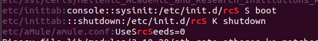
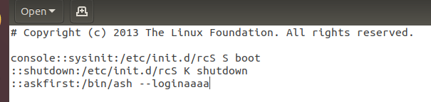

```
console::sysinit:/etc/init.d/rcS S boot：在系统初始化时执行 /etc/init.d/rcS 脚本，并传递参数 S boot。
::shutdown:/etc/init.d/rcS K shutdown：在系统关机时执行 /etc/init.d/rcS 脚本，并传递参数 K shutdown。
::askfirst:/bin/ash --login：在控制台上首次登录时使用 /bin/ash 作为登录 shell。
```

因为我们是开机初始化，所以我们继续追踪rcS文件。


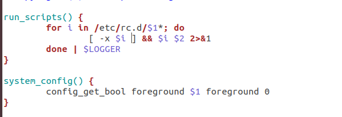

在rcS文件中，我们看到，它循环启动了在/etc/rc.d/中的传过来的参数一“S”开头的文件。


# 2、system模拟
这个固件firm AE模拟不起来。
所以需要我们进行系统级模拟。


配置网卡
```
 sudo tunctl -t tap0 -u 'iot'
```

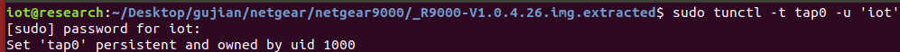
命令 sudo tunctl -t tap1 -u 'iot' 的作用是在Linux系统中创建一个名为 tap1 的TAP接口，并将该接口的所有权（即拥有者）设置为用户 iot。TAP接口通常用于模拟一个以太网设备，使得你可以像操作真实以太网接口一样来操作它，这在虚拟网络环境中非常有用，比如桥接网络、VPN客户端和服务端等场景。


```
 sudo ifconfig tap0 192.168.0.1/24 up
```
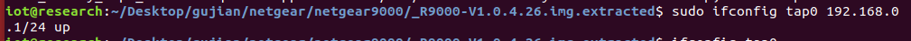
 命令 sudo ifconfig tap1 10.10.10.3/24 用于在Linux系统中配置名为 tap1 的网络接口（在这个例子中是一个TAP接口）的IP地址和子网掩码。具体来说，这个命令将 tap1 接口的IP地址设置为 10.10.10.3，子网掩码设置为 /24（即255.255.255.0）。

```
ifconfig tap1
```
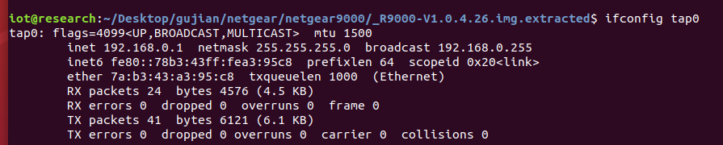
检查是否成功


启动虚拟机
```
sudo qemu-system-arm -M vexpress-a9 -kernel vmlinuz-3.2.0-4-vexpress -initrd initrd.img-3.2.0-4-vexpress -drive if=sd,file=debian_wheezy_armhf_standard.qcow2 -append "root=/dev/mmcblk0p2 console=ttyAMA0" -net nic -net tap,ifname=tap0,script=no,downscript=no -nographic
```

### 命令解释

```bash
sudo qemu-system-arm -M vexpress-a9 \
```
- **sudo**：以超级用户权限运行命令。
- **qemu-system-arm**：启动 QEMU 模拟器，模拟 ARM 架构。
- **-M vexpress-a9**：指定机器类型为 `vexpress-a9`，这是一个基于 ARM Cortex-A9 的开发板。

```bash
-kernel vmlinuz-3.2.0-4-vexpress \
```
- **-kernel**：指定内核映像文件，`vmlinuz-3.2.0-4-vexpress` 是要加载的内核文件。

```bash
-initrd initrd.img-3.2.0-4-vexpress \
```
- **-initrd**：指定初始 RAM 磁盘映像，`initrd.img-3.2.0-4-vexpress` 包含启动时需要的驱动和文件系统。

```bash
-drive if=sd,file=debian_wheezy_armhf_standard.qcow2 \
```
- **-drive**：定义一个磁盘驱动器。
  - **if=sd**：指定接口类型为 SD 卡。
  - **file=debian_wheezy_armhf_standard.qcow2**：指定使用的磁盘映像文件。

```bash
-append "root=/dev/mmcblk0p2 console=ttyAMA0" \
```
- **-append**：向内核传递参数。
  - **root=/dev/mmcblk0p2**：指定根文件系统的位置。
  - **console=ttyAMA0**：设置控制台输出到串行端口。

```bash
-net nic \
```
- **-net nic**：创建一个网络接口卡（NIC），允许虚拟机通过网络通信。

```bash
-net tap,ifname=tap0,script=no,downscript=no \
```
- **-net tap**：使用 TAP 网络设备连接虚拟机。
  - **ifname=tap0**：指定使用的 TAP 接口名称。
  - **script=no**：禁用自动创建和删除脚本。
  - **downscript=no**：禁用关闭时执行的脚本。

```bash
-nographic
```
- **-nographic**：禁用图形输出，所有输出通过命令行终端进行，适用于无头（headless）环境。


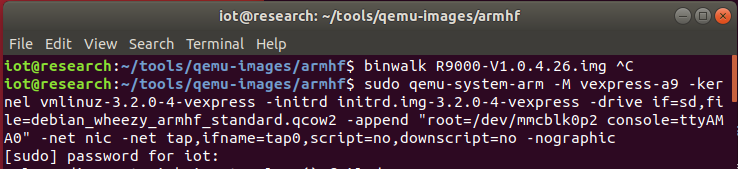
账号：root
密码：root


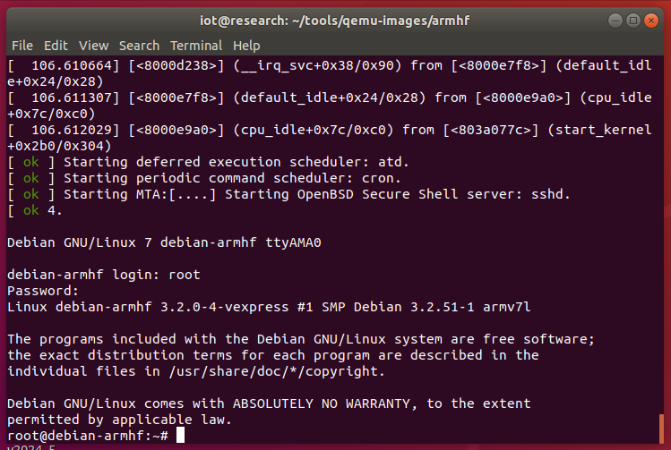


压缩文件
```
tar -zcvf squashfs-root.tar.gz squashfs-root
```
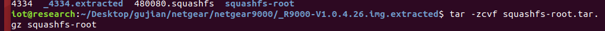


发包

```
python -m SimpleHTTPServer 

wget http://192.168.0.1:8000/squashfs-root.tar.gz

```
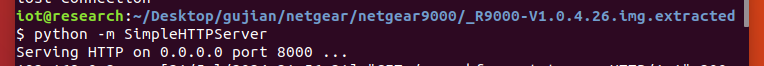


解压
```
tar -zxvf filename
```

接下来挂载文件系统
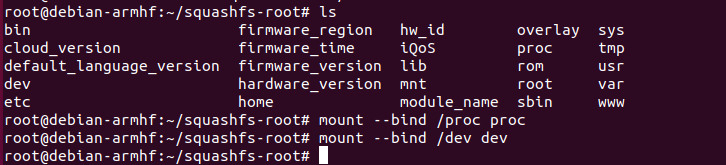


```
mount --bind /proc proc
mount --bind /dev dev
```


### 命令解释


```bash
mount --bind /proc proc
```
- **mount --bind**：将一个目录挂载到另一个位置。
- **/proc**：虚拟文件系统，提供系统信息和进程信息。
- **proc**：在当前目录下创建一个新的挂载点，通常需要先创建此目录（例如 `mkdir proc`）。

```bash
mount --bind /dev dev
```
- **/dev**：包含设备文件的目录。
- **dev**：在当前目录下创建一个新的挂载点，通常也需要先创建此目录（例如 `mkdir dev`）。

```bash
chroot . sh
```
- **chroot .**：将当前根目录更改为当前目录（`.`），即切换到当前环境。
- **sh**：启动一个新的 shell 实例，使用新的根文件系统。

### 总结
这些命令通常用于在一个新的根文件系统中执行操作，比如在进行系统修复或安装时，以便访问必要的资源（如 `/proc` 和 `/dev`）。


