# zyxel启动

（补充一下信息的收集）

问题：
首先这个文件可以在firmAE模拟，但是，没办法访问到web界面，所以我们要想办法把这个web界面启动

首先我们看一下这个的service
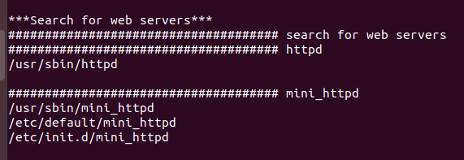

这里面的我们看它的启动项，发现这个文件系统应该启动的是mini_httpd服务，

但是这里我们进shll看ps发现它启动的是httpd，不是mini_httpd

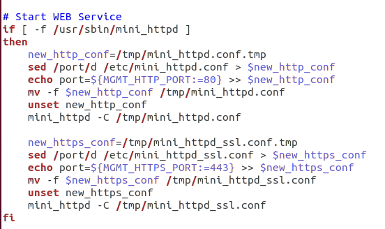

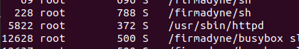

接下来要做的是我们需要启动mini_httpd服务

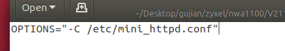

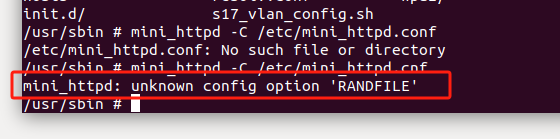

发现软连接指向的是另一个文件，但是我们去看，并没有发现这个文件，所以我们需要建一下这个文件

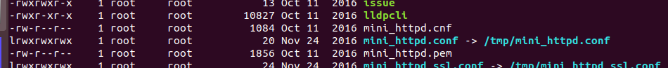

用另一个mini_httpd.cnf文件
然后我们看到报这个错误。

直接进mini_httpd查找这个错误
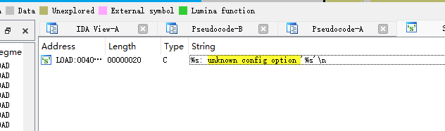

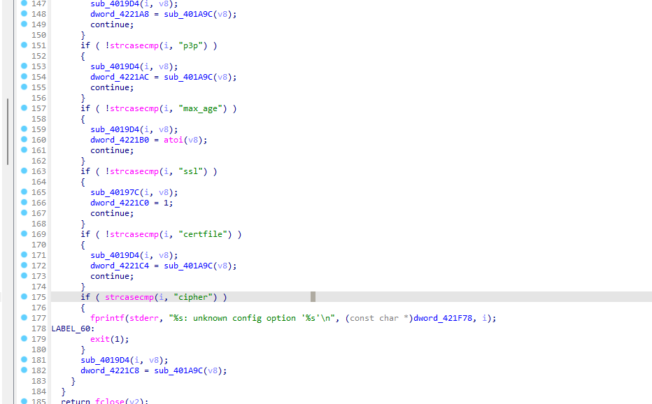

代码分析一下以后发现我们需要给配置文件需要这样配置
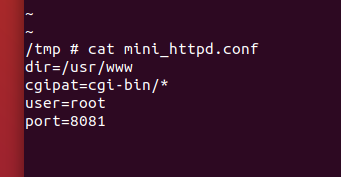

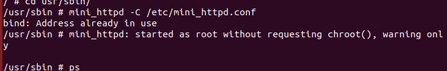

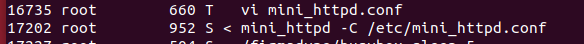

加上mini_httpd的端口访问mini_httpd

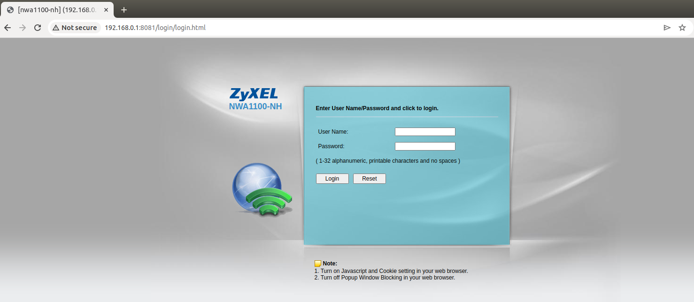

登录以后，程序卡在这里，报错

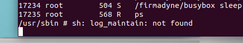

搜索以后分析一下代码，发现这里有问题
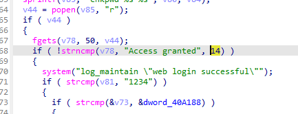

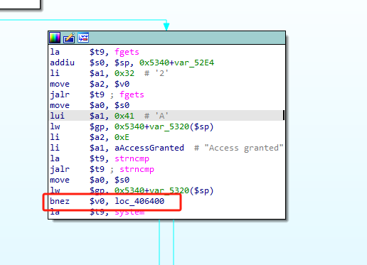

改成beqz

通过010改

搜索这个

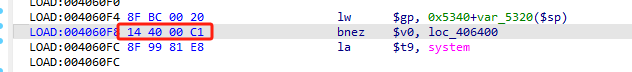

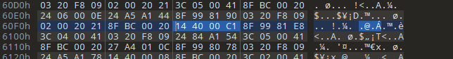

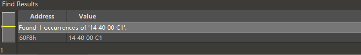

然后通过firmAE自带的文件传输传进去我们自己改好的文件

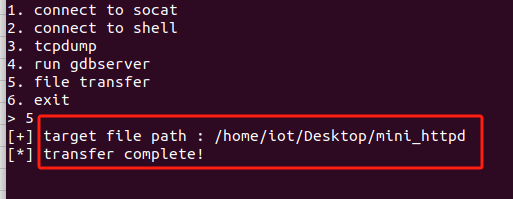

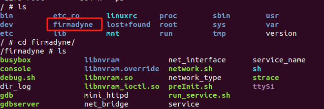

传进来的文件会被放到这个文件里面

然后把这个改好文件放到原本的mini_httpd的位置
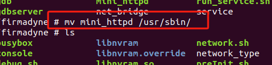

然后启动

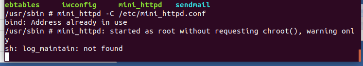

