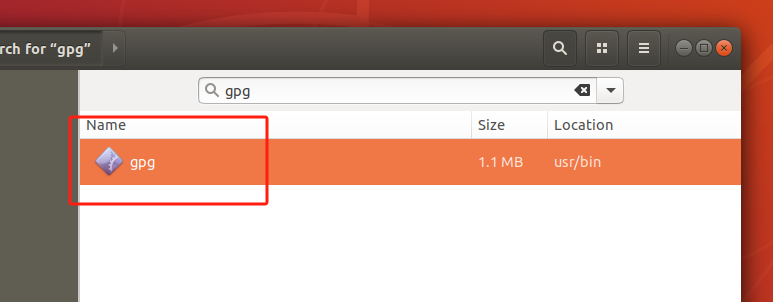
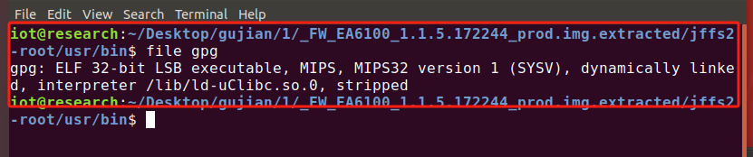
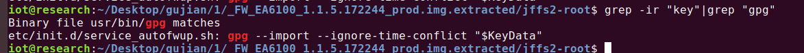
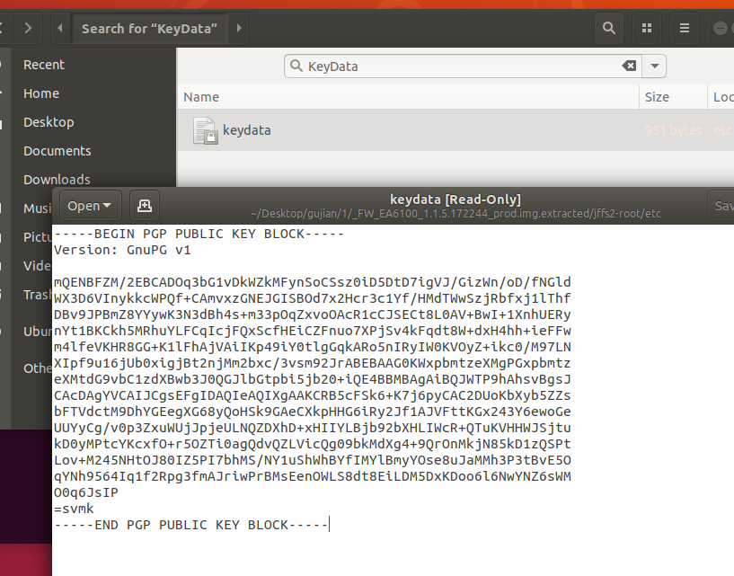
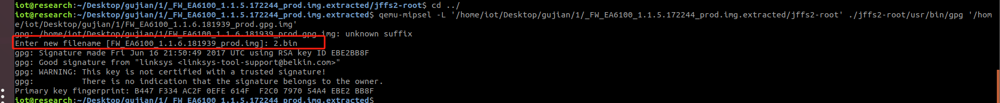
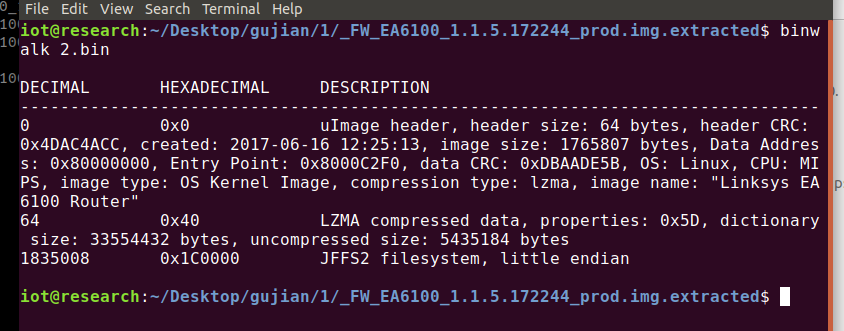
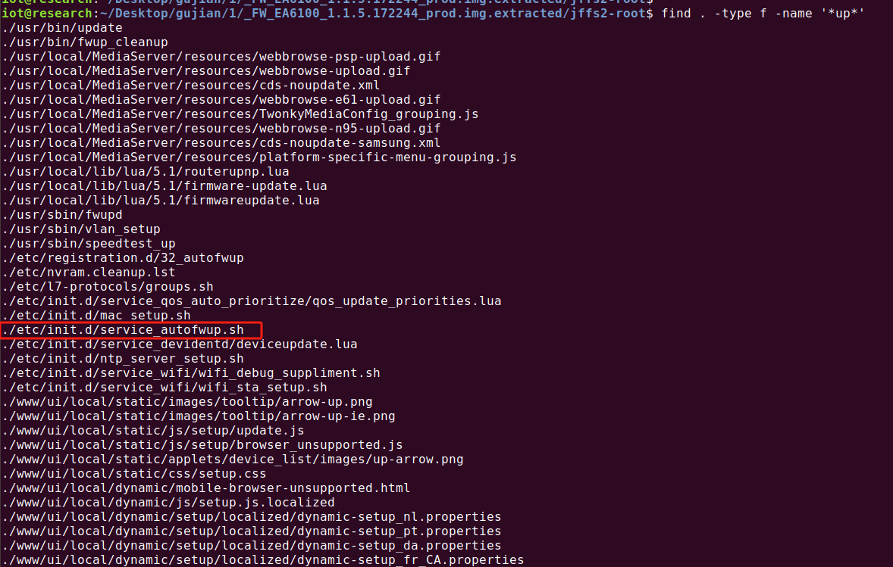
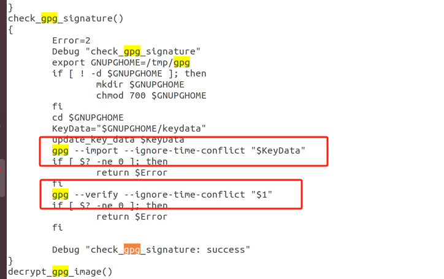
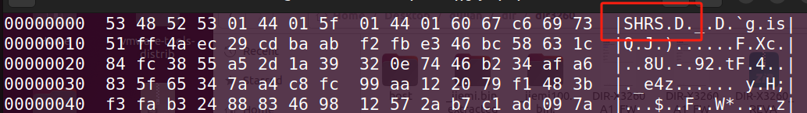
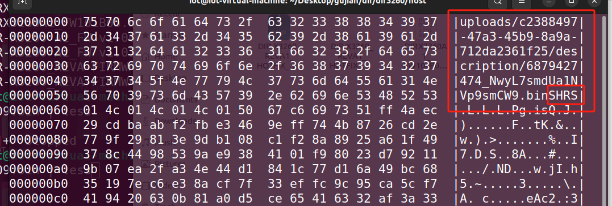

# 固件1、FW_EA6100

固件：
[FW_EA6100_1.1.5.172244_prod.img](vx_attachments/14498079246388/FW_EA6100_1.1.5.172244_prod.img)

[FW_EA6100_1.1.6.181939_prod.gpg.img](vx_attachments/14498079246388/FW_EA6100_1.1.6.181939_prod.gpg.img)


## 解密

这个固件的解密方式在初始版本中存在有解密脚本。所以我们可以在之前的版本中寻找解密脚本。

### 首先

#### 第一种思路：

我们在这个文件的文件名里面可以看到这个prod.gpg，我们检索一下


    `prod.gpg` 通常指一个加密文件，使用 GnuPG（GPG）工具进行加密和解密。以下是一些关于 `prod.gpg` 的常见用途和信息：

    #### 主要用途

    1. **数据加密**：
    - `prod.gpg` 文件可能用于存储敏感数据，如配置文件、凭证或其他重要信息，以确保数据在存储和传输过程中的安全性。

    2. **安全传输**：
    - 该文件可能用于在不安全的网络中安全传输数据。通过加密，可以防止未授权访问。

    3. **文件签名**：
    - GPG 也可以用于对文件进行数字签名，以验证文件的来源和完整性。

    #### 如何使用

    - **解密文件**：
    使用以下命令解密 `prod.gpg`：
    ```bash
    gpg --decrypt prod.gpg
    ```

    - **加密文件**：
    如果需要加密文件，可以使用以下命令：
    ```bash
    gpg --encrypt prod.txt
    ```

    #### 注意事项

    - **密钥管理**：
    - 使用 GPG 时，确保妥善管理公钥和私钥，以便能够正确加密和解密文件。

    - **安全性**：
    - 确保在安全的环境中操作加密文件，防止密钥泄露。


我们看到这个是一种加密方式。我们可以下文件进行检索。




可以看到这个gpg二进制文件。

那我们尝试一下运行这个文件

    file gpg



我们可以看到这个文件是mips的小端，所以我们需要使用qemu-mipsel进行模拟运行。

    qemu-mipsel -L '/home/iot/Desktop/gujian/1/_FW_EA6100_1.1.5.172244_prod.img.extracted/jffs2-root' ./jffs2-root/usr/bin/gpg '/home/iot/Desktop/gujian/1/FW_EA6100_1.1.6.181939_prod.gpg.img'
    gpg: keyring /home/iot/.gnupg/secring.gpg' created gpg: keyring /home/iot/.gnupg/pubring.gpg' created
    gpg: /home/iot/Desktop/gujian/1/FW_EA6100_1.1.6.181939_prod.gpg.img: unknown suffix
    Enter new filename [FW_EA6100_1.1.6.181939_prod.img]: jiemi.bin
    gpg: Signature made Fri Jun 16 21:50:49 2017 UTC using RSA key ID EBE2BB8F
    gpg: Can't check signature: public key not found

结果发现这个提示说没有密钥


    遇到错误信息 `Can't check signature: public key not found` 表示 GPG 无法找到用于验证签名的公钥。以下是解决此问题的一些步骤：
    ### 解决步骤
    1. **导入公钥**：
    - 你需要有用于签名的公钥。如果你知道公钥的来源，可以通过以下命令导入：
        ```bash
        gpg --import /path/to/public/key/file
        ```
    2. **查找公钥**：
    - 如果公钥在一个密钥服务器上，你可以通过以下命令从服务器获取：
        ```bash
        gpg --keyserver hkp://keyserver.ubuntu.com --recv-keys EBE2BB8F
        ```
    3. **查看已有的公钥**：
    - 确认公钥是否已存在：
        ```bash
        gpg --list-keys
        ```
    4. **重试验证**：
    - 导入公钥后，再次运行 GPG 命令以验证签名。

    ### 示例命令

    如果你知道公钥的文件，可以直接导入：
    ```bash
    gpg --import /path/to/your/public.key
    ```
    ### 注意事项

    - 确保公钥是来自可信来源。
    - 如果你没有公钥的文件或不确定其来源，可能需要联系文件的发布者以获得公钥。


也就是说我们需要导入密钥

    grep -ir "key"|grep "gpg"



我们可以看到，跟gpg有关的只有一个KeyData

我们检索一下



我们发现了我们想要的这个key

导入一下

    qemu-mipsel -L '/home/iot/Desktop/gujian/1/_FW_EA6100_1.1.5.172244_prod.img.extracted/jffs2-root' ./jffs2-root/usr/bin/gpg --import '/home/iot/Desktop/gujian/1/_FW_EA6100_1.1.5.172244_prod.img.extracted/jffs2-root/etc/keydata' 

然后再运行一下上面的命令。


    qemu-mipsel -L '/home/iot/Desktop/gujian/1/_FW_EA6100_1.1.5.172244_prod.img.extracted/jffs2-root' ./jffs2-root/usr/bin/gpg '/home/iot/Desktop/gujian/1/FW_EA6100_1.1.6.181939_prod.gpg.img'






我们可以看到，解密成功。


#### 第二种思路：

就是我们拿到一个新的陌生的固件，也没有看到这个gpg的后缀

一般来说，涉及到固件的加密解密这一方面会在我们自己上传固件进行升级的时候。所以可以从“upgrade”入手




经过我们的检索，我们看到这个文件里面有一些关于key的赋值操作和解密的指令。



这边我们也就可以锁定这个固件的加密方法了，也就是说我们可以确定这个固件的加密方式---gpg，

所以说我们可以去尝试这个命令了，上下的操作跟方法一就一样了。


# 固件2、DIR-X3260

这个固件的加密设计到一个头的混淆。

在这个固件的一个热补丁存在头混淆

[DIR-X3260_REVA1_HOTFIX_FIRMWARE_v104B01.zip](vx_attachments/14498079246388/DIR-X3260_REVA1_HOTFIX_FIRMWARE_v104B01.zip)

[DIR-X3260_REVA-FIRMWARE_v1.02B02.zip](vx_attachments/14498079246388/DIR-X3260_REVA-FIRMWARE_v1.02B02.zip)


在第一个固件里面存在这个头混淆，下面的那个固件里面并没有相应的头混淆

我们在尝试解密下面的这个脚本的时候，了解到一个解密工具

[firmware-utils-master(2).zip](vx_attachments/14498079246388/firmware-utils-master(2).zip)

[firmware-utils-master.md](vx_attachments/14498079246388/firmware-utils-master.md)


    hexdump -C DIRX3260A1_FW100B09.bin | less


这个工具可以把下面没有头混淆的固件进行解密，分析了源码发现这个就是进行文件头的识别'SHRS'字符串，识别到便知道使用的是同类型加密算法。

然而在第一固件的二进制文件里面，头部的开头并不是'SHRS'

    hexdump -C DIRX3260A1_FW104B01_beta_vul_fix+buffer.bin |less




只需要把前面多余的头部进行删除就好，就可以进行正常的解密。


