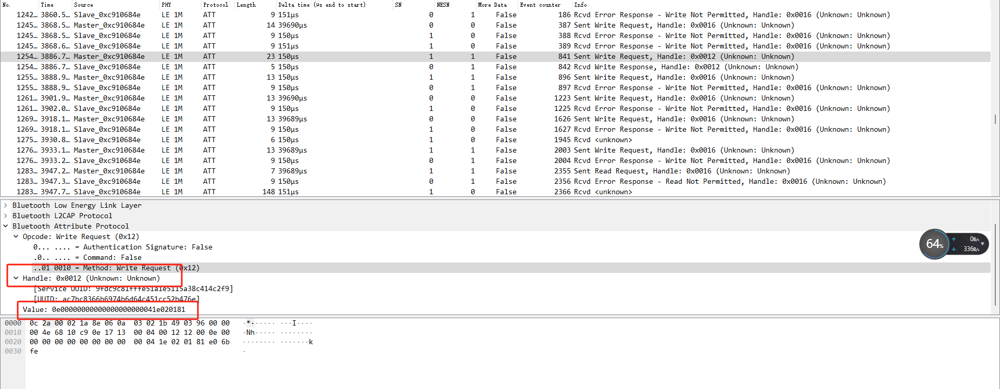
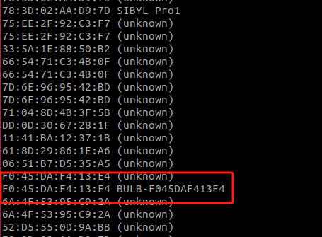
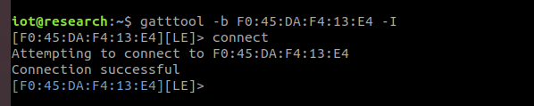
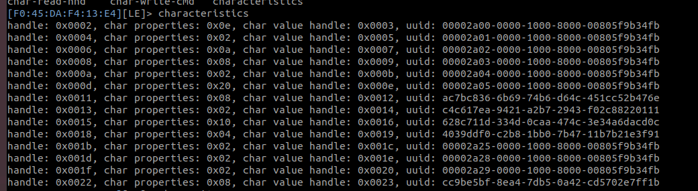
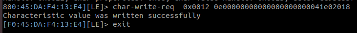

# 蓝牙的抓包与重放

[蓝牙包.pcapng](vx_attachments/440957764520477/蓝牙包.pcapng)
完整的抓包：

# 抓包

工具：E104

驱动：[usb_drivers.rar](vx_attachments/440957764520477/usb_drivers.rar)

工具：Wireshark  
[nrf_sniffer_V3_0.zip](vx_attachments/440957764520477/nrf_sniffer_V3_0.zip)

配置好以后抓包  
  

通过数据包的分析，发现这个是控制灯泡的开关的句柄

# 重放：
设备：UD100

把设备连接到虚拟机，然后hciconfig查看链接

执行命令

    sudo hcitool lescan

查看搜索到的蓝牙设备

## 连接设备

    gatttool -b F0:45:DA:F4:13:E4 -I

`gatttool -b F0:45:DA:F4:13:E4 -I` 是一个用于与蓝牙设备进行交互的命令，具体解释如下：

### 组成部分

1. **gatttool**：
   - 这是一个命令行工具，用于与支持 GATT（通用属性配置文件）的蓝牙低功耗（BLE）设备通信。

2. **-b F0:45:DA:F4:13:E4**：
   - `-b` 选项后面跟的是蓝牙设备的 MAC 地址。在这个例子中，`F0:45:DA:F4:13:E4` 是要连接的设备的地址。

3. **-I**：
   - 这个选项表示以交互模式运行 `gatttool`。在交互模式下，你可以输入多个命令与蓝牙设备进行交互，而不是一次性发送单个命令。

### 用法示例

运行该命令后，你可以输入其他 `gatttool` 命令，例如：
- 连接到设备
- 读取或写入特性
- 发现服务

通过抓到的包分析来看，我们知到句柄为0x0012的为灯泡开关控制

具体的开关是由后面的value值来决定的

开灯泡：Value: 0e00000000000000000000041e020181
关灯泡：Value: 0e00000000000000000000041f020180

## 查看特征

    characteristics    

通过characteristics显示特征

### 字段解释

1. **handle**:
   - 这是特征在 GATT 数据库中的唯一标识符。它用于区分不同的特征。

2. **char properties**:
   - 这是特征的属性标志，表示该特征支持的操作。每个操作用一个位表示，常见的属性包括：
     - 0x01: 读（Read）
     - 0x02: 写（Write）
     - 0x04: 通知（Notify）
     - 0x08: 指示（Indicate）
     - 0x10: 广播（Broadcast）
     - 0x20: 可靠写入（Reliable Write）
   - 例如，0x0E 表示该特征支持读、写和通知。

3. **char value handle**:
   - 这是特征值的句柄，表示特征的实际数据存储位置。可以通过这个句柄读取或写入特征的值。

4. **uuid**:
   - 这是特征的唯一标识符（UUID），用于标识特征的类型。UUID 可以是 16 位或 128 位。常见的 UUID 例如：
     - `00002a00`：设备名称
     - `00002a01`：外观
     - `00002a02`：连接间隔
   - 你提供的 UUID 也包括自定义 UUID（例如 `ac7bc836-6b69-74b6-d64c-451cc52b476e`），通常用于特定应用或设备。

### 示例总结

- **特征 1**:
  - `handle: 0x0002`
  - `char properties: 0x0e`（支持读、写、通知）
  - `char value handle: 0x0003`
  - `uuid: 00002a00`（设备名称）

- **特征 2**:
  - `handle: 0x0004`
  - `char properties: 0x02`（支持写）
  - `char value handle: 0x0005`
  - `uuid: 00002a01`（外观）

## 改值

        char-write-req  0x0012 0e00000000000000000000041e020181

`char-write-req` 是 `gatttool` 中的一个命令，用于向蓝牙低功耗（BLE）设备的特征写入数据。以下是对该命令的详细解释：

### 组成部分

1. **char-write-req**：
   - 这是命令的名称，表示发送一个写请求到特定的特征。

2. **参数**：
   - 该命令通常需要两个参数：
     - **特征句柄**（Characteristic Handle）：要写入的特征的句柄。
     - **数据**：要写入特征的值，通常以十六进制格式提供。

就可以实现对这个蓝牙灯泡的控制。

# zigbee
[zigbee.pcapng](vx_attachments/440957764520477/zigbee.pcapng)

